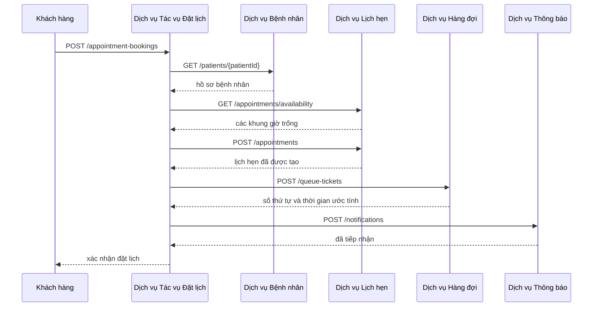
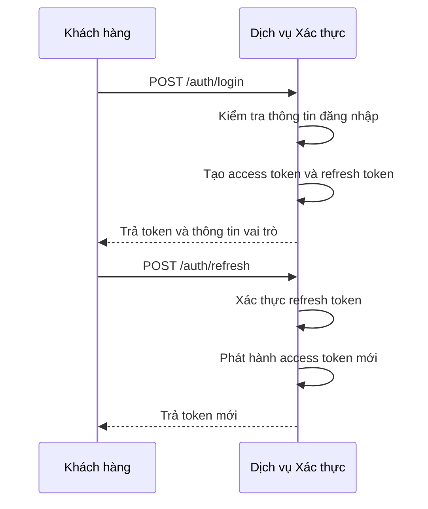
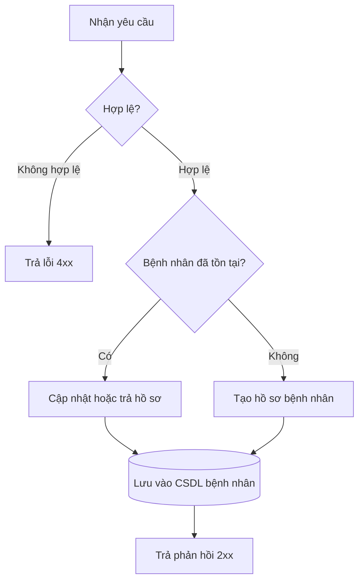
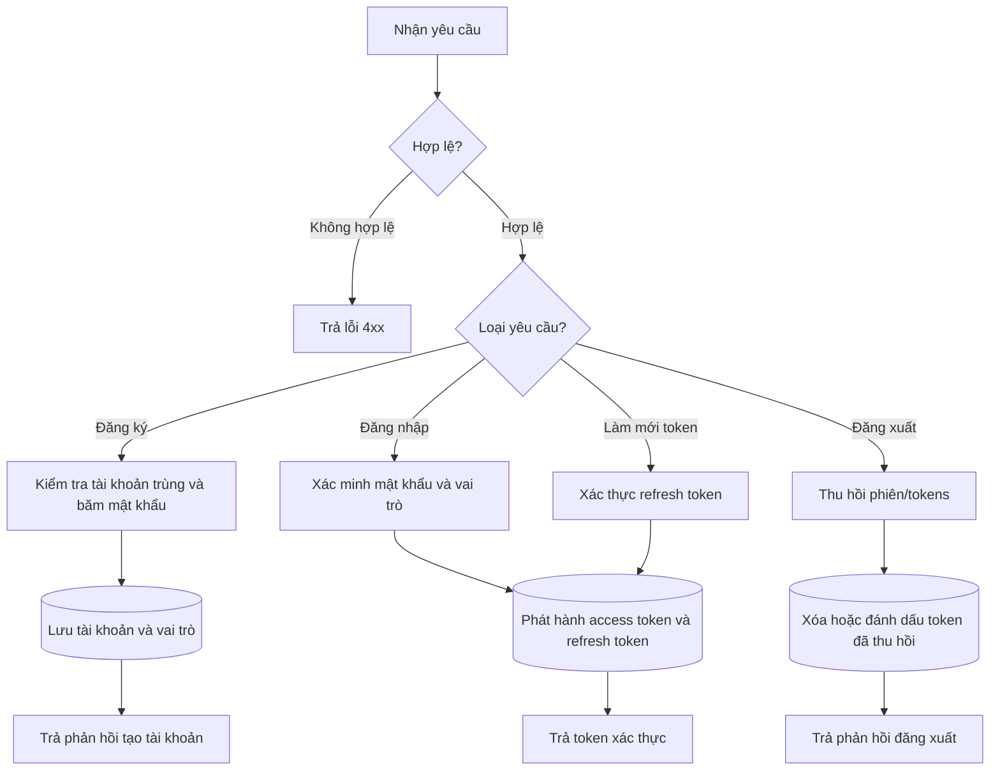
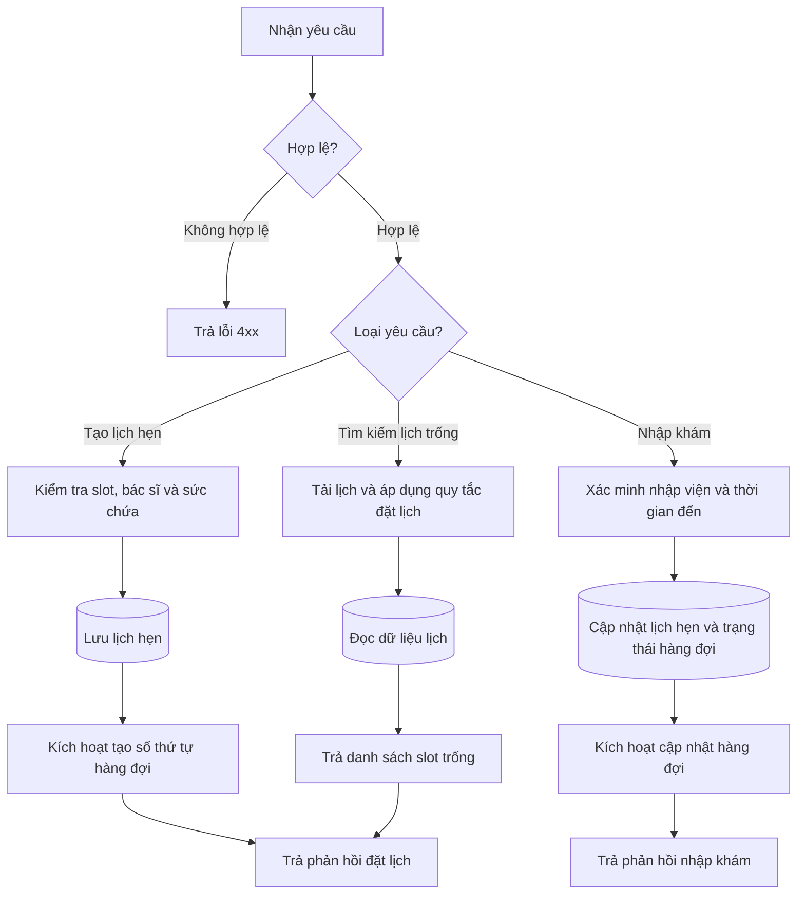

# Phân tích và Thiết kế — Giải pháp Tự động hóa Quy trình Nghiệp vụ

> **Mục tiêu**: Phân tích một quy trình nghiệp vụ cụ thể và thiết kế một giải pháp tự động hóa theo hướng dịch vụ (SOA/Microservices).
> Phạm vi: Bài tập trong 4–6 tuần — chỉ tập trung vào **một quy trình nghiệp vụ**, không phải toàn bộ hệ thống.

**Tài liệu tham khảo:**
1. *Service-Oriented Architecture: Analysis and Design for Services and Microservices* — Thomas Erl (2nd Edition)
2. *Microservices Patterns: With Examples in Java* — Chris Richardson
3. *Bài tập — Phát triển phần mềm hướng dịch vụ* — Hung Dang (available in Vietnamese)

---

## Phần 1 — Chuẩn bị Phân tích

### 1.1 Định nghĩa Quy trình Nghiệp vụ

Mô tả hoặc vẽ sơ đồ quy trình nghiệp vụ mức cao cần được tự động hóa.

- **Miền nghiệp vụ**: Hệ thống quản lý khám thai và chăm sóc thai phụ
- **Quy trình nghiệp vụ**: *(điền vào)*
- **Tác nhân**: Thai phụ, Lễ tân, Bác sĩ, Y tá/Điều dưỡng/Hộ sinh, Admin.
- **Phạm vi**: 
    - Thai phụ (Web/App): 
        1. Đăng ký khám, cung cấp hồ sơ khám thai, nhận số thứ tự, nhận thông báo và thực hiện lịch khám.
        2. Theo dõi hồ sơ sức khỏe, phác đồ điều trị, hóa đơn, đơn thuốc,...
        3. Hỏi đáp, nhận tư vấn qua Chatbot AI.
        4. Theo dõi cổng thông tin bệnh viện.
    - Lễ tân (Web):
        1. Theo dõi lịch khám của thai phụ. 
        2. Gửi thông báo tới bác sĩ, thai phụ (trong các trường hợp bất thường).
        3. Xử lý các phần của quy trình khám thai mà không thể tự động hóa (thanh toán tiền mặt, thực hiện hồ sơ vật lý, ...).
    - Bác sĩ (Web):
        1. Trả lời, giải đáp thắc mắc của thai phụ (thông qua diễn đàn, chat, ...)
    - Y tá/Điều dưỡng/Hộ sinh (Web):
        1. Nhập liệu thông tin liên quan đến dịch vụ khám.
        2. Quét hồ sơ và lưu lên hệ thống. 
    - Admin: 
        1. Quản lý.

**Sơ đồ quy trình:**

*(Chèn BPMN, flowchart hoặc hình ảnh vào `docs/asset/` và tham chiếu tại đây)*

### 1.2 Các Hệ thống Tự động hóa Hiện có

Liệt kê các hệ thống, cơ sở dữ liệu hoặc logic kế thừa liên quan đến quy trình này.

| Tên hệ thống | Loại | Vai trò hiện tại | Phương thức tương tác |
|-------------|------|------------------|------------------------|
|             |      |              |                   |

> Nếu không có, ghi: *"Không có — quy trình hiện đang được thực hiện thủ công."*

### 1.3 Yêu cầu Phi chức năng

Các yêu cầu phi chức năng là đầu vào để xác định các Ứng viên Dịch vụ Tiện ích và Vi dịch vụ ở bước 2.7.

| Yêu cầu    | Mô tả |
|------------|-------|
| Hiệu năng  |       |
| Bảo mật    |       |
| Khả năng mở rộng | |
| Sẵn sàng   |       |

---

## Phần 2 — Mô hình hóa REST/Microservices

### 2.1 Phân rã Quy trình Nghiệp vụ & 2.2 Lọc các Hành động Không phù hợp

Phân rã quy trình ở mục 1.1 thành các hành động chi tiết. Đánh dấu các hành động không phù hợp để đóng gói thành dịch vụ.

2.1.1. Quy trình nghiệp vụ "Thai phụ khám bệnh"

**A. Đặt lịch khám thai**

| # | Hành động | Actor | Mô tả | Phù hợp? |
|---|-----------|-------|-------|----------|
| 1 | Đăng ký tài khoản | Thai phụ | Tạo tài khoản đăng nhập (username/password) | ✅ |
| 2 | Đăng nhập hệ thống | Thai phụ | Xác thực danh tính để truy cập | ✅ |
| 3 | Chọn chức năng "Đăng ký dịch vụ khám thai" | Thai phụ | Điều hướng UI | ❌ |
| 4 | Chọn hình thức khám: Khám thường / Khám dịch vụ | Thai phụ | Điểm rẽ nhánh nghiệp vụ | ✅ |

**Nhánh 1 — Khám thường**

| # | Hành động | Actor | Mô tả | Phù hợp? |
|---|-----------|-------|-------|----------|
| 5a | Hiển thị danh sách ngày/ca khám còn trống (quy tắc 75%/25%) | Hệ thống | Tính slot trống | ✅ |
| 6a | Chọn ngày khám | Thai phụ | Chọn 1 slot | ❌ |

**Nhánh 2 — Khám dịch vụ**

| # | Hành động | Actor | Mô tả | Phù hợp? |
|---|-----------|-------|-------|----------|
| 5b | Hiển thị danh sách dịch vụ khám | Hệ thống | Lấy catalog dịch vụ | ✅ |
| 6b | Chọn dịch vụ khám | Thai phụ | Lựa chọn dịch vụ | ❌ |
| 7b | Hiển thị danh sách bác sĩ theo dịch vụ | Hệ thống | Truy vấn bác sĩ phù hợp | ✅ |
| 8b | Chọn bác sĩ | Thai phụ | Lựa chọn bác sĩ | ❌ |
| 9b | Hiển thị ngày/giờ trống của bác sĩ | Hệ thống | Tính lịch trống theo bác sĩ | ✅ |
| 10b | Chọn ngày, giờ khám | Thai phụ | Chọn slot cụ thể | ❌ |

**Hội tụ 2 nhánh**

| # | Hành động | Actor | Mô tả | Phù hợp? |
|---|-----------|-------|-------|----------|
| 11 | Tạo/cập nhật hồ sơ Patient (thông tin định danh) | Thai phụ | Nhập thông tin cá nhân/y tế nếu chưa có | ✅ |
| 12 | Ghi nhận lịch khám thành công | Hệ thống | Lưu booking | ✅ |
| 13 | Trả số thứ tự hàng đợi ưu tiên | Hệ thống | Cấp số thứ tự | ✅ |
| 14 | Ước tính thời gian đến lượt khám | Hệ thống | Tính thời gian chờ | ✅ |
| 15 | Áp dụng quy tắc mất ưu tiên nếu trễ >30 phút | Hệ thống | Kiểm tra giờ đến thực tế | ✅ |

**B. Thai phụ đến khám thai**

| # | Hành động | Actor | Mô tả | Phù hợp? |
|---|-----------|-------|-------|----------|
| 16 | Gửi thông báo nhắc lịch hẹn | Hệ thống | Push/SMS nhắc lịch | ✅ |
| 17 | Đến bệnh viện đúng ngày/giờ | Thai phụ | Hành động vật lý | ❌ |
| 18 | Đến bàn lễ tân | Thai phụ | Hành động vật lý | ❌ |
| 19 | Xác nhận định danh thai phụ | Lễ tân | Tra cứu, xác thực thai phụ | ✅ |
| 20 | Cấp hồ sơ khám (nhập khám) | Lễ tân | Khởi tạo hồ sơ khám cho lượt khám | ✅ |
| 21 | Xử lý thanh toán | Lễ tân | Giao dịch thanh toán | ✅ |
| 22 | Đưa thai phụ vào hàng chờ khám | Hệ thống | Thêm vào queue | ✅ |
| 23 | Chờ đến lượt khám | Thai phụ | Hành động chờ đợi | ❌ |

**C. Y tá/Điều dưỡng xử lý quy trình khám**

| # | Hành động | Actor | Mô tả | Phù hợp? |
|---|-----------|-------|-------|----------|
| 24 | Hiển thị danh sách chờ khám | Hệ thống | Truy vấn hàng đợi | ✅ |
| 25 | Mời thai phụ tiếp theo vào khám | Y tá/Điều dưỡng | Cập nhật trạng thái hàng đợi | ✅ |
| 26 | Gửi thông báo đẩy tới thai phụ | Hệ thống | Push notification | ✅ |
| 27 | Thực hiện khám lâm sàng | Bác sĩ | Khám tay, hỏi bệnh trực tiếp | ❌ |
| 28 | Tổng hợp kết quả xét nghiệm/siêu âm | Bác sĩ | Gom dữ liệu kết quả | ✅ |
| 29 | Chẩn đoán, kê đơn thuốc, phác đồ điều trị | Bác sĩ | Nhập chẩn đoán/đơn thuốc | ✅ |
| 30 | Scan và gửi hồ sơ/kết quả lên hệ thống | Y tá/Điều dưỡng | Số hóa tài liệu giấy | ✅ |
| 31 | Luân chuyển hồ sơ khám giữa các phòng/dịch vụ | Hệ thống | Định tuyến dữ liệu hồ sơ | ✅ |
| 32 | Hiển thị kết quả tới bác sĩ | Hệ thống | Render dữ liệu kết quả | ✅ |
> Các hành động đánh dấu ❌: chỉ thực hiện thủ công, cần phán đoán của con người, hoặc không thể đóng gói thành dịch vụ.

### 2.3 Ứng viên Dịch vụ Thực thể

Xác định các thực thể nghiệp vụ và nhóm các hành động tái sử dụng được (không phụ thuộc ngữ cảnh) vào các Ứng viên Dịch vụ Thực thể.

| Thực thể | Ứng viên dịch vụ | Các hành động độc lập ngữ cảnh |
|--------|-------------------|------------------|
| Bệnh nhân | Dịch vụ Bệnh nhân | Tạo/cập nhật hồ sơ bệnh nhân, truy xuất định danh bệnh nhân, xác minh thông tin bệnh nhân, xem tóm tắt bệnh nhân qua các lần khám. |
| Bác sĩ | Dịch vụ Bác sĩ | Tra cứu danh mục bác sĩ, lấy hồ sơ bác sĩ, liệt kê bác sĩ theo dịch vụ, kiểm tra lịch trống của bác sĩ. |
| Lịch hẹn | Dịch vụ Lịch hẹn | Tạo/đọc/dời/hủy lịch hẹn, xác nhận nhập khám, truy vấn trạng thái lịch hẹn. |
| Vé hàng đợi | Dịch vụ Hàng đợi | Cấp số thứ tự, truy vấn trạng thái hàng đợi, đánh dấu trễ/không đến, lấy trạng thái ước tính thời gian chờ. |
| Hồ sơ y tế | Dịch vụ Hồ sơ y tế | Lưu tài liệu đã quét, truy xuất hồ sơ khám, tổng hợp kết quả xét nghiệm/siêu âm, liên kết hồ sơ với bệnh nhân hoặc lịch hẹn. |

Dịch vụ thực thể phù hợp ở đây vì mỗi dịch vụ bao gói một danh từ nghiệp vụ ổn định, được tái sử dụng trong nhiều trường hợp sử dụng và có thể sở hữu dữ liệu, quy tắc riêng mà không phụ thuộc vào một luồng quy trình đơn lẻ.

### 2.4 Ứng viên Dịch vụ Tác vụ

Nhóm các hành động đặc thù theo quy trình (không độc lập ngữ cảnh) vào một Ứng viên Dịch vụ Tác vụ.

| Hành động đặc thù | Ứng viên dịch vụ tác vụ |
|---------------------|------------------------|
| Đăng ký tài khoản, đăng nhập, chọn hình thức khám, chọn ngày/dịch vụ/bác sĩ/khung giờ, tạo đặt lịch, sinh số thứ tự hàng đợi, tính thời gian chờ, gửi thông báo xác nhận | Dịch vụ Tác vụ Đặt lịch khám |
| Xác minh định danh tại quầy lễ tân, thực hiện nhập khám/thanh toán, đưa bệnh nhân vào hàng chờ, gọi bệnh nhân tiếp theo, thông báo bệnh nhân vào phòng khám | Dịch vụ Tác vụ Nhập khám |

Dịch vụ tác vụ được sử dụng ở đây vì các hành động này tập trung vào điều phối quy trình và yêu cầu phối hợp giữa nhiều dịch vụ thực thể, quy tắc kiểm tra và năng lực tiện ích. Chúng không đại diện cho một danh từ nghiệp vụ có thể tái sử dụng riêng lẻ.

### 2.5 Xác định Tài nguyên

Ánh xạ các thực thể/quy trình thành các tài nguyên URI REST.

| Thực thể / Quy trình | URI tài nguyên |
|------------------|--------------|
| Bệnh nhân | /patients |
| Bác sĩ | /doctors |
| Danh mục dịch vụ | /services |
| Xác thực | /auth |
| Lịch hẹn | /appointments |
| Quy trình đặt lịch | /appointment-bookings |
| Vé hàng đợi | /queue-tickets |
| Hồ sơ y tế | /medical-records |
| Quy trình nhập khám | /check-ins |
| Thông báo | /notifications |

### 2.6 Gắn Năng lực với Tài nguyên và Phương thức

| Ứng viên dịch vụ | Năng lực | Tài nguyên | Phương thức HTTP |
|-------------------|------------|----------|-------------|
| Dịch vụ Bệnh nhân | Tạo hồ sơ bệnh nhân | /patients | POST |
| Dịch vụ Bệnh nhân | Cập nhật hồ sơ bệnh nhân | /patients/{patientId} | PATCH |
| Dịch vụ Bệnh nhân | Truy xuất hồ sơ bệnh nhân | /patients/{patientId} | GET |
| Dịch vụ Xác thực | Đăng ký tài khoản | /auth/register | POST |
| Dịch vụ Xác thực | Đăng nhập | /auth/login | POST |
| Dịch vụ Xác thực | Làm mới token | /auth/refresh | POST |
| Dịch vụ Xác thực | Đăng xuất | /auth/logout | POST |
| Dịch vụ Xác thực | Lấy thông tin phiên hiện tại | /auth/me | GET |
| Dịch vụ Bác sĩ | Liệt kê bác sĩ theo dịch vụ | /doctors?serviceId={serviceId} | GET |
| Dịch vụ Bác sĩ | Truy xuất lịch làm việc của bác sĩ | /doctors/{doctorId}/availability | GET |
| Dịch vụ Lịch hẹn | Tìm kiếm khung giờ khám thường | /appointments/availability?type=normal&date={date} | GET |
| Dịch vụ Lịch hẹn | Tìm kiếm khung giờ khám dịch vụ | /doctors/{doctorId}/availability | GET |
| Dịch vụ Lịch hẹn | Tạo lịch hẹn | /appointments | POST |
| Dịch vụ Lịch hẹn | Truy xuất trạng thái lịch hẹn | /appointments/{appointmentId} | GET |
| Dịch vụ Lịch hẹn | Xác nhận nhập khám | /appointments/{appointmentId}/check-in | POST |
| Dịch vụ Hàng đợi | Cấp vé hàng đợi | /queue-tickets | POST |
| Dịch vụ Hàng đợi | Truy xuất trạng thái hàng đợi và thời gian ước tính | /queue-tickets/{ticketId} | GET |
| Dịch vụ Hàng đợi | Đánh dấu trễ/không đến | /queue-tickets/{ticketId}/status | PATCH |
| Dịch vụ Hồ sơ y tế | Tải lên tài liệu đã quét | /medical-records | POST |
| Dịch vụ Hồ sơ y tế | Truy xuất hồ sơ y tế tổng hợp | /medical-records?patientId={patientId} | GET |
| Dịch vụ Tác vụ Đặt lịch khám | Điều phối quá trình đặt lịch | /appointment-bookings | POST |
| Dịch vụ Tác vụ Nhập khám | Điều phối quá trình nhập khám tại lễ tân | /check-ins | POST |

### 2.7 Ứng viên Dịch vụ Tiện ích & Vi dịch vụ

Dựa trên các yêu cầu phi chức năng (1.3) và yêu cầu xử lý, xác định các logic tiện ích cắt ngang hoặc logic cần mức tự chủ/hiệu năng cao.

| Ứng viên | Loại (Tiện ích / Vi dịch vụ) | Lý do |
|-----------|-------------------------------|---------------|
| Dịch vụ Thông báo | Tiện ích | Cung cấp chức năng gửi nhắc lịch, push và SMS cho xác nhận đặt lịch, nhắc lịch hẹn và thông báo mời bệnh nhân vào khám. Đây là năng lực cắt ngang và được tái sử dụng bởi nhiều quy trình, nên phù hợp với vai trò Dịch vụ Tiện ích. |
| Dịch vụ Xác thực | Tiện ích | Tập trung hóa đăng nhập, phát hành token và kiểm soát truy cập theo vai trò cho thai phụ, lễ tân, bác sĩ, y tá và admin. Logic nhạy cảm về bảo mật không nên bị sao chép giữa các dịch vụ. |
| Dịch vụ Ước tính Hàng đợi | Vi dịch vụ | Tính thời gian chờ ước tính từ độ dài hàng đợi hiện tại, năng suất bác sĩ và quy tắc đến trễ. Logic này nhạy cảm về hiệu năng và cần khả năng mở rộng độc lập. |
| Dịch vụ Lưu trữ Tệp | Tiện ích | Lưu trữ các tài liệu y tế đã quét, phiếu siêu âm và các tệp đính kèm mà không gắn lưu trữ nhị phân vào các dịch vụ nghiệp vụ. |
| Dịch vụ Ghi nhật ký Kiểm toán | Tiện ích | Ghi lại các thao tác y tế, lễ tân và đặt lịch để phục vụ truy vết và tuân thủ. Đây là năng lực cắt ngang và nên được tái sử dụng bởi toàn bộ hệ thống. |

Các dịch vụ tiện ích chỉ được chọn khi logic mang tính chia sẻ, hạ tầng hoặc định hướng bảo mật/tuân thủ. Năng lực ước tính hàng đợi được tách thành vi dịch vụ vì nó có thể tiến hóa và mở rộng độc lập với logic đặt lịch và quản lý trạng thái hàng đợi.

### 2.8 Ứng viên Kết hợp Dịch vụ

Sơ đồ tương tác cho thấy các ứng viên dịch vụ phối hợp như thế nào để hoàn thành quy trình nghiệp vụ.

### 2.9 Luồng Xác Thực

Dịch vụ Xác thực đứng riêng để tập trung xử lý tài khoản, mật khẩu băm, phát hành token và phân quyền theo vai trò.

---

## Phần 3 — Thiết kế Hướng Dịch vụ

### 3.1 Thiết kế Hợp đồng Thống nhất

Đặc tả hợp đồng dịch vụ cho từng dịch vụ. Đặc tả OpenAPI đầy đủ:
- [`docs/api-specs/service-a.yaml`](api-specs/service-a.yaml)
- [`docs/api-specs/service-b.yaml`](api-specs/service-b.yaml)
- [`docs/api-specs/auth-service.yaml`](api-specs/auth-service.yaml)

**Dịch vụ A: Dịch vụ Bệnh nhân**

| Endpoint | Phương thức | Kiểu dữ liệu | Yêu cầu | Mã phản hồi |
|----------|------------|-------------|---------|--------------|
| /health | GET | application/json | Không có | 200 |
| /patients | POST | application/json | PatientCreateRequest | 201, 400, 409 |
| /patients/{patientId} | GET | application/json | Không có | 200, 404 |
| /patients/{patientId} | PATCH | application/json | PatientUpdateRequest | 200, 400, 404 |
| /patients/{patientId}/summary | GET | application/json | Không có | 200, 404 |

**Dịch vụ B: Dịch vụ Lịch hẹn**

| Endpoint | Phương thức | Kiểu dữ liệu | Yêu cầu | Mã phản hồi |
|----------|------------|-------------|---------|--------------|
| /health | GET | application/json | Không có | 200 |
| /services | GET | application/json | Không có | 200 |
| /doctors?serviceId={serviceId} | GET | application/json | Không có | 200, 404 |
| /doctors/{doctorId}/availability | GET | application/json | Không có | 200, 404 |
| /appointments/availability?type=normal&date={date} | GET | application/json | Không có | 200, 400 |
| /appointments | POST | application/json | AppointmentCreateRequest | 201, 400, 409 |
| /appointments/{appointmentId} | GET | application/json | Không có | 200, 404 |
| /appointments/{appointmentId}/check-in | POST | application/json | CheckInRequest | 200, 400, 404, 409 |

**Dịch vụ C: Dịch vụ Xác thực**

| Endpoint | Phương thức | Kiểu dữ liệu | Yêu cầu | Mã phản hồi |
|----------|------------|-------------|---------|--------------|
| /health | GET | application/json | Không có | 200 |
| /auth/register | POST | application/json | AuthRegisterRequest | 201, 400, 409 |
| /auth/login | POST | application/json | AuthLoginRequest | 200, 400, 401 |
| /auth/refresh | POST | application/json | RefreshTokenRequest | 200, 401, 403 |
| /auth/logout | POST | application/json | LogoutRequest | 204, 401 |
| /auth/me | GET | application/json | Không có | 200, 401 |

### 3.2 Thiết kế Luồng Xử lý của Dịch vụ

Luồng xử lý nội bộ cho từng dịch vụ.

**Dịch vụ A: Dịch vụ Bệnh nhân**

**Dịch vụ C: Dịch vụ Xác thực**

**Dịch vụ B: Dịch vụ Lịch hẹn**

