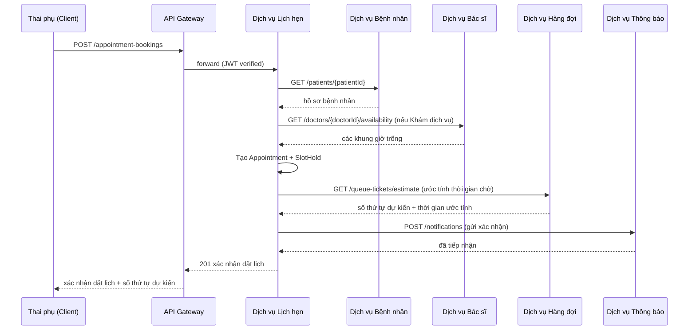
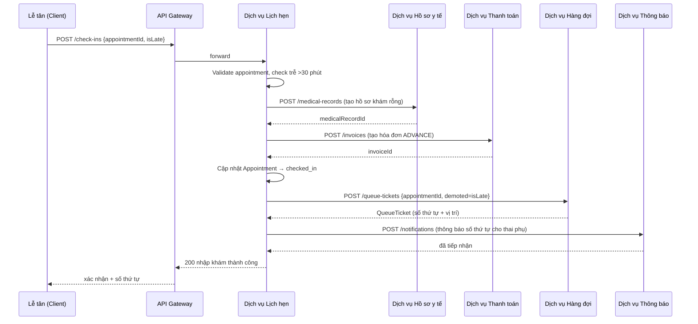
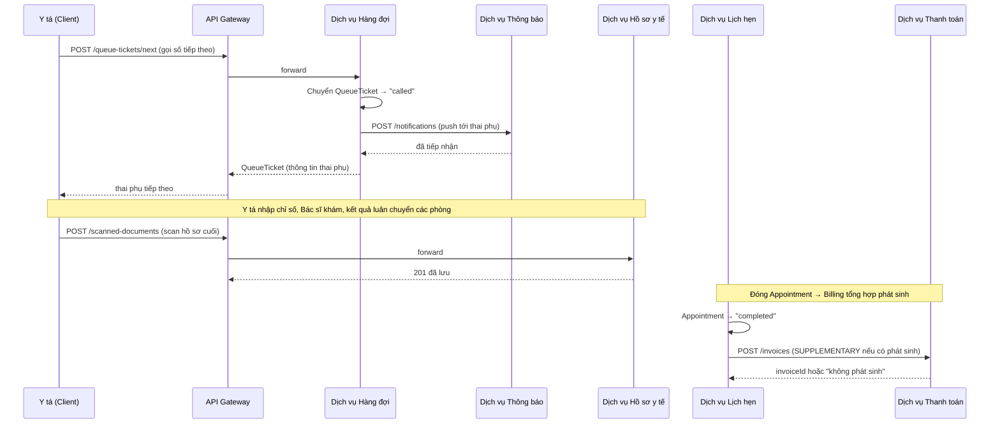
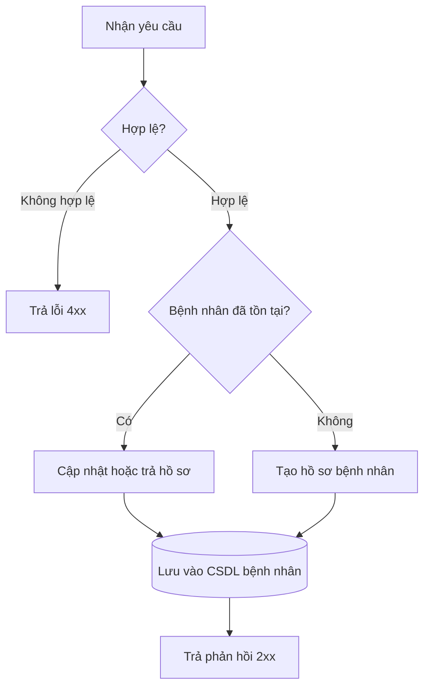
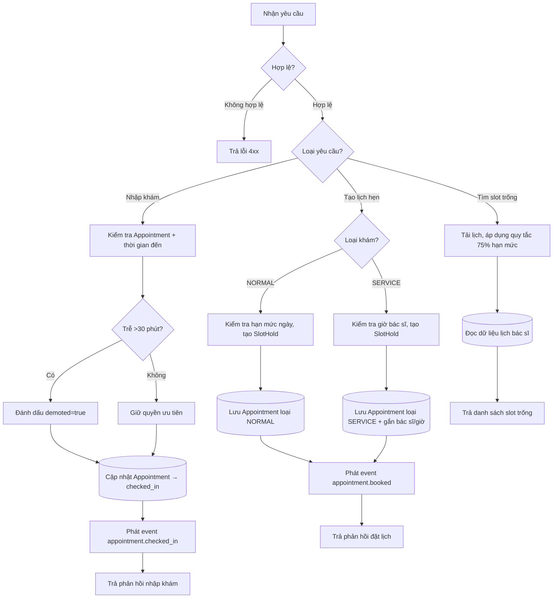
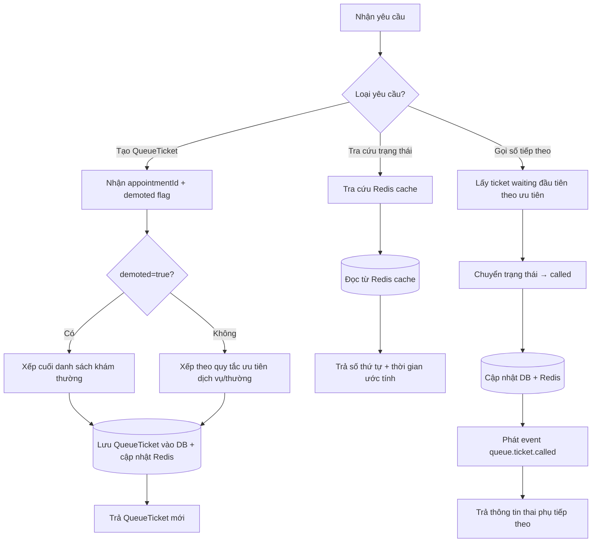
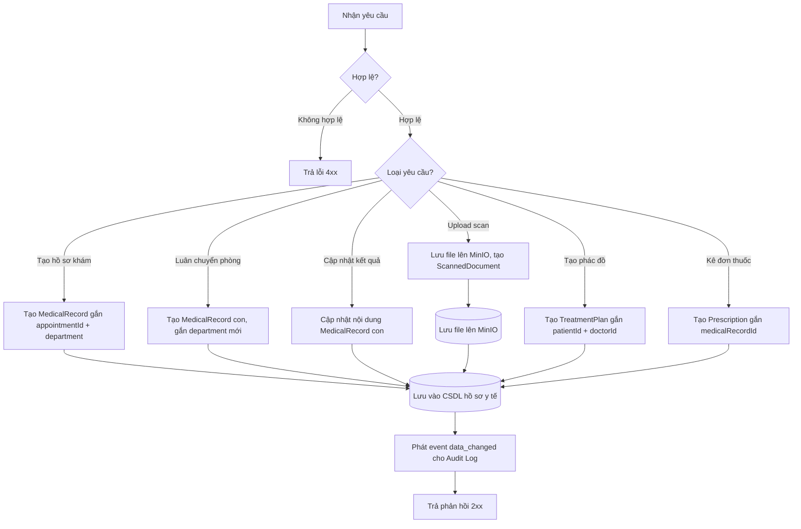
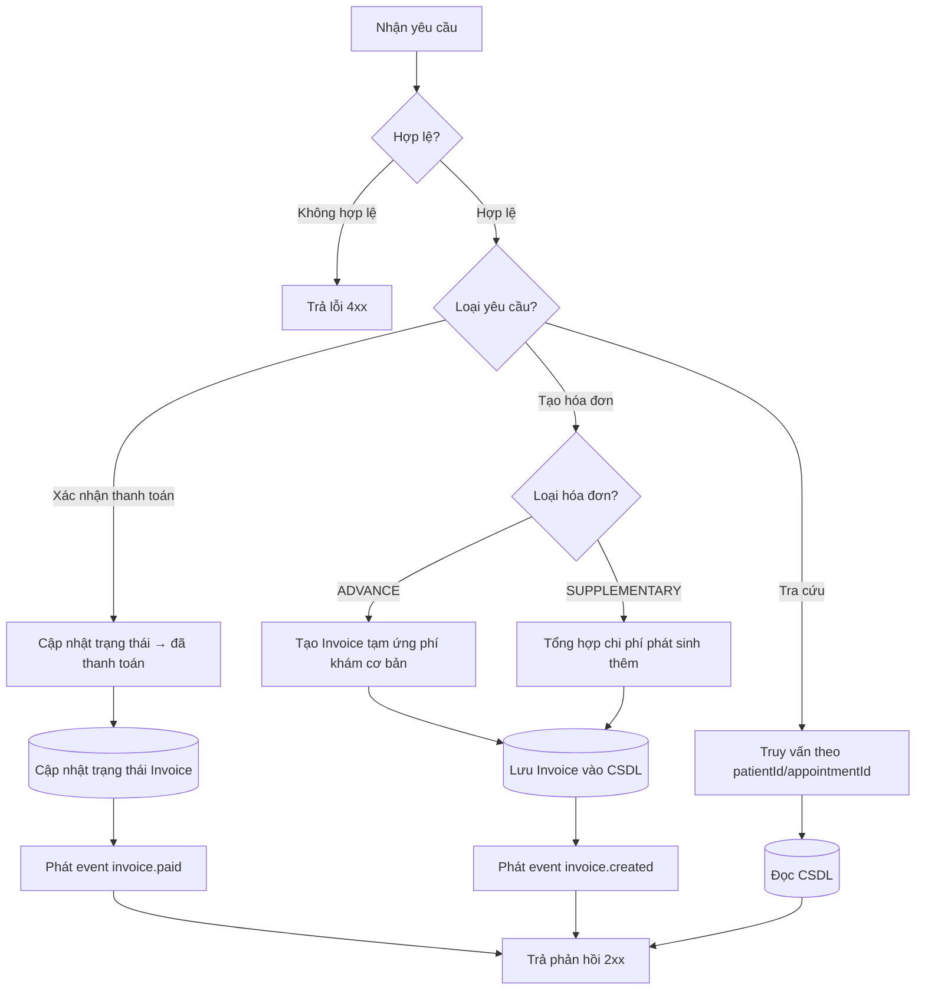

# Phân tích và Thiết kế — Giải pháp Tự động hóa Quy trình Nghiệp vụ

> **Mục tiêu**: Phân tích một quy trình nghiệp vụ cụ thể và thiết kế một giải pháp tự động hóa theo hướng dịch vụ (SOA/Microservices).
> Phạm vi: Bài tập trong 4–6 tuần — chỉ tập trung vào **một quy trình nghiệp vụ**, không phải toàn bộ hệ thống.

**Tài liệu tham khảo:**
1. *Service-Oriented Architecture: Analysis and Design for Services and Microservices* — Thomas Erl (2nd Edition)
2. *Microservices Patterns: With Examples in Java* — Chris Richardson
3. *Bài tập — Phát triển phần mềm hướng dịch vụ* — Hung Dang (available in Vietnamese)

---

## Phần 1 — Chuẩn bị Phân tích

### 1.1 Định nghĩa Quy trình Nghiệp vụ

Mô tả hoặc vẽ sơ đồ quy trình nghiệp vụ mức cao cần được tự động hóa.

- **Miền nghiệp vụ**: Hệ thống quản lý khám thai và chăm sóc thai phụ
- **Quy trình nghiệp vụ**: Quy trình khám thai từ đầu đến cuối — bao gồm đặt lịch khám thai trực tuyến, nhập khám tại bệnh viện, khám lâm sàng, thanh toán, và tư vấn/hỏi đáp. Hệ thống hỗ trợ thai phụ đặt lịch, khai báo hồ sơ, theo dõi toàn bộ quá trình chăm sóc thai kỳ (hồ sơ sức khỏe, phác đồ điều trị, đơn thuốc, hóa đơn) trực tuyến qua Web/App; giảm thời gian chờ tại bệnh viện thông qua hàng đợi số và thông báo tự động.
- **Tác nhân**: Thai phụ, Lễ tân, Bác sĩ, Y tá/Điều dưỡng/Hộ sinh, Admin.
- **Phạm vi**:
    - Thai phụ (Web/App):
        1. Đăng ký/đặt lịch khám thai — chọn ngày giờ, bác sĩ/dịch vụ phù hợp.
        2. Khai báo hồ sơ khám thai (thông tin cá nhân, tiền sử bệnh).
        3. Nhận số thứ tự (vé hàng đợi), biết vị trí xếp hàng.
        4. Nhận thông báo (nhắc lịch, thay đổi lịch, kết quả khám).
        5. Đến khám theo lịch hẹn, xác nhận định danh tại quầy lễ tân.
        6. Theo dõi hồ sơ sức khỏe thai kỳ, phác đồ điều trị, hóa đơn, đơn thuốc.
        7. Hỏi đáp, nhận tư vấn qua Chatbot AI.
        8. Theo dõi cổng thông tin bệnh viện.
    - Lễ tân (Web):
        1. Theo dõi lịch khám của thai phụ (danh sách trong ngày, trạng thái).
        2. Xác nhận định danh & xử lý thủ tục nhập khám (cấp hồ sơ khám, thu tiền, đưa vào hàng chờ).
        3. Gửi thông báo tới bác sĩ/thai phụ khi có bất thường (trễ giờ, đổi phòng, bác sĩ nghỉ).
        4. Thu thêm chi phí phát sinh sau khi khám (xét nghiệm/thuốc ngoài dự kiến).
        5. Thực hiện hồ sơ vật lý / nhập liệu thay cho thai phụ không dùng app.
        6. Hủy/đổi lịch khám thay cho thai phụ (qua điện thoại/tại quầy).
    - Bác sĩ (Web):
        1. Trả lời/giải đáp thắc mắc của thai phụ (diễn đàn, chat).
        2. Xem hồ sơ khám và kết quả nhập liệu trước khi khám.
        3. Khám lâm sàng và ghi nhận kết quả khám.
        4. Lập/cập nhật phác đồ điều trị.
        5. Kê đơn thuốc.
    - Y tá/Điều dưỡng/Hộ sinh (Web):
        1. Nhập liệu thông tin liên quan đến dịch vụ khám (đo huyết áp, cân nặng, siêu âm, xét nghiệm).
        2. Quét hồ sơ giấy và lưu lên hệ thống.
        3. Gọi số thứ tự tiếp theo trong danh sách chờ khám.
    - Admin (Web):
        1. Quản lý tài khoản người dùng (thai phụ, lễ tân, bác sĩ, y tá).
        2. Quản lý danh mục (bác sĩ, dịch vụ khám, lịch làm việc, phòng khám).
        3. Cấu hình quy tắc hàng đợi/ưu tiên (khám thường vs khám dịch vụ).
        4. Xem báo cáo, thống kê vận hành.
        5. Theo dõi nhật ký (audit log) hệ thống.

**Trong phạm vi (In-scope):**
- Đặt lịch khám thai trực tuyến, nhận số thứ tự (hàng đợi số) và thông báo nhắc lịch.
- Khai báo, lưu trữ và tra cứu hồ sơ sức khỏe thai kỳ, phác đồ điều trị, đơn thuốc, hóa đơn.
- Tư vấn/hỏi đáp qua Chatbot AI và qua diễn đàn/chat với bác sĩ.
- Lễ tân theo dõi lịch khám, gửi thông báo bất thường, xử lý thanh toán tiền mặt, hồ sơ vật lý.
- Y tá/hộ sinh nhập liệu thông tin dịch vụ khám và số hóa (quét) hồ sơ giấy.
- Admin quản trị người dùng, danh mục và xem báo cáo thống kê.

**Ngoài phạm vi (Out-of-scope):**
- Thanh toán trực tuyến qua cổng thanh toán bên thứ ba — giai đoạn đầu chỉ hỗ trợ thanh toán tiền mặt tại quầy.
- Chẩn đoán y khoa tự động — Chatbot AI chỉ tư vấn thông tin chung, không thay thế chỉ định/chẩn đoán của bác sĩ.
- Quản lý kho thuốc, dược, bảo hiểm y tế (BHYT/BHXH) — thuộc hệ thống HIS riêng của bệnh viện.
- Thiết bị IoT (máy đo tại nhà, wearable) — chưa có trong yêu cầu hiện tại.
- Đặt lịch khám các chuyên khoa khác ngoài thai sản.

**Sơ đồ quy trình:**

*(Chèn BPMN, flowchart hoặc hình ảnh vào `docs/asset/` và tham chiếu tại đây)*

### 1.2 Các Hệ thống Tự động hóa Hiện có

Liệt kê các hệ thống, cơ sở dữ liệu hoặc logic kế thừa liên quan đến quy trình này.

> *Không có — quy trình hiện đang được thực hiện thủ công.* Toàn bộ quy trình đặt lịch, nhập khám, theo dõi hàng đợi và lưu trữ hồ sơ đang được xử lý bằng giấy tờ và giao tiếp trực tiếp tại bệnh viện.

### 1.3 Yêu cầu Phi chức năng

Các yêu cầu phi chức năng là đầu vào để xác định các Ứng viên Dịch vụ Tiện ích và Vi dịch vụ ở bước 2.7.

| Yêu cầu | Mô tả cụ thể | Ảnh hưởng đến thiết kế service |
|----------|--------------|-------------------------------|
| Hiệu năng | Tra cứu trạng thái hàng đợi phản hồi < 500ms (P95); tra cứu slot khám trống < 800ms; gửi thông báo trong vòng < 2 phút kể từ sự kiện phát sinh | Cần Queue Service tách riêng, có cache (Redis) cho trạng thái hàng đợi thời gian thực; Notification Service xử lý bất đồng bộ qua message queue |
| Bảo mật | Mã hóa hồ sơ y tế (MedicalRecord, Prescription) khi lưu trữ (at-rest) và truyền tải (TLS); phân quyền RBAC theo actor (Thai phụ chỉ xem hồ sơ của mình, Bác sĩ xem hồ sơ bệnh nhân được phân công, Admin toàn quyền cấu hình) | Cần Auth Service (JWT/OAuth2) tập trung cấp token và xác thực; Authorization được kiểm tra ở API Gateway và tại từng service nghiệp vụ |
| Khả năng mở rộng | Queue Service và Notification Service cần scale độc lập vào giờ cao điểm buổi sáng (7h–9h); Chatbot AI Service cần scale theo lượng truy vấn đồng thời | Thiết kế các service này stateless, deploy độc lập (container hóa), autoscale theo tải; tách biệt khỏi các service ít biến động như Doctor/Patient Service |
| Sẵn sàng | Uptime tối thiểu 99.5% cho các service cốt lõi (Appointment, Queue); có cơ chế fallback khi Notification Service lỗi (chuyển sang kênh dự phòng SMS nếu push notification thất bại); circuit breaker giữa các service | Áp dụng health check, retry với backoff, circuit breaker (VD: Resilience4j); Notification Service có hàng đợi retry và kênh gửi dự phòng |
| Tuân thủ / Pháp lý | Lưu trữ dữ liệu y tế (MedicalRecord, TreatmentPlan, Prescription) theo quy định pháp luật về hồ sơ bệnh án; có audit trail cho mọi thao tác chỉnh sửa hóa đơn, hồ sơ y tế, cấp quyền tài khoản | Cần Audit Log Service riêng, ghi lại mọi hành động thay đổi dữ liệu nhạy cảm (ai, khi nào, thay đổi gì); dữ liệu y tế lưu trữ có thời hạn tối thiểu theo quy định, có cơ chế backup định kỳ |

---

## Phần 2 — Mô hình hóa REST/Microservices

### 2.1 Phân rã Quy trình Nghiệp vụ & 2.2 Lọc các Hành động Không phù hợp

Phân rã quy trình ở mục 1.1 thành các hành động chi tiết. Đánh dấu các hành động không phù hợp để đóng gói thành dịch vụ.

> Các hành động đánh dấu ❌: chỉ thực hiện thủ công, cần phán đoán của con người, hoặc không thể đóng gói thành dịch vụ.

**A. Đặt lịch khám thai**

> Có 2 luồng con: Khám thường chỉ chọn ngày (hệ thống tự xếp bác sĩ theo hạn mức ngày), Khám dịch vụ chọn cụ thể dịch vụ → bác sĩ → giờ.

| # | Hành động | Actor | Mô tả | Phù hợp? |
|---|-----------|-------|-------|----------|
| 1 | Chọn hình thức khám (Thường/Dịch vụ) | Thai phụ | Điều hướng sang đúng luồng con | ✅ |
| 2 | Tra cứu ngày còn hạn mức (Khám thường) | Hệ thống | Truy vấn hạn mức 75% theo ngày, tổng hợp từ lịch tất cả bác sĩ trực | ✅ |
| 3 | Chọn ngày khám | Thai phụ | Chọn 1 ngày (không chọn bác sĩ/giờ cụ thể) | ❌ |
| 4 | Tra cứu dịch vụ → bác sĩ → giờ trống (Khám dịch vụ) | Hệ thống | Truy vấn catalog dịch vụ, danh sách bác sĩ, lịch làm việc | ✅ |
| 5 | Chọn dịch vụ, bác sĩ, ngày giờ cụ thể | Thai phụ | Lựa chọn UI tuần tự | ❌ |
| 6 | Giữ chỗ tạm thời (SlotHold) | Hệ thống | Khóa hạn mức ngày hoặc giờ cụ thể trong thời gian ngắn để tránh trùng đặt | ✅ |
| 7 | Khai báo thông tin định danh (nếu chưa có) | Thai phụ | Tạo/hoàn thiện hồ sơ Patient | ✅ |
| 8 | Xác nhận đặt lịch | Thai phụ | Chốt thông tin, tạo Appointment (NORMAL hoặc SERVICE) | ✅ |
| 9 | Tính số thứ tự hàng đợi dự kiến & thời gian ước tính | Hệ thống | Trả về ngay sau khi xác nhận thành công | ✅ |
| 10 | Gửi thông báo xác nhận lịch | Hệ thống | Gửi qua app/SMS/email | ✅ |
| 11 | Thai phụ chuẩn bị giấy tờ tùy thân trước khi đến khám | Thai phụ | Hành động vật lý, ngoài hệ thống | ❌ |

**B. Nhập khám (Xác nhận định danh & Thủ tục hành chính → Hàng chờ)**

> Thanh toán phí khám cơ bản (ADVANCE) diễn ra ở bước này — TRƯỚC khi khám. Việc "vào hàng chờ" là kết quả sau khi lễ tân xử lý xong thủ tục.

| # | Hành động | Actor | Mô tả | Phù hợp? |
|---|-----------|-------|-------|----------|
| 1 | Gửi thông báo nhắc lịch hẹn | Hệ thống | Push/SMS/Email trước giờ hẹn (1 ngày và 1 giờ trước) | ✅ |
| 2 | Đến bệnh viện đúng ngày/giờ | Thai phụ | Hành động vật lý | ❌ |
| 3 | Đến bàn lễ tân | Thai phụ | Hành động vật lý | ❌ |
| 4 | Tra cứu lịch hẹn theo mã/SĐT/tên | Lễ tân | Xác định đúng thai phụ đến khám | ✅ |
| 5 | Xác nhận định danh (đối chiếu giấy tờ) | Lễ tân | Hành động vật lý (xem CCCD/giấy tờ) | ❌ |
| 6 | Cấp hồ sơ khám (tạo MedicalRecord rỗng gắn Appointment) | Lễ tân | Chuẩn bị hồ sơ cho lượt khám | ✅ |
| 7 | Thu tiền tạm ứng/phí khám cơ bản | Lễ tân | Hành động vật lý (giao nhận tiền mặt) | ❌ |
| 8 | Ghi nhận đã thu tiền, tạo Invoice loại ADVANCE | Lễ tân | Cập nhật trạng thái thanh toán trên hệ thống | ✅ |
| 9 | Đánh dấu Appointment đã nhập khám xong | Hệ thống | Trigger để sinh QueueTicket | ✅ |
| 10 | Sinh và tính vị trí vé hàng đợi (áp dụng demote nếu trễ >30 phút) | Hệ thống | Áp dụng quy tắc ưu tiên dịch vụ/thường | ✅ |
| 11 | Hướng dẫn thai phụ ngồi khu vực chờ | Lễ tân | Hành động vật lý tại chỗ | ❌ |

**C. Khám lâm sàng**

> Người gọi số là Y tá/Điều dưỡng; hồ sơ khám có thể luân chuyển qua nhiều phòng/dịch vụ; việc số hóa kết quả cuối do Y tá/Điều dưỡng scan và gửi lên.

| # | Hành động | Actor | Mô tả | Phù hợp? |
|---|-----------|-------|-------|----------|
| 1 | Xem danh sách chờ khám | Y tá | Truy vấn QueueTicket trạng thái "waiting" | ✅ |
| 2 | Gọi số thứ tự tiếp theo | Y tá | Chuyển QueueTicket sang "called" | ✅ |
| 3 | Gửi thông báo đẩy tới thai phụ | Hệ thống | Push notification khi được gọi | ✅ |
| 4 | Đo chỉ số ban đầu (cân nặng, huyết áp) | Y tá | Hành động vật lý | ❌ |
| 5 | Nhập chỉ số ban đầu vào hồ sơ | Y tá | Lưu vào MedicalRecord gắn Appointment | ✅ |
| 6 | Khám lâm sàng trực tiếp | Bác sĩ | Hành động chuyên môn vật lý (khám, siêu âm...) | ❌ |
| 7 | Luân chuyển hồ sơ sang phòng/dịch vụ khác (nếu cần) | Hệ thống | Tạo MedicalRecord con gắn department, đồng bộ trạng thái luân chuyển | ✅ |
| 8 | Thực hiện xét nghiệm/siêu âm tại phòng chuyên môn | Nhân sự phòng đó | Hành động chuyên môn vật lý | ❌ |
| 9 | Ghi nhận kết quả cận lâm sàng lên hệ thống | Nhân sự phòng đó | Cập nhật MedicalRecord con | ✅ |
| 10 | Tổng hợp kết quả từ các phòng, chẩn đoán | Bác sĩ | Xem toàn bộ MedicalRecord con qua hệ thống | ✅ |
| 11 | Lập/cập nhật phác đồ điều trị | Bác sĩ | Tạo/cập nhật TreatmentPlan | ✅ |
| 12 | Kê đơn thuốc | Bác sĩ | Tạo Prescription gắn với MedicalRecord tổng hợp | ✅ |
| 13 | Scan hồ sơ bệnh án/đơn thuốc/phác đồ và gửi lên hệ thống | Y tá | Tạo ScannedDocument, đính kèm MedicalRecord tổng hợp (is_final_summary=true) | ✅ |
| 14 | Đóng Appointment, kích hoạt luồng thanh toán bổ sung | Hệ thống | Cập nhật trạng thái "completed", phát event cho Billing Service | ✅ |

**D. Thanh toán bổ sung (sau khám)**

> Thanh toán chính (phí khám cơ bản) diễn ra ở use case Nhập khám. Use case này chỉ xử lý phần phát sinh thêm sau khi khám xong.

| # | Hành động | Actor | Mô tả | Phù hợp? |
|---|-----------|-------|-------|----------|
| 1 | Tổng hợp chi phí phát sinh thành hóa đơn bổ sung | Hệ thống | Tính từ dịch vụ thêm + thuốc, tạo Invoice loại SUPPLEMENTARY | ✅ |
| 2 | Thu tiền mặt phần phát sinh tại quầy | Lễ tân | Hành động vật lý (giao nhận tiền) | ❌ |
| 3 | Xác nhận đã thanh toán trên hệ thống | Lễ tân | Cập nhật trạng thái Invoice | ✅ |
| 4 | Gửi biên nhận điện tử | Hệ thống | Gửi thông báo/email biên nhận | ✅ |

**E. Tư vấn qua Chatbot AI / Diễn đàn**

| # | Hành động | Actor | Mô tả | Phù hợp? |
|---|-----------|-------|-------|----------|
| 1 | Gửi câu hỏi tới Chatbot | Thai phụ | Nhập câu hỏi qua giao diện chat | ✅ |
| 2 | Chatbot xử lý và trả lời tự động | Hệ thống (AI) | Dựa trên cơ sở tri thức đã duyệt | ✅ |
| 3 | Phát hiện & chuyển tiếp câu hỏi vượt khả năng cho bác sĩ | Hệ thống | Escalation dựa trên rule/độ tin cậy | ✅ |
| 4 | Bác sĩ trả lời câu hỏi được chuyển tiếp | Bác sĩ | Nhập câu trả lời qua giao diện | ✅ |
| 5 | Thai phụ đọc và tự đánh giá mức độ hữu ích | Thai phụ | Hành vi chủ quan ngoài hệ thống | ❌ |

### 2.3 Ứng viên Dịch vụ Thực thể

Xác định các thực thể nghiệp vụ và nhóm các hành động tái sử dụng được (không phụ thuộc ngữ cảnh) vào các Ứng viên Dịch vụ Thực thể.

| Thực thể | Ứng viên dịch vụ | Các hành động độc lập ngữ cảnh |
|--------|-------------------|---------------------|
| Bệnh nhân (Patient) | Dịch vụ Bệnh nhân | Tạo/cập nhật hồ sơ bệnh nhân, truy xuất định danh bệnh nhân, xác minh thông tin bệnh nhân, xem tóm tắt bệnh nhân qua các lần khám. |
| Bác sĩ (Doctor) | Dịch vụ Bác sĩ | Tra cứu danh mục bác sĩ, lấy hồ sơ bác sĩ, liệt kê bác sĩ theo dịch vụ, kiểm tra lịch trống của bác sĩ, quản lý trạng thái hoạt động/nghỉ. |
| Hồ sơ y tế (MedicalRecord) | Dịch vụ Hồ sơ y tế | Tạo hồ sơ khám (tổng hợp + con theo phòng/dịch vụ), lưu tài liệu đã quét (ScannedDocument), truy xuất hồ sơ khám, tổng hợp kết quả xét nghiệm/siêu âm, quản lý TreatmentPlan, quản lý Prescription, liên kết hồ sơ với bệnh nhân hoặc lịch hẹn. |
| Hóa đơn (Invoice) | Dịch vụ Thanh toán | Tạo hóa đơn tạm ứng (ADVANCE) khi nhập khám, tạo hóa đơn bổ sung (SUPPLEMENTARY) sau khám, xác nhận thanh toán, ghi nhận công nợ, tra cứu hóa đơn theo bệnh nhân/lịch hẹn. |

Dịch vụ thực thể phù hợp ở đây vì mỗi dịch vụ bao gói một danh từ nghiệp vụ ổn định, được tái sử dụng trong nhiều trường hợp sử dụng và có thể sở hữu dữ liệu, quy tắc riêng mà không phụ thuộc vào một luồng quy trình đơn lẻ.

### 2.4 Ứng viên Dịch vụ Tác vụ

Nhóm các hành động đặc thù theo quy trình (không độc lập ngữ cảnh) vào các Ứng viên Dịch vụ Tác vụ.

| Hành động đặc thù | Ứng viên dịch vụ tác vụ |
|---------------------|------------------------|
| Chọn hình thức khám, tra cứu ngày/dịch vụ/bác sĩ/khung giờ, giữ chỗ tạm thời (SlotHold), tạo Appointment (NORMAL/SERVICE), xác nhận nhập khám, quản lý hạn mức 75% slot online, hủy/dời lịch | Dịch vụ Lịch hẹn (Appointment Service) |
| Cấp số thứ tự (QueueTicket), tính vị trí hàng đợi theo quy tắc ưu tiên, áp dụng demote khi trễ >30 phút, ước tính thời gian chờ, gọi số thứ tự tiếp theo, cập nhật trạng thái (waiting → called → done) | Dịch vụ Hàng đợi (Queue Service) |
| Tiếp nhận câu hỏi từ thai phụ, Chatbot AI xử lý và trả lời tự động, phát hiện & escalate câu hỏi vượt khả năng sang bác sĩ, round-robin phân bổ bác sĩ trả lời | Dịch vụ Tư vấn (Consultation Service) |

Dịch vụ tác vụ được sử dụng ở đây vì các hành động này tập trung vào điều phối quy trình và yêu cầu phối hợp giữa nhiều dịch vụ thực thể, quy tắc kiểm tra và năng lực tiện ích. Chúng không đại diện cho một danh từ nghiệp vụ có thể tái sử dụng riêng lẻ.

### 2.5 Xác định Tài nguyên

Ánh xạ các thực thể/quy trình thành các tài nguyên URI REST.

| Thực thể / Quy trình | URI tài nguyên |
|------------------|--------------:|
| Bệnh nhân | /patients |
| Bác sĩ | /doctors |
| Danh mục dịch vụ khám | /services |
| Lịch hẹn | /appointments |
| Quy trình đặt lịch | /appointment-bookings |
| Quy trình nhập khám | /check-ins |
| Vé hàng đợi | /queue-tickets |
| Hồ sơ y tế | /medical-records |
| Phác đồ điều trị | /treatment-plans |
| Đơn thuốc | /prescriptions |
| Hồ sơ scan | /scanned-documents |
| Hóa đơn | /invoices |
| Luồng tư vấn | /consultation-threads |
| Thông báo | /notifications |
| Nhật ký kiểm toán | /audit-logs |

### 2.6 Gắn Năng lực với Tài nguyên và Phương thức

| Ứng viên dịch vụ | Năng lực | Tài nguyên | Phương thức HTTP |
|-------------------|------------|----------|-------------|
| Dịch vụ Bệnh nhân | Tạo hồ sơ bệnh nhân | /patients | POST |
| Dịch vụ Bệnh nhân | Cập nhật hồ sơ bệnh nhân | /patients/{patientId} | PATCH |
| Dịch vụ Bệnh nhân | Truy xuất hồ sơ bệnh nhân | /patients/{patientId} | GET |
| Dịch vụ Bệnh nhân | Xem tóm tắt bệnh nhân qua các lần khám | /patients/{patientId}/summary | GET |
| Dịch vụ Bác sĩ | Liệt kê bác sĩ theo dịch vụ | /doctors?serviceId={serviceId} | GET |
| Dịch vụ Bác sĩ | Truy xuất lịch làm việc của bác sĩ | /doctors/{doctorId}/availability | GET |
| Dịch vụ Bác sĩ | Truy xuất hồ sơ bác sĩ | /doctors/{doctorId} | GET |
| Dịch vụ Lịch hẹn | Tìm kiếm khung giờ khám thường | /appointments/availability?type=normal&date={date} | GET |
| Dịch vụ Lịch hẹn | Tạo lịch hẹn | /appointments | POST |
| Dịch vụ Lịch hẹn | Truy xuất trạng thái lịch hẹn | /appointments/{appointmentId} | GET |
| Dịch vụ Lịch hẹn | Hủy/dời lịch hẹn | /appointments/{appointmentId} | PATCH |
| Dịch vụ Lịch hẹn | Xác nhận nhập khám | /appointments/{appointmentId}/check-in | POST |
| Dịch vụ Lịch hẹn | Điều phối quá trình đặt lịch | /appointment-bookings | POST |
| Dịch vụ Lịch hẹn | Điều phối quá trình nhập khám | /check-ins | POST |
| Dịch vụ Hàng đợi | Cấp vé hàng đợi | /queue-tickets | POST |
| Dịch vụ Hàng đợi | Truy xuất trạng thái hàng đợi và thời gian ước tính | /queue-tickets/{ticketId} | GET |
| Dịch vụ Hàng đợi | Gọi số thứ tự tiếp theo | /queue-tickets/next | POST |
| Dịch vụ Hàng đợi | Đánh dấu trễ/không đến (demote) | /queue-tickets/{ticketId}/status | PATCH |
| Dịch vụ Hồ sơ y tế | Tạo hồ sơ khám | /medical-records | POST |
| Dịch vụ Hồ sơ y tế | Truy xuất hồ sơ y tế tổng hợp | /medical-records?patientId={patientId} | GET |
| Dịch vụ Hồ sơ y tế | Luân chuyển hồ sơ sang phòng/dịch vụ khác | /medical-records/{recordId}/transfer | POST |
| Dịch vụ Hồ sơ y tế | Tải lên tài liệu đã quét | /scanned-documents | POST |
| Dịch vụ Hồ sơ y tế | Tạo/cập nhật phác đồ điều trị | /treatment-plans | POST |
| Dịch vụ Hồ sơ y tế | Tạo đơn thuốc | /prescriptions | POST |
| Dịch vụ Thanh toán | Tạo hóa đơn (ADVANCE hoặc SUPPLEMENTARY) | /invoices | POST |
| Dịch vụ Thanh toán | Truy xuất hóa đơn | /invoices/{invoiceId} | GET |
| Dịch vụ Thanh toán | Xác nhận đã thanh toán | /invoices/{invoiceId}/payment | POST |
| Dịch vụ Thanh toán | Tra cứu hóa đơn theo bệnh nhân | /invoices?patientId={patientId} | GET |
| Dịch vụ Tư vấn | Gửi câu hỏi tới Chatbot | /consultation-threads | POST |
| Dịch vụ Tư vấn | Truy xuất luồng tư vấn | /consultation-threads/{threadId} | GET |
| Dịch vụ Tư vấn | Bác sĩ trả lời câu hỏi | /consultation-threads/{threadId}/replies | POST |
| Dịch vụ Thông báo | Gửi thông báo | /notifications | POST |
| Dịch vụ Thông báo | Tra cứu thông báo theo người nhận | /notifications?recipientId={id} | GET |
| Dịch vụ Xác thực | Đăng ký tài khoản | /auth/register | POST |
| Dịch vụ Xác thực | Đăng nhập | /auth/login | POST |
| Dịch vụ Xác thực | Làm mới token | /auth/refresh | POST |
| Dịch vụ Ghi nhật ký | Ghi nhật ký kiểm toán | /audit-logs | POST |
| Dịch vụ Ghi nhật ký | Tra cứu nhật ký | /audit-logs?entityType={type}&entityId={id} | GET |

### 2.7 Ứng viên Dịch vụ Tiện ích & Vi dịch vụ

Dựa trên các yêu cầu phi chức năng (1.3) và yêu cầu xử lý, xác định các logic tiện ích cắt ngang hoặc logic cần mức tự chủ/hiệu năng cao.

| Ứng viên | Loại (Tiện ích / Vi dịch vụ) | Lý do |
|-----------|-------------------------------|-------|
| Dịch vụ Thông báo (Notification Service) | Tiện ích | Cung cấp chức năng gửi nhắc lịch, push notification, SMS cho xác nhận đặt lịch, nhắc lịch hẹn, thông báo mời bệnh nhân vào khám, thông báo bất thường (bác sĩ nghỉ, đổi lịch). Đây là năng lực cắt ngang được tái sử dụng bởi mọi quy trình. NFR yêu cầu gửi < 2 phút từ khi sự kiện phát sinh, xử lý bất đồng bộ qua message queue, có fallback SMS khi push thất bại. |
| Dịch vụ Xác thực (Auth Service) | Tiện ích | Tập trung hóa đăng nhập, phát hành JWT/Refresh Token và kiểm soát truy cập RBAC theo 5 actor (Thai phụ, Lễ tân, Bác sĩ, Y tá, Admin). NFR yêu cầu mã hóa tại rest/transit, phân quyền nghiêm ngặt — logic nhạy cảm bảo mật không nên bị sao chép giữa các dịch vụ. |
| Dịch vụ Lưu trữ Tệp (File Storage Service) | Tiện ích | Lưu trữ các tài liệu y tế đã quét (ScannedDocument), phiếu siêu âm và các tệp đính kèm mà không gắn lưu trữ nhị phân vào các dịch vụ nghiệp vụ. Sử dụng MinIO (S3-compatible) để tách biệt binary storage. |
| Dịch vụ Ghi nhật ký Kiểm toán (Audit Log Service) | Tiện ích | NFR yêu cầu audit trail cho mọi thao tác chỉnh sửa hóa đơn, hồ sơ y tế, cấp quyền tài khoản theo quy định pháp luật. Ghi lại thao tác y tế, lễ tân và đặt lịch (ai, khi nào, thay đổi gì) để phục vụ truy vết và tuân thủ. Đây là năng lực cắt ngang nên được tái sử dụng bởi toàn bộ hệ thống. |

Các dịch vụ tiện ích chỉ được chọn khi logic mang tính chia sẻ, hạ tầng hoặc định hướng bảo mật/tuân thủ. Năng lực ước tính hàng đợi được gộp vào Queue Service (mục 2.4) thay vì tách riêng thành vi dịch vụ, vì logic này gắn chặt với trạng thái hàng đợi và cần truy xuất cùng dữ liệu QueueTicket.

### 2.8 Ứng viên Kết hợp Dịch vụ

Sơ đồ tương tác cho thấy các ứng viên dịch vụ phối hợp như thế nào để hoàn thành quy trình nghiệp vụ.

**Luồng 1 — Đặt lịch khám thai**

**Luồng 2 — Nhập khám (Lễ tân xử lý → Sinh hàng đợi)**

**Luồng 3 — Khám lâm sàng (Y tá gọi số → Bác sĩ khám → Đóng)**

---

## Phần 3 — Thiết kế Hướng Dịch vụ

### 3.1 Thiết kế Hợp đồng Thống nhất

Đặc tả hợp đồng dịch vụ cho từng dịch vụ. Đặc tả OpenAPI đầy đủ:
- [`docs/api-specs/patient-service.yaml`](api-specs/patient-service.yaml)
- [`docs/api-specs/appointment-service.yaml`](api-specs/appointment-service.yaml)
- [`docs/api-specs/queue-service.yaml`](api-specs/queue-service.yaml)
- [`docs/api-specs/medical-record-service.yaml`](api-specs/medical-record-service.yaml)
- [`docs/api-specs/billing-service.yaml`](api-specs/billing-service.yaml)
- [`docs/api-specs/consultation-service.yaml`](api-specs/consultation-service.yaml)
- [`docs/api-specs/notification-service.yaml`](api-specs/notification-service.yaml)

**Dịch vụ Bệnh nhân (Patient Service)**

| Endpoint | Phương thức | Kiểu dữ liệu | Yêu cầu | Mã phản hồi |
|----------|------------|-------------|---------|-------------|
| /health | GET | application/json | Không có | 200 |
| /patients | POST | application/json | PatientCreateRequest | 201, 400, 409 |
| /patients/{patientId} | GET | application/json | Không có | 200, 404 |
| /patients/{patientId} | PATCH | application/json | PatientUpdateRequest | 200, 400, 404 |
| /patients/{patientId}/summary | GET | application/json | Không có | 200, 404 |

**Dịch vụ Lịch hẹn (Appointment Service)**

| Endpoint | Phương thức | Kiểu dữ liệu | Yêu cầu | Mã phản hồi |
|----------|------------|-------------|---------|-------------|
| /health | GET | application/json | Không có | 200 |
| /services | GET | application/json | Không có | 200 |
| /doctors?serviceId={serviceId} | GET | application/json | Không có | 200, 404 |
| /doctors/{doctorId}/availability | GET | application/json | Không có | 200, 404 |
| /appointments/availability?type={type}&date={date} | GET | application/json | Không có | 200, 400 |
| /appointments | POST | application/json | AppointmentCreateRequest | 201, 400, 409 |
| /appointments/{appointmentId} | GET | application/json | Không có | 200, 404 |
| /appointments/{appointmentId} | PATCH | application/json | AppointmentUpdateRequest | 200, 400, 404 |
| /appointments/{appointmentId}/check-in | POST | application/json | CheckInRequest | 200, 400, 404, 409 |
| /appointment-bookings | POST | application/json | BookingRequest | 201, 400, 409 |
| /check-ins | POST | application/json | CheckInRequest | 200, 400, 404 |

**Dịch vụ Hàng đợi (Queue Service)**

| Endpoint | Phương thức | Kiểu dữ liệu | Yêu cầu | Mã phản hồi |
|----------|------------|-------------|---------|-------------|
| /health | GET | application/json | Không có | 200 |
| /queue-tickets | POST | application/json | QueueTicketCreateRequest | 201, 400 |
| /queue-tickets/{ticketId} | GET | application/json | Không có | 200, 404 |
| /queue-tickets/{ticketId}/status | PATCH | application/json | StatusUpdateRequest | 200, 400, 404 |
| /queue-tickets/next | POST | application/json | NextTicketRequest | 200, 404 |
| /queue-tickets/estimate | GET | application/json | Không có | 200 |

**Dịch vụ Hồ sơ y tế (Medical Record Service)**

| Endpoint | Phương thức | Kiểu dữ liệu | Yêu cầu | Mã phản hồi |
|----------|------------|-------------|---------|-------------|
| /health | GET | application/json | Không có | 200 |
| /medical-records | POST | application/json | MedicalRecordCreateRequest | 201, 400 |
| /medical-records?patientId={patientId} | GET | application/json | Không có | 200 |
| /medical-records/{recordId} | GET | application/json | Không có | 200, 404 |
| /medical-records/{recordId} | PATCH | application/json | MedicalRecordUpdateRequest | 200, 400, 404 |
| /medical-records/{recordId}/transfer | POST | application/json | TransferRequest | 200, 400, 404 |
| /scanned-documents | POST | multipart/form-data | ScannedDocumentUpload | 201, 400, 413 |
| /treatment-plans | POST | application/json | TreatmentPlanCreateRequest | 201, 400 |
| /treatment-plans/{planId} | PATCH | application/json | TreatmentPlanUpdateRequest | 200, 400, 404 |
| /prescriptions | POST | application/json | PrescriptionCreateRequest | 201, 400 |

**Dịch vụ Thanh toán (Billing Service)**

| Endpoint | Phương thức | Kiểu dữ liệu | Yêu cầu | Mã phản hồi |
|----------|------------|-------------|---------|-------------|
| /health | GET | application/json | Không có | 200 |
| /invoices | POST | application/json | InvoiceCreateRequest | 201, 400 |
| /invoices/{invoiceId} | GET | application/json | Không có | 200, 404 |
| /invoices/{invoiceId}/payment | POST | application/json | PaymentConfirmRequest | 200, 400, 404 |
| /invoices?patientId={patientId} | GET | application/json | Không có | 200 |
| /invoices?appointmentId={appointmentId} | GET | application/json | Không có | 200 |

**Dịch vụ Tư vấn (Consultation Service)**

| Endpoint | Phương thức | Kiểu dữ liệu | Yêu cầu | Mã phản hồi |
|----------|------------|-------------|---------|-------------|
| /health | GET | application/json | Không có | 200 |
| /consultation-threads | POST | application/json | ThreadCreateRequest | 201, 400 |
| /consultation-threads/{threadId} | GET | application/json | Không có | 200, 404 |
| /consultation-threads/{threadId}/replies | POST | application/json | ReplyCreateRequest | 201, 400, 404 |
| /consultation-threads?patientId={patientId} | GET | application/json | Không có | 200 |

**Dịch vụ Thông báo (Notification Service)**

| Endpoint | Phương thức | Kiểu dữ liệu | Yêu cầu | Mã phản hồi |
|----------|------------|-------------|---------|-------------|
| /health | GET | application/json | Không có | 200 |
| /notifications | POST | application/json | NotificationSendRequest | 201, 400 |
| /notifications?recipientId={id} | GET | application/json | Không có | 200 |
| /notifications/{notificationId}/read | PATCH | application/json | Không có | 200, 404 |

### 3.2 Thiết kế Luồng Xử lý của Dịch vụ

Luồng xử lý nội bộ cho từng dịch vụ.

**Dịch vụ Bệnh nhân (Patient Service)**

**Dịch vụ Lịch hẹn (Appointment Service)**

**Dịch vụ Hàng đợi (Queue Service)**

**Dịch vụ Hồ sơ y tế (Medical Record Service)**

**Dịch vụ Thanh toán (Billing Service)**

