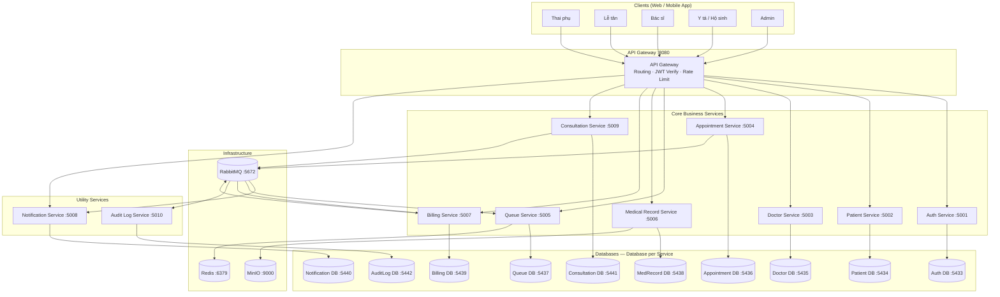
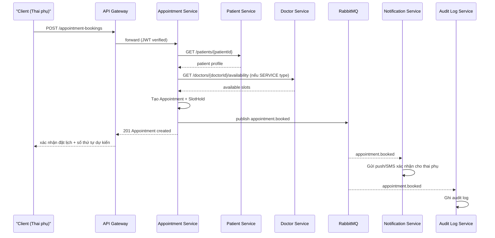
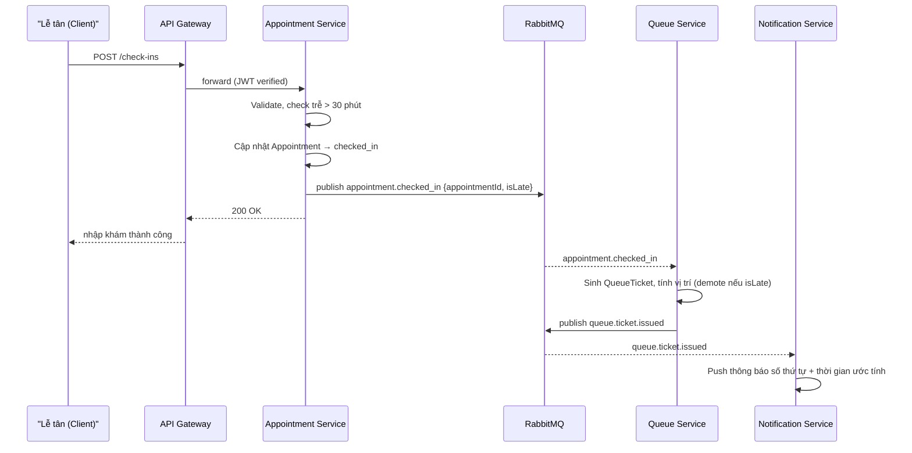

# Kiến trúc Hệ thống — Hệ thống Quản lý Khám Thai và Chăm sóc Thai phụ

> Tài liệu này được hoàn thiện **sau** [Phân tích & Thiết kế](analysis-and-design.md).
> Dựa trên các Ứng viên Dịch vụ (Bước 7) và Yêu cầu Phi chức năng (Bước 6) đã xác định, lựa chọn pattern kiến trúc phù hợp và thiết kế kiến trúc triển khai.

**Tài liệu tham khảo:**
1. *Service-Oriented Architecture: Analysis and Design for Services and Microservices* — Thomas Erl (2nd Edition)
2. *Microservices Patterns: With Examples in Java* — Chris Richardson
3. *Bài tập — Phát triển phần mềm hướng dịch vụ* — Hung Dang (available in Vietnamese)

---

## 1. Lựa chọn Pattern Kiến trúc


| Pattern | Áp dụng? | Lý do Nghiệp vụ / Kỹ thuật |
|---------|----------|----------------------------|
| **API Gateway** | ✅ Có | Tất cả client (Web/App của thai phụ, lễ tân, bác sĩ, y tá, admin) đều đi qua một điểm vào duy nhất. Gateway đảm nhận routing tới đúng service, kiểm tra JWT (xác thực tầng đầu vào) và rate-limiting. Giảm coupling trực tiếp client–service. |
| **Database per Service** | ✅ Có | Mỗi service sở hữu schema/database riêng (Patient DB, Appointment DB, Queue DB, Medical Record DB, Billing DB...). Đảm bảo loose coupling — thay đổi schema của một service không ảnh hưởng service khác; phù hợp với yêu cầu scale độc lập của Queue Service và Notification Service vào giờ cao điểm. |
| **Shared Database** | ❌ Không | Không áp dụng — vi phạm nguyên tắc service autonomy. Mỗi service có DB riêng theo pattern Database per Service ở trên. |
| **Saga (Choreography)** | ✅ Có | Luồng Đặt lịch khám và Nhập khám trải dài nhiều service (Appointment → Queue → Notification → Billing). Dùng Saga choreography qua message queue (RabbitMQ): mỗi service publish event sau khi hoàn thành bước của mình, service tiếp theo lắng nghe và phản ứng. Không dùng Orchestration để tránh service điều phối trung tâm trở thành điểm lỗi. |
| **Event-driven / Message Queue** | ✅ Có | NFR: thông báo phải gửi < 2 phút sau khi sự kiện phát sinh; Queue Service cần xử lý bất đồng bộ và không chặn luồng Appointment. Dùng RabbitMQ làm message broker cho các event: `appointment.booked`, `appointment.checked_in`, `appointment.cancelled`, `queue.ticket.called`, `invoice.created`. Notification Service subscribe toàn bộ các event này. |
| **CQRS** | ⚠️ Một phần | Áp dụng giới hạn cho **Queue Service**: tách Write model (cập nhật trạng thái QueueTicket) và Read model (truy vấn số thứ tự, thời gian ước tính < 500ms P95) qua Redis cache. Không áp dụng toàn hệ thống vì tăng độ phức tạp không cần thiết cho các service ít đọc ghi đồng thời. |
| **Circuit Breaker** | ✅ Có | NFR yêu cầu uptime ≥ 99.5% cho Appointment và Queue Service. Áp dụng Circuit Breaker (Resilience4j) giữa: Appointment Service ↔ Patient Service; Appointment Service ↔ Doctor Service; Task Service ↔ Queue Service. Khi một service downstream lỗi, Circuit Breaker mở và trả về fallback thay vì để lỗi lan truyền. |
| **Service Registry / Discovery** | ✅ Có | Với nhiều service containerized (Docker), cần Service Discovery để API Gateway và các service tìm được nhau mà không hardcode IP. Dùng DNS resolution tích hợp trong Docker Compose cho môi trường dev; có thể mở rộng sang Kubernetes Service Discovery cho production. |
| **Strangler Fig** | ⚠️ Không áp dụng ngay | Hệ thống xây mới từ đầu, không có legacy system cần chuyển đổi dần. Ghi nhận để tham khảo khi tích hợp HIS bệnh viện trong tương lai. |

> **Tham khảo:** *Microservices Patterns* — Chris Richardson, chương về Decomposition, Data Management, và Communication Patterns.

---

## 2. Thành phần Hệ thống

> Port quy ước: Gateway 8080; Frontend 3000; mỗi service backend 50xx; DB/infra 54xx/63xx/90xx.

| Thành phần | Trách nhiệm | Tech Stack | Port |
|------------|-------------|------------|------|
| **Web/App Client** | Giao diện cho Thai phụ (đặt lịch, xem hồ sơ, chatbot), Lễ tân (nhập khám, hàng đợi), Bác sĩ (diễn đàn, hồ sơ bệnh nhân), Y tá (nhập liệu, scan), Admin (quản trị) | ReactJS (Web) / React Native (App) | 3000 |
| **API Gateway** | Điểm vào duy nhất; routing request tới đúng service; xác thực JWT; rate-limiting; logging request | NestJS / Nginx | 8080 |
| **Auth Service** | Đăng ký, đăng nhập, phát hành JWT/Refresh Token; RBAC theo 5 actor; thu hồi token | NestJS, PostgreSQL | 5001 |
| **Patient Service** | Tạo/cập nhật/truy xuất hồ sơ Patient; tra cứu định danh; tóm tắt bệnh nhân qua các lần khám | NestJS, PostgreSQL | 5002 |
| **Doctor Service** | Quản lý danh mục bác sĩ; lịch làm việc; tra cứu bác sĩ theo dịch vụ; quản lý trạng thái hoạt động/nghỉ | NestJS, PostgreSQL | 5003 |
| **Appointment Service** | Tạo/đọc/dời/hủy Appointment (NORMAL & SERVICE); quản lý hạn mức 75% slot online; giữ chỗ tạm thời (SlotHold); xác nhận nhập khám; phát event `appointment.*` | NestJS, PostgreSQL | 5004 |
| **Queue Service** | Cấp QueueTicket; tính vị trí hàng đợi và thời gian ước tính; áp dụng quy tắc demote (trễ > 30 phút); cập nhật trạng thái (waiting → called → done); cache trạng thái bằng Redis | NestJS, PostgreSQL + Redis | 5005 |
| **Medical Record Service** | Lưu MedicalRecord (tổng hợp + con theo phòng/dịch vụ); quản lý TreatmentPlan, Prescription, ScannedDocument; tổng hợp kết quả cận lâm sàng | NestJS, PostgreSQL + MinIO | 5006 |
| **Billing Service** | Tạo Invoice (ADVANCE khi nhập khám, SUPPLEMENTARY sau khám); xác nhận thanh toán; ghi nhận công nợ | NestJS, PostgreSQL | 5007 |
| **Notification Service** | Subscribe event từ RabbitMQ; gửi push notification, SMS, Email(Nodemailer); fallback và retry với exponential backoff | NestJS, PostgreSQL, RabbitMQ consumer | 5008 |
| **Consultation Service** | Quản lý ConsultationThread; tích hợp Chatbot AI (OpenAI API); escalation câu hỏi sang bác sĩ trực; round-robin phân bổ bác sĩ trả lời | NestJS, PostgreSQL | 5009 |
| **Audit Log Service** | Ghi nhận mọi thao tác thay đổi dữ liệu nhạy cảm (ai, khi nào, thay đổi gì); phục vụ tuân thủ pháp lý | NestJS, PostgreSQL (append-only) | 5010 |
| **RabbitMQ** | Message broker bất đồng bộ giữa các service; đảm bảo Notification và Queue Service không bị chặn bởi luồng Appointment | RabbitMQ 3 | 5672 / 15672 |
| **Redis Cache** | Cache trạng thái hàng đợi thời gian thực cho Queue Service; đảm bảo tra cứu < 500ms P95 | Redis 7 | 6379 |
| **MinIO** | Lưu trữ file scan hồ sơ y tế (ScannedDocument); tách biệt binary storage khỏi database | MinIO (S3-compatible) | 9000 / 9001 |
| **Auth DB** | Database riêng cho Auth Service | PostgreSQL | 5433 |
| **Patient DB** | Database riêng cho Patient Service | PostgreSQL | 5434 |
| **Doctor DB** | Database riêng cho Doctor Service | PostgreSQL | 5435 |
| **Appointment DB** | Database riêng cho Appointment Service | PostgreSQL | 5436 |
| **Queue DB** | Database riêng cho Queue Service | PostgreSQL | 5437 |
| **MedicalRecord DB** | Database riêng cho Medical Record Service | PostgreSQL | 5438 |
| **Billing DB** | Database riêng cho Billing Service | PostgreSQL | 5439 |
| **Notification DB** | Database riêng cho Notification Service | PostgreSQL | 5440 |
| **Consultation DB** | Database riêng cho Consultation Service | PostgreSQL | 5441 |
| **Audit Log DB** | Database riêng cho Audit Log Service (append-only) | PostgreSQL | 5442 |

---

## 3. Giao tiếp giữa các Service

### 3.1 Chiến lược giao tiếp

| Loại giao tiếp | Pattern | Sử dụng khi nào |
|----------------|---------|-----------------|
| **Đồng bộ (Sync)** | REST/HTTP | Client → Gateway → Service; Service → Service khi cần kết quả ngay (VD: Appointment Service gọi Patient Service để verify bệnh nhân trước khi tạo lịch) |
| **Bất đồng bộ (Async)** | Event qua RabbitMQ | Service phát event sau khi hoàn thành nghiệp vụ; các service downstream subscribe và xử lý độc lập (VD: `appointment.booked` → Notification Service gửi xác nhận) |

### 3.2 Ma trận giao tiếp giữa các Service

> **HTTP** = gọi REST đồng bộ | **EVENT** = gửi/nhận event bất đồng bộ qua RabbitMQ | **—** = không giao tiếp trực tiếp

| Từ → Đến | Auth | Patient | Doctor | Appointment | Queue | MedRecord | Billing | Notification | Consultation | AuditLog |
|----------|------|---------|--------|-------------|-------|-----------|---------|--------------|--------------|----------|
| **API Gateway** | HTTP | HTTP | HTTP | HTTP | HTTP | HTTP | HTTP | HTTP | HTTP | HTTP |
| **Appointment Svc** | — | HTTP (verify) | HTTP (verify/slot) | — | EVENT (checked_in) | — | EVENT (completed) | EVENT (booked, cancelled) | — | EVENT |
| **Queue Svc** | — | — | — | HTTP (query detail) | — | — | — | EVENT (ticket.called) | — | EVENT |
| **Medical Record Svc** | — | HTTP (verify) | HTTP (verify) | HTTP (verify) | — | — | — | — | — | EVENT |
| **Billing Svc** | — | — | — | HTTP (query) | — | HTTP (query) | — | EVENT (invoice.paid) | — | EVENT |
| **Notification Svc** | — | — | — | — | — | — | — | — | — | — |
| **Consultation Svc** | — | HTTP (get info) | HTTP (get/assign) | — | — | — | — | EVENT (new question) | — | EVENT |
| **Audit Log Svc** | — | — | — | — | — | — | — | — | — | — |

### 3.3 Danh sách Event (RabbitMQ Topics)

| Event | Publisher | Subscriber(s) | Mô tả |
|-------|-----------|---------------|-------|
| `appointment.booked` | Appointment Service | Notification Service, Audit Log | Gửi thông báo xác nhận đặt lịch cho thai phụ |
| `appointment.reminder` | Appointment Service (scheduled) | Notification Service | Nhắc lịch hẹn trước 1 ngày và 1 giờ |
| `appointment.cancelled` | Appointment Service | Notification Service, Queue Service | Thông báo hủy; giải phóng QueueTicket nếu có |
| `appointment.checked_in` | Appointment Service | Queue Service | Trigger sinh QueueTicket, tính vị trí hàng đợi |
| `appointment.completed` | Appointment Service | Billing Service | Trigger tổng hợp chi phí phát sinh → Invoice SUPPLEMENTARY |
| `appointment.doctor_unavailable` | Appointment Service | Notification Service | Thông báo bác sĩ nghỉ đột xuất, đề xuất đổi lịch |
| `queue.ticket.called` | Queue Service | Notification Service | Push notification mời thai phụ vào phòng khám |
| `invoice.created` | Billing Service | Notification Service | Thông báo có hóa đơn cần thanh toán |
| `invoice.paid` | Billing Service | Notification Service, Audit Log | Xác nhận thanh toán, gửi biên nhận điện tử |
| `consultation.escalated` | Consultation Service | Notification Service | Thông báo bác sĩ có câu hỏi cần trả lời |
| `*.data_changed` | Mọi service nghiệp vụ | Audit Log Service | Ghi nhận mọi thao tác thay đổi dữ liệu nhạy cảm |

---

## 4. Sơ đồ Kiến trúc

### 4.1 Sơ đồ thành phần tổng thể



### 4.2 Luồng Đặt lịch khám (Saga Choreography)



### 4.3 Luồng Nhập khám → Sinh hàng đợi (Saga Choreography)



---

## 5. Phân quyền RBAC

| Actor | Role (JWT) | Quyền truy cập |
|-------|-----------|----------------|
| **Thai phụ** | `PATIENT` | Xem/sửa hồ sơ của chính mình; đặt/hủy lịch; xem hàng đợi, hóa đơn, đơn thuốc của chính mình; dùng chatbot/diễn đàn |
| **Lễ tân** | `RECEPTIONIST` | Tra cứu/xem tất cả appointment trong ngày; xác nhận nhập khám; tạo Invoice; gửi thông báo bất thường; hủy/đổi lịch thay thai phụ |
| **Bác sĩ** | `DOCTOR` | Xem hồ sơ bệnh nhân được phân công; xem/cập nhật MedicalRecord; lập TreatmentPlan; kê Prescription; trả lời diễn đàn |
| **Y tá / Hộ sinh** | `NURSE` | Nhập chỉ số lâm sàng vào MedicalRecord; upload ScannedDocument; gọi số thứ tự tiếp theo trong Queue |
| **Admin** | `ADMIN` | Toàn quyền quản lý tài khoản, danh mục, cấu hình quy tắc hàng đợi; xem báo cáo thống kê; xem Audit Log |

> JWT payload chứa `userId`, `role`, `sub`. API Gateway verify chữ ký và forward header `X-User-Id`, `X-User-Role` xuống từng service. Mỗi service tự kiểm tra phân quyền tại business layer.

---

## 6. Chiến lược xử lý lỗi & Sẵn sàng

| Tình huống lỗi | Chiến lược |
|----------------|-----------|
| **Service downstream không phản hồi** | Circuit Breaker (Resilience4j) mở sau N lần timeout; trả 503 có thông báo rõ ràng thay vì treo request |
| **Gửi thông báo thất bại (push)** | Notification Service retry 3 lần với exponential backoff; sau đó fallback sang SMS (VNPT/Viettel API) |
| **Race condition giữ chỗ slot** | Appointment Service dùng ràng buộc UNIQUE + row-level lock ở DB; 1 request thành công, request còn lại nhận 409 Conflict + gợi ý slot thay thế |
| **Message Queue tạm thời ngừng** | Service ghi event vào local outbox table (Outbox Pattern); background job retry khi RabbitMQ phục hồi |
| **Redis Cache down** | Queue Service fallback đọc thẳng PostgreSQL; hiệu năng giảm nhưng hệ thống vẫn hoạt động |
| **Service lỗi giữa Saga** | Service publish compensating event để rollback; VD: Queue Service fail → `queue.ticket.failed` → Appointment Service rollback trạng thái checked_in |

---

## 7. Triển khai (Deployment)

### 7.1 Môi trường Development

- Tất cả service containerized bằng **Docker**
- Orchestrate bằng **Docker Compose** — khởi động toàn bộ hệ thống:

```bash
docker compose up --build
```

- Mỗi service có `Dockerfile` riêng tại `/services/<service-name>/`
- File `.env` cho từng service quản lý DB connection string, JWT secret, RabbitMQ URL...

### 7.2 Thứ tự khởi động (Docker Compose `depends_on`)

```
PostgreSQL instances + Redis + RabbitMQ + MinIO
    → Auth Service
    → Patient Service, Doctor Service          (song song)
    → Medical Record Service, Billing Service, Audit Log Service  (song song)
    → Appointment Service
    → Queue Service
    → Notification Service, Consultation Service  (song song)
    → API Gateway
    → Frontend
```

### 7.3 Cấu hình Docker Compose (tóm tắt)

| Service | Image | Env vars chính |
|---------|-------|----------------|
| `api-gateway` | `node:20-alpine` | `AUTH_SERVICE_URL`, `JWT_SECRET` |
| `auth-service` | `node:20-alpine` | `DATABASE_URL`, `JWT_SECRET`, `JWT_EXPIRES_IN` |
| `patient-service` | `node:20-alpine` | `DATABASE_URL` |
| `doctor-service` | `node:20-alpine` | `DATABASE_URL` |
| `appointment-service` | `node:20-alpine` | `DATABASE_URL`, `RABBITMQ_URL`, `PATIENT_SERVICE_URL`, `DOCTOR_SERVICE_URL` |
| `queue-service` | `node:20-alpine` | `DATABASE_URL`, `RABBITMQ_URL`, `REDIS_URL` |
| `medical-record-service` | `node:20-alpine` | `DATABASE_URL`, `MINIO_ENDPOINT`, `MINIO_ACCESS_KEY` |
| `billing-service` | `node:20-alpine` | `DATABASE_URL`, `RABBITMQ_URL` |
| `notification-service` | `node:20-alpine` | `DATABASE_URL`, `RABBITMQ_URL`, `FCM_SERVER_KEY`, `SMS_API_KEY` |
| `consultation-service` | `node:20-alpine` | `DATABASE_URL`, `RABBITMQ_URL`, `OPENAI_API_KEY` |
| `audit-log-service` | `node:20-alpine` | `DATABASE_URL`, `RABBITMQ_URL` |
| `rabbitmq` | `rabbitmq:3-management` | `RABBITMQ_DEFAULT_USER`, `RABBITMQ_DEFAULT_PASS` |
| `redis` | `redis:7-alpine` | — |
| `minio` | `minio/minio` | `MINIO_ROOT_USER`, `MINIO_ROOT_PASSWORD` |

### 7.4 Hướng mở rộng sang Production

- Thay Docker Compose bằng **Kubernetes**; thêm **HPA** cho Queue Service và Notification Service (scale vào giờ cao điểm 7h–9h)
- Thêm **Ingress Controller** (Nginx/Traefik) thay thế API Gateway đơn giản
- Cân nhắc **Kafka** thay RabbitMQ nếu cần replay event và audit stream quy mô lớn
- Tích hợp HIS bệnh viện thông qua **Anti-Corruption Layer** (pattern Strangler Fig)
