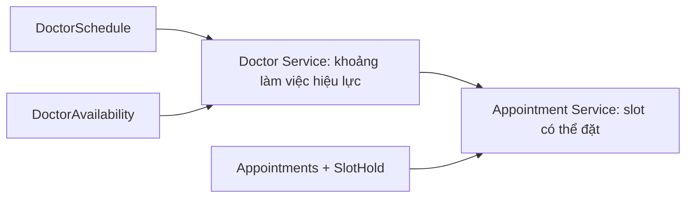
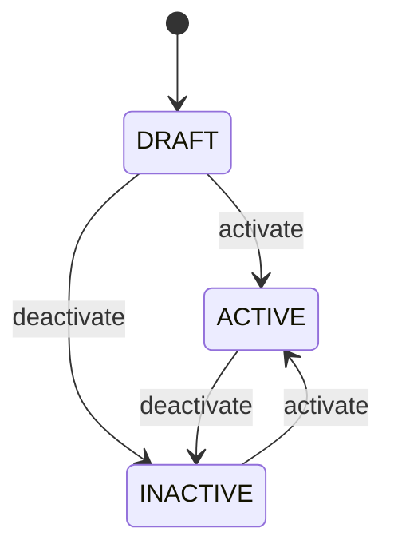

# Doctor Service — Service Specification

Đặc tả này được xây dựng từ `docs/quy-hoach-microservices-use-case-thai-phu-kham-thai.md`, `docs/use-case-flow-thai-phu-kham-thai.md` và `docs/service-specification-template.md`.

Mục tiêu là chốt boundary và contract đủ rõ để review, viết OpenAPI, migration và giao cho coding agent. Đây là bản thiết kế, chưa phải mô tả implementation hiện có.

---

## Version / Change Log

| Version | Date | Change | Impact |
|---|---|---|---|
| Draft-2026-09-22-rank-pricing | 2026-09-22 | Bổ sung quyết định Doctor Service phải sở hữu rank/phân loại bác sĩ chuẩn hóa, ví dụ `consultationRank`, để Service Catalog map giá/phụ phí theo rank. `professionalTitle` chỉ dùng hiển thị và không được dùng để tính giá. | Cần cập nhật Doctor schema/API/OpenAPI trước khi implement pricing theo rank ở Catalog/Appointment. Doctor Service vẫn không sở hữu giá tiền. |

---

## 1. Tổng quan và Boundary

| Thuộc tính | Giá trị |
|---|---|
| **Tên service** | Doctor Service |
| **Mục đích** | Quản lý thông tin bác sĩ cần cho quy trình khám thai: hồ sơ công khai, chuyên khoa, lịch nhận khám và các khoảng khả dụng/không khả dụng. Service cung cấp dữ liệu để thai phụ chọn bác sĩ và để Appointment Service xác nhận bác sĩ có thể nhận lịch. |
| **Bounded context** | Doctor Directory & Working Availability; không phải hệ thống HR và không sở hữu lịch hẹn khám |
| **Actors/Consumers** | `PATIENT`, `DOCTOR`, `ADMIN`, Appointment Service, Service Catalog Service, Medical Record Service |
| **Source path** | `services/apps/doctor-service/` |
| **Port / Tech stack** | `5005` / NestJS 11, TypeScript, Prisma 6, PostgreSQL 16; dùng monorepo hiện có |

### Chịu trách nhiệm

- Quản lý hồ sơ bác sĩ ở mức cần thiết cho hoạt động khám, không theo hướng quản trị nhân sự.
- Liên kết một bác sĩ với đúng một tài khoản `DOCTOR` của Auth Service.
- Quản lý danh mục chuyên khoa và quan hệ bác sĩ–chuyên khoa.
- Quản lý lịch nhận khám định kỳ của bác sĩ.
- Quản lý các ngoại lệ lịch như nghỉ đột xuất hoặc ca nhận khám bổ sung.
- Tính các khoảng làm việc hiệu lực theo lịch định kỳ và ngoại lệ.
- Cung cấp danh sách bác sĩ đang hoạt động cho luồng khám dịch vụ.
- Xác nhận bác sĩ đang hoạt động, đúng chuyên khoa và có khả năng làm việc tại một thời điểm cho Appointment Service.
- Phát tín hiệu thay đổi trạng thái/lịch để Appointment Service xử lý các lịch hẹn bị ảnh hưởng khi cơ chế tích hợp được triển khai.

### Không chịu trách nhiệm

- Không quản lý mật khẩu, đăng nhập, JWT, role hoặc vòng đời tài khoản; thuộc Auth Service.
- Không quản lý chấm công, lương, hợp đồng, phòng nhân sự hoặc toàn bộ nhân viên bệnh viện.
- Không quản lý hồ sơ thai phụ; thuộc Patient Service.
- Không sở hữu dịch vụ khám, khoa/phòng hoặc giá; thuộc Service Catalog Service.
- Không tạo, giữ chỗ, đổi, hủy hoặc hoàn tất lịch hẹn; thuộc Appointment Service.
- Không quyết định slot còn trống sau khi trừ lịch đã đặt/slot hold; thuộc Appointment Service.
- Không quản lý check-in, tiếp nhận tại quầy hoặc hàng chờ.
- Không lưu bệnh án, kết quả khám, chẩn đoán, đơn thuốc hoặc phác đồ điều trị.
- Không gửi SMS/email/push notification trực tiếp.

### Quy tắc phân chia availability



- Doctor Service là source of truth cho **khoảng bác sĩ có thể làm việc**.
- Appointment Service là source of truth cho **slot có thể đặt**, vì service này sở hữu lịch hẹn và slot hold.
- API availability của Doctor Service không cam kết slot chưa bị người khác đặt. Appointment Service phải kiểm tra và giữ slot trong transaction của chính nó.

### Data ownership

Service là source of truth cho: `Doctor`, `DoctorProfile`, `Specialty`, `DoctorSpecialty`, `DoctorSchedule`, `DoctorAvailability`.

**Pricing-related note:** Doctor Service cũng là owner của **rank/phân loại bác sĩ chuẩn hóa** dùng cho pricing downstream, ví dụ `consultationRank`. Service này chỉ lưu rank, **không lưu tiền khám/phụ phí**. Bảng tiền map theo rank thuộc Service Catalog/Billing. `professionalTitle` chỉ là text hiển thị, không được dùng để tính giá.

| Dữ liệu chỉ tham chiếu | Owner service | Cách tham chiếu |
|---|---|---|
| `accountId` | Auth Service | UUID immutable từ JWT `sub`/internal account contract |
| `medicalServiceId` | Service Catalog Service | Không lưu ở MVP; Catalog ánh xạ dịch vụ khám sang `specialtyId` |
| `departmentId`, `roomId` | Service Catalog Service | UUID nullable trong lịch; chỉ là reference |
| `appointmentId` | Appointment Service | Không lưu trong domain Doctor; chỉ xuất hiện trong correlation/audit khi cần |
| `medicalRecordId` | Medical Record Service | Không lưu; Medical Record chỉ tham chiếu `doctorId` |

> Doctor Service không query trực tiếp database của service khác và service khác không query database Doctor Service.

---

## 2. Actors và Authorization

Auth Service hiện phát JWT có `sub` và `role`. Các permission dưới đây là nhãn policy của Doctor Service; ở MVP service ánh xạ từ role sang policy và vẫn kiểm tra ownership. Khi Auth Service hỗ trợ permission claims, contract có thể nâng cấp nhưng không được bỏ resource-level rule.

| Actor/Consumer | Hành động | Permission | Resource-level rule |
|---|---|---|---|
| `PATIENT` | Xem danh sách/hồ sơ công khai bác sĩ đang hoạt động và chuyên khoa | `doctor:read:public` | Chỉ dữ liệu public của doctor `ACTIVE`; không thấy `accountId`, audit hoặc lý do nghỉ |
| `DOCTOR` | Xem hồ sơ đầy đủ của mình | `doctor:read:own` | JWT `sub` phải bằng `Doctor.accountId` |
| `DOCTOR` | Sửa bio, ngôn ngữ, ảnh đại diện của mình | `doctor:update:own` | Không được sửa license, chuyên khoa, status hoặc server-managed fields |
| `DOCTOR` | Xem lịch và tạo/hủy khoảng nghỉ của mình | `doctor:availability:own` | JWT `sub` phải map đúng `doctorId`; chỉ tạo `UNAVAILABLE` |
| `ADMIN` | Tạo/sửa/kích hoạt/ngừng hoạt động bác sĩ | `doctor:manage` | Toàn bộ Doctor domain; mọi thay đổi phải audit |
| `ADMIN` | Quản lý chuyên khoa, lịch và availability override | `doctor:schedule:manage` | Không được tạo lịch chồng lấn |
| Appointment Service | Đọc doctor, lịch hiệu lực và kiểm tra eligibility | `doctor:internal:read` | Chỉ qua internal contract và service authentication |
| Service Catalog Service | Đọc chuyên khoa/bác sĩ phù hợp | `doctor:internal:read` | Chỉ dữ liệu directory, không nhận PII nội bộ |
| Medical Record Service | Xác nhận `doctorId` và hiển thị tên/chuyên khoa snapshot | `doctor:internal:read` | Không cấp quyền xem bệnh án thông qua Doctor Service |

Quy tắc xác thực:

- Client chỉ đi qua Kong/API Gateway; Doctor Service không tin `X-User-Id`, `X-Role` hoặc header identity do client tự gửi.
- Gateway phải xóa identity headers từ request ngoài trước khi gắn identity đã xác thực.
- Endpoint `/internal/*` không route công khai và phải dùng cơ chế service authentication đã được nhóm approve.
- Role `DOCTOR` không mặc định được sửa hoặc xem hồ sơ nội bộ của bác sĩ khác.

---

## 3. Domain và Data Model

### Enums

| Enum | Giá trị |
|---|---|
| `DoctorStatus` | `DRAFT`, `ACTIVE`, `INACTIVE` |
| `SpecialtyStatus` | `ACTIVE`, `INACTIVE` |
| `ScheduleStatus` | `ACTIVE`, `CANCELLED` |
| `AvailabilityType` | `UNAVAILABLE`, `EXTRA_AVAILABLE` |
| `AvailabilityStatus` | `ACTIVE`, `CANCELLED` |
| `AvailabilityReasonCode` | `SICK_LEAVE`, `PERSONAL_LEAVE`, `TRAINING`, `EMERGENCY`, `EXTRA_SHIFT`, `OTHER` |
| `DoctorConsultationRank` | `BASIC`, `SPECIALIST_I`, `SPECIALIST_II`, `MASTER`, `ASSOC_PROFESSOR`, `PROFESSOR`, `EXPERT` — đề xuất, cần chốt code chính thức |

### Entities

#### `Doctor`

| Field | Type | Required | Default | Constraint | Mô tả |
|---|---|---:|---|---|---|
| `id` | UUID | Yes | Generated | PK, immutable | Định danh nghiệp vụ dùng giữa các service |
| `accountId` | UUID | Yes | — | UNIQUE, immutable | Tài khoản do Auth Service sở hữu |
| `licenseNumber` | string | Yes | — | UNIQUE, trim, uppercase, 3–50 ký tự | Mã/chứng chỉ hành nghề; không public mặc định |
| `consultationRank` | `DoctorConsultationRank` | Yes | `BASIC` | Valid enum hoặc FK master rank nếu chọn table | Rank chuẩn hóa dùng để Catalog/Billing map giá; không phải giá tiền |
| `status` | `DoctorStatus` | Yes | `DRAFT` | Valid enum | Vòng đời hồ sơ bác sĩ |
| `version` | integer | Yes | `1` | `>= 1` | Optimistic concurrency |
| `createdAt` | timestamptz | Yes | DB now | Immutable | Thời điểm tạo UTC |
| `updatedAt` | timestamptz | Yes | DB now | Auto update | Thời điểm cập nhật UTC |

#### `DoctorProfile`

| Field | Type | Required | Default | Constraint | Mô tả |
|---|---|---:|---|---|---|
| `doctorId` | UUID | Yes | — | PK, FK Doctor | Quan hệ 1–1 |
| `fullName` | string | Yes | — | Trim, 2–150 ký tự | Tên hiển thị bác sĩ |
| `professionalTitle` | string | No | `null` | Tối đa 100 ký tự | Ví dụ `BS.CKI`; chỉ hiển thị, không dùng để tính giá |
| `biography` | string | No | `null` | Tối đa 2.000 ký tự | Giới thiệu công khai |
| `practiceStartYear` | integer | No | `null` | `1950..currentYear` | Không lưu `yearsExperience` dễ lỗi thời |
| `languages` | string[] | Yes | `[]` | Mỗi mã 2–10 ký tự, tối đa 10 phần tử | Ngôn ngữ tư vấn, ví dụ `vi`, `en` |
| `photoUrl` | string | No | `null` | HTTPS URL, tối đa 2.048 ký tự | Ảnh công khai; file do storage khác sở hữu |
| `createdAt` | timestamptz | Yes | DB now | Immutable | Thời điểm tạo |
| `updatedAt` | timestamptz | Yes | DB now | Auto update | Thời điểm cập nhật |

#### `Specialty`

| Field | Type | Required | Default | Constraint | Mô tả |
|---|---|---:|---|---|---|
| `id` | UUID | Yes | Generated | PK | Định danh chuyên khoa |
| `code` | string | Yes | — | UNIQUE, uppercase, `^[A-Z0-9_]{2,50}$` | Mã ổn định, ví dụ `OBSTETRICS` |
| `name` | string | Yes | — | UNIQUE case-insensitive, 2–120 ký tự | Tên hiển thị |
| `description` | string | No | `null` | Tối đa 1.000 ký tự | Mô tả |
| `status` | `SpecialtyStatus` | Yes | `ACTIVE` | Valid enum | Chuyên khoa có cho phép gán mới hay không |
| `createdAt` | timestamptz | Yes | DB now | Immutable | Thời điểm tạo |
| `updatedAt` | timestamptz | Yes | DB now | Auto update | Thời điểm cập nhật |

#### `DoctorSpecialty`

| Field | Type | Required | Default | Constraint | Mô tả |
|---|---|---:|---|---|---|
| `doctorId` | UUID | Yes | — | PK composite, FK Doctor | Bác sĩ |
| `specialtyId` | UUID | Yes | — | PK composite, FK Specialty | Chuyên khoa |
| `isPrimary` | boolean | Yes | `false` | Tối đa một primary/doctor | Chuyên khoa chính |
| `createdAt` | timestamptz | Yes | DB now | Immutable | Thời điểm gán |

#### `DoctorSchedule`

Lịch làm việc định kỳ theo ngày trong tuần, có khoảng hiệu lực theo ngày địa phương.

| Field | Type | Required | Default | Constraint | Mô tả |
|---|---|---:|---|---|---|
| `id` | UUID | Yes | Generated | PK | Định danh lịch |
| `doctorId` | UUID | Yes | — | FK Doctor | Chủ lịch |
| `dayOfWeek` | smallint | Yes | — | ISO-8601: `1` Thứ Hai … `7` Chủ Nhật | Ngày lặp |
| `startTime` | time | Yes | — | `< endTime` | Giờ địa phương, inclusive |
| `endTime` | time | Yes | — | `> startTime` | Giờ địa phương, exclusive |
| `slotDurationMinutes` | integer | Yes | `30` | Một trong `15, 20, 30, 45, 60` | Kích thước slot gợi ý cho Appointment |
| `effectiveFrom` | date | Yes | — | Inclusive | Ngày bắt đầu áp dụng |
| `effectiveTo` | date | No | `null` | Inclusive, `>= effectiveFrom` | `null` nghĩa chưa có ngày kết thúc |
| `timezone` | string | Yes | `Asia/Bangkok` | IANA timezone; MVP chỉ cho `Asia/Bangkok` | Timezone nghiệp vụ |
| `departmentId` | UUID | No | `null` | Reference Catalog | Khoa nếu đã có Catalog |
| `roomId` | UUID | No | `null` | Reference Catalog | Phòng nếu đã có Catalog |
| `status` | `ScheduleStatus` | Yes | `ACTIVE` | Valid enum | Không hard delete |
| `version` | integer | Yes | `1` | `>= 1` | Optimistic concurrency |
| `createdAt` | timestamptz | Yes | DB now | Immutable | Thời điểm tạo |
| `updatedAt` | timestamptz | Yes | DB now | Auto update | Thời điểm cập nhật |

#### `DoctorAvailability`

Ngoại lệ có thời gian tuyệt đối. `UNAVAILABLE` chặn lịch định kỳ/ca bổ sung; `EXTRA_AVAILABLE` bổ sung khoảng làm việc ngoài lịch định kỳ.

| Field | Type | Required | Default | Constraint | Mô tả |
|---|---|---:|---|---|---|
| `id` | UUID | Yes | Generated | PK | Định danh ngoại lệ |
| `doctorId` | UUID | Yes | — | FK Doctor | Bác sĩ |
| `type` | `AvailabilityType` | Yes | — | Valid enum | Nghỉ hoặc ca bổ sung |
| `startAt` | timestamptz | Yes | — | `< endAt` | Inclusive, lưu UTC |
| `endAt` | timestamptz | Yes | — | `> startAt` | Exclusive, lưu UTC |
| `reasonCode` | `AvailabilityReasonCode` | Yes | — | Phù hợp với `type` | Mã lý do không nhạy cảm |
| `note` | string | No | `null` | Tối đa 500 ký tự | Nội bộ; không trả cho patient/internal directory |
| `status` | `AvailabilityStatus` | Yes | `ACTIVE` | Valid enum | Không hard delete |
| `createdBy` | UUID | Yes | JWT `sub` | Immutable | Actor tạo |
| `version` | integer | Yes | `1` | `>= 1` | Optimistic concurrency |
| `createdAt` | timestamptz | Yes | DB now | Immutable | Thời điểm tạo |
| `updatedAt` | timestamptz | Yes | DB now | Auto update | Thời điểm cập nhật |

### Relationships, constraints và indexes

| Entity/Table | Loại | Fields | Mục đích/quy tắc |
|---|---|---|---|
| `Doctor → DoctorProfile` | 1—1 | `doctorId` | Profile không tồn tại độc lập |
| `Doctor ↔ Specialty` | N—N | `DoctorSpecialty` | Một bác sĩ có nhiều chuyên khoa |
| `Doctor → DoctorSchedule` | 1—N | `doctorId` | Lịch định kỳ thuộc một bác sĩ |
| `Doctor → DoctorAvailability` | 1—N | `doctorId` | Ngoại lệ lịch thuộc một bác sĩ |
| `doctors` | UNIQUE | `account_id` | Một tài khoản chỉ ánh xạ một bác sĩ |
| `doctors` | UNIQUE | `license_number` | Không trùng chứng chỉ hành nghề |
| `doctor_specialties` | UNIQUE partial | `doctor_id WHERE is_primary = true` | Tối đa một chuyên khoa chính |
| `doctor_schedules` | INDEX | `doctor_id, status, day_of_week, effective_from, effective_to` | Tính lịch hiệu lực |
| `doctor_availabilities` | INDEX | `doctor_id, status, start_at, end_at` | Truy vấn overlap theo khoảng thời gian |
| `doctor_schedules` | CHECK | `start_time < end_time` | MVP không cho ca qua nửa đêm |
| `doctor_availabilities` | CHECK | `start_at < end_at` | Chặn khoảng rỗng/âm |
| Tất cả entity mutable | optimistic lock | `version` | Update phải gửi `If-Match` hoặc `version` |

Việc kiểm tra lịch chồng lấn phải chạy trong transaction và khóa doctor row tương ứng để hai request đồng thời không cùng tạo lịch xung đột.

### State machine — Doctor

| Current | Action/Event | Next | Điều kiện |
|---|---|---|---|
| `DRAFT` | `activate` | `ACTIVE` | Có profile hợp lệ và ít nhất một chuyên khoa chính đang active |
| `DRAFT` | `deactivate` | `INACTIVE` | Admin thực hiện |
| `ACTIVE` | `deactivate` | `INACTIVE` | Admin thực hiện; không tự hủy lịch hẹn đã đặt |
| `INACTIVE` | `activate` | `ACTIVE` | Account còn active và dữ liệu bắt buộc hợp lệ |



`DoctorSchedule` và `DoctorAvailability`: `ACTIVE → CANCELLED`; `CANCELLED` là terminal. Muốn thay nội dung quan trọng của record đã cancel phải tạo record mới.

Invalid transition trả `409 INVALID_STATE_TRANSITION`, không đổi dữ liệu, không tạo audit success/outbox event.

---

## 4. API Contract

- **OpenAPI:** `docs/api-specs/doctor-service.yaml` (phải tạo trước hoặc cùng implementation)
- **Public base path qua Gateway:** `/api/doctors`
- **Service-local paths:** `/health`, `/doctors`, `/specialties`, `/internal/doctors/...`
- **Authentication:** JWT được xác thực tại Kong; service vẫn enforce role/ownership. Internal endpoint dùng service authentication và không public route.
- **Content type:** `application/json; charset=utf-8`
- **Timestamp:** ISO-8601 UTC, ví dụ `2026-09-01T01:30:00Z`
- **Date:** `YYYY-MM-DD` theo `Asia/Bangkok`
- **Pagination:** cursor-based, mặc định `limit=20`, tối đa `100`

### Response/error envelope

```json
{
  "data": {},
  "meta": { "requestId": "uuid" }
}
```

```json
{
  "error": {
    "code": "VALIDATION_FAILED",
    "message": "Request validation failed",
    "details": [{ "field": "startAt", "reason": "must be before endAt" }],
    "requestId": "uuid"
  }
}
```

### Endpoint summary

| ID | Method | Path | Mục đích | Permission |
|---|---|---|---|---|
| API-001 | GET | `/health` | Health check | Public/Internal |
| API-002 | POST | `/doctors` | Tạo hồ sơ bác sĩ | `doctor:manage` |
| API-003 | GET | `/doctors` | Tìm bác sĩ | `doctor:read:public` hoặc internal |
| API-004 | GET | `/doctors/{doctorId}` | Xem bác sĩ | Public fields / own / admin / internal |
| API-005 | PATCH | `/doctors/{doctorId}` | Sửa hồ sơ bác sĩ | Own limited hoặc `doctor:manage` |
| API-006 | POST | `/doctors/{doctorId}/activate` | Kích hoạt bác sĩ | `doctor:manage` |
| API-007 | POST | `/doctors/{doctorId}/deactivate` | Ngừng hoạt động bác sĩ | `doctor:manage` |
| API-008 | POST | `/specialties` | Tạo chuyên khoa | `doctor:manage` |
| API-009 | GET | `/specialties` | Danh sách chuyên khoa | Authenticated/internal |
| API-010 | PUT | `/doctors/{doctorId}/specialties/{specialtyId}` | Gán/cập nhật chuyên khoa | `doctor:manage` |
| API-011 | DELETE | `/doctors/{doctorId}/specialties/{specialtyId}` | Bỏ chuyên khoa | `doctor:manage` |
| API-012 | POST | `/doctors/{doctorId}/schedules` | Tạo lịch định kỳ | `doctor:schedule:manage` |
| API-013 | GET | `/doctors/{doctorId}/schedules` | Xem lịch định kỳ | Own/admin/internal |
| API-014 | PATCH | `/doctors/{doctorId}/schedules/{scheduleId}` | Sửa lịch tương lai | `doctor:schedule:manage` |
| API-015 | POST | `/doctors/{doctorId}/schedules/{scheduleId}/cancel` | Hủy lịch định kỳ | `doctor:schedule:manage` |
| API-016 | POST | `/doctors/{doctorId}/availability-overrides` | Tạo nghỉ/ca bổ sung | Own limited hoặc admin |
| API-017 | GET | `/doctors/{doctorId}/availability` | Tính khoảng làm việc hiệu lực | Own/admin/internal |
| API-018 | POST | `/doctors/{doctorId}/availability-overrides/{overrideId}/cancel` | Hủy ngoại lệ | Own creator hoặc admin |
| API-019 | GET | `/internal/doctors/{doctorId}/eligibility` | Xác nhận khả năng nhận khám | Internal service only |

### Endpoint detail

#### API-001 — `GET /health`

- **Mục đích:** Liveness/readiness cơ bản cho container.
- **Caller/Authorization:** Không yêu cầu JWT; không expose cấu hình hoặc dependency detail.
- **Idempotency:** Safe.

**Success — `200 OK`**

```json
{ "status": "ok" }
```

Readiness chỉ trả `ok` khi process đã khởi động và kết nối DB dùng được; nếu không trả `503`.

#### API-002 — `POST /doctors`

- **Mục đích:** Admin tạo doctor ở trạng thái `DRAFT` và profile ban đầu.
- **Caller/Authorization:** `ADMIN` + `doctor:manage`.
- **Idempotency:** Bắt buộc `Idempotency-Key` (UUID, tối đa 128 ký tự); `accountId` và `licenseNumber` là business uniqueness.

```json
{
  "accountId": "9b48cdea-a468-4d83-9807-e0f96707eec8",
  "licenseNumber": "VN-OB-012345",
  "profile": {
    "fullName": "Nguyễn Thị An",
    "professionalTitle": "BS.CKI",
    "biography": "Bác sĩ chuyên khoa sản.",
    "practiceStartYear": 2015,
    "languages": ["vi"],
    "photoUrl": "https://cdn.example.test/doctors/doctor-id.jpg"
  }
}
```

| Body field | Type | Required | Validation |
|---|---|---:|---|
| `accountId` | UUID | Yes | Account tồn tại, active và có role `DOCTOR` |
| `licenseNumber` | string | Yes | Trim/uppercase, 3–50 ký tự |
| `profile.fullName` | string | Yes | Trim, 2–150 ký tự |
| `profile.professionalTitle` | string | No | Tối đa 100 ký tự |
| `profile.biography` | string | No | Tối đa 2.000 ký tự |
| `profile.practiceStartYear` | integer | No | `1950..currentYear` |
| `profile.languages` | string[] | No | Unique normalized, tối đa 10 |
| `profile.photoUrl` | URL | No | HTTPS, tối đa 2.048 ký tự |

**Success — `201 Created`**

```json
{
  "data": {
    "id": "uuid",
    "accountId": "uuid",
    "licenseNumber": "VN-OB-012345",
    "status": "DRAFT",
    "version": 1,
    "profile": { "fullName": "Nguyễn Thị An" }
  }
}
```

**Errors:** `400 VALIDATION_FAILED`, `401 UNAUTHENTICATED`, `403 FORBIDDEN`, `409 DOCTOR_ACCOUNT_EXISTS`, `409 LICENSE_NUMBER_EXISTS`, `409 IDEMPOTENCY_KEY_REUSED`, `422 ACCOUNT_NOT_DOCTOR`, `503 DEPENDENCY_UNAVAILABLE`.

**Writes và side effects:** Transaction tạo Doctor + DoctorProfile + audit + outbox `doctor.created`. Nếu Auth lookup lỗi thì không write. Retry cùng key/payload trả cùng doctor và không tạo event lần hai.

#### API-003 — `GET /doctors`

- **Mục đích:** Tìm danh sách bác sĩ cho directory và luồng chọn bác sĩ.
- **Caller/Authorization:** `PATIENT`/authenticated chỉ thấy public active records; `ADMIN` có thể xem mọi status; internal theo contract.
- **Idempotency:** Safe.

Query: `specialtyId?: UUID`, `status?: DoctorStatus` (admin only), `q?: string` (2–100 ký tự), `cursor?: string`, `limit?: 1..100`, `sort?: fullName|createdAt`.

**Success — `200 OK`**

```json
{
  "data": [
    {
      "id": "uuid",
      "status": "ACTIVE",
      "profile": { "fullName": "Nguyễn Thị An", "professionalTitle": "BS.CKI", "languages": ["vi"] },
      "specialties": [{ "id": "uuid", "code": "OBSTETRICS", "name": "Sản khoa", "isPrimary": true }]
    }
  ],
  "meta": { "nextCursor": null, "limit": 20, "requestId": "uuid" }
}
```

Patient response không chứa `accountId`, `licenseNumber`, availability note hoặc inactive specialty. `q` tìm kiếm trên tên đã normalize; không cho arbitrary database sort/filter.

#### API-004 — `GET /doctors/{doctorId}`

- **Mục đích:** Xem hồ sơ bác sĩ theo view phù hợp caller.
- **Caller/Authorization:** Public-authenticated view cho active doctor; own/admin/internal có field allowlist riêng.
- **Idempotency:** Safe.

Path `doctorId` phải là UUID. Patient truy cập doctor không active nhận `404 DOCTOR_NOT_FOUND` để không leak; admin nhận record thật.

**Success — `200 OK`:** cùng cấu trúc item API-003; own/admin có thêm `accountId`, `licenseNumber`, `version`, timestamps. Internal chỉ nhận fields đã khai báo trong internal DTO.

#### API-005 — `PATCH /doctors/{doctorId}`

- **Mục đích:** Sửa profile; không dùng endpoint này để đổi status/chuyên khoa/lịch.
- **Caller/Authorization:** Doctor sửa own limited fields; admin sửa profile và license.
- **Idempotency:** Idempotent theo desired values; bắt buộc `If-Match: <version>`.

```json
{
  "biography": "Bác sĩ chuyên khoa sản, tư vấn thai kỳ nguy cơ cao.",
  "languages": ["vi", "en"],
  "photoUrl": "https://cdn.example.test/doctors/doctor-id-v2.jpg"
}
```

Doctor chỉ được gửi `biography`, `languages`, `photoUrl`. Admin có thể gửi thêm `fullName`, `professionalTitle`, `practiceStartYear`, `licenseNumber`. Empty body hoặc server-managed field trả `400`.

**Success — `200 OK`:** trả doctor đã update với `version + 1`.

**Errors:** `403 FORBIDDEN`, `404 DOCTOR_NOT_FOUND`, `409 VERSION_CONFLICT`, `409 LICENSE_NUMBER_EXISTS`, `400 FIELD_NOT_ALLOWED`.

**Writes và side effects:** Update Doctor/DoctorProfile + audit changed-field names + outbox `doctor.profile_updated` trong một transaction; không ghi giá trị nhạy cảm vào audit.

#### API-006 — `POST /doctors/{doctorId}/activate`

- **Mục đích:** Chuyển `DRAFT`/`INACTIVE` sang `ACTIVE`.
- **Caller/Authorization:** Admin.
- **Idempotency:** Lặp khi đã `ACTIVE` trả `200` cùng state, không tạo event lần hai.
- **Request:** `If-Match` bắt buộc; body rỗng.

**Success — `200 OK`:** `{ "data": { "id": "uuid", "status": "ACTIVE", "version": 2 } }`.

**Errors:** `404 DOCTOR_NOT_FOUND`, `409 VERSION_CONFLICT`, `422 DOCTOR_PROFILE_INCOMPLETE`, `422 PRIMARY_SPECIALTY_REQUIRED`, `422 ACCOUNT_NOT_ACTIVE`, `503 DEPENDENCY_UNAVAILABLE`.

#### API-007 — `POST /doctors/{doctorId}/deactivate`

- **Mục đích:** Ngừng cho bác sĩ nhận lịch mới.
- **Caller/Authorization:** Admin.
- **Idempotency:** Lặp khi đã `INACTIVE` trả `200`, không tạo event lần hai.

```json
{ "reason": "Temporarily unavailable" }
```

`reason` bắt buộc, trim, 3–500 ký tự và chỉ lưu audit nội bộ. Thành công trả `200` với state/version mới. Transaction cập nhật status + audit + outbox `doctor.status_changed`. Không tự sửa/hủy appointment; Appointment Service xử lý theo event/reconciliation.

#### API-008 — `POST /specialties`

- **Mục đích:** Tạo chuyên khoa trong Doctor domain.
- **Caller/Authorization:** Admin.
- **Idempotency:** `Idempotency-Key`; `code` và tên normalize là unique.

```json
{ "code": "OBSTETRICS", "name": "Sản khoa", "description": "Khám và chăm sóc thai kỳ." }
```

**Success — `201 Created`:** trả `id`, `code`, `name`, `description`, `status: ACTIVE`.

**Errors:** `400 VALIDATION_FAILED`, `409 SPECIALTY_CODE_EXISTS`, `409 SPECIALTY_NAME_EXISTS`, `409 IDEMPOTENCY_KEY_REUSED`.

#### API-009 — `GET /specialties`

- **Mục đích:** Liệt kê chuyên khoa để lọc bác sĩ/ánh xạ catalog.
- **Caller/Authorization:** Authenticated/internal; non-admin chỉ thấy `ACTIVE`.
- **Idempotency:** Safe.

Query: `status?` admin only, `cursor?`, `limit?`. Trả danh sách theo `name ASC, id ASC`.

#### API-010 — `PUT /doctors/{doctorId}/specialties/{specialtyId}`

- **Mục đích:** Upsert quan hệ bác sĩ–chuyên khoa.
- **Caller/Authorization:** Admin.
- **Idempotency:** PUT idempotent.

```json
{ "isPrimary": true }
```

**Success:** `201` nếu tạo, `200` nếu cập nhật. Khi đặt primary mới, transaction bỏ cờ primary cũ và đặt primary mới. Specialty phải `ACTIVE`.

**Errors:** `404 DOCTOR_NOT_FOUND`, `404 SPECIALTY_NOT_FOUND`, `422 SPECIALTY_INACTIVE`, `409 VERSION_CONFLICT` nếu race.

#### API-011 — `DELETE /doctors/{doctorId}/specialties/{specialtyId}`

- **Mục đích:** Bỏ quan hệ chuyên khoa.
- **Caller/Authorization:** Admin.
- **Idempotency:** Nếu mapping không còn tồn tại trả `204`.

Không cho xóa chuyên khoa primary cuối cùng của doctor `ACTIVE`; trả `422 PRIMARY_SPECIALTY_REQUIRED`. Thành công `204 No Content`, audit và phát `doctor.specialties_changed`.

#### API-012 — `POST /doctors/{doctorId}/schedules`

- **Mục đích:** Tạo lịch nhận khám định kỳ.
- **Caller/Authorization:** Admin.
- **Idempotency:** `Idempotency-Key` bắt buộc.

```json
{
  "dayOfWeek": 1,
  "startTime": "08:00:00",
  "endTime": "11:30:00",
  "slotDurationMinutes": 30,
  "effectiveFrom": "2026-09-01",
  "effectiveTo": null,
  "timezone": "Asia/Bangkok",
  "departmentId": "uuid",
  "roomId": "uuid"
}
```

**Success — `201 Created`:** trả schedule `ACTIVE`, `version: 1`.

**Errors:** `404 DOCTOR_NOT_FOUND`, `422 DOCTOR_NOT_ACTIVE`, `422 INVALID_DATE_RANGE`, `422 SLOT_DURATION_NOT_DIVISIBLE` nếu khoảng ca không chia hết cho duration, `409 SCHEDULE_OVERLAP`, `503 DEPENDENCY_UNAVAILABLE` nếu bắt buộc xác minh room/department mà Catalog lỗi.

Transaction khóa doctor row, kiểm tra overlap, tạo schedule + audit + outbox `doctor.schedule_changed`.

#### API-013 — `GET /doctors/{doctorId}/schedules`

- **Mục đích:** Xem các rule lịch định kỳ, không phải slot đã trừ appointment.
- **Caller/Authorization:** Own/admin/internal.
- **Idempotency:** Safe.

Query: `from?: date`, `to?: date`, `status?: enum` (admin), `cursor?`, `limit?`. Khoảng tối đa 366 ngày. Patient không gọi endpoint này trực tiếp.

#### API-014 — `PATCH /doctors/{doctorId}/schedules/{scheduleId}`

- **Mục đích:** Sửa phần lịch chưa diễn ra.
- **Caller/Authorization:** Admin.
- **Idempotency:** Desired-state + `If-Match`.

Cho phép sửa `startTime`, `endTime`, `slotDurationMinutes`, `effectiveFrom`, `effectiveTo`, `departmentId`, `roomId`. Không cho sửa `doctorId`, `dayOfWeek` của occurrence đã có hiệu lực trong quá khứ; trường hợp đó phải kết thúc schedule cũ và tạo schedule mới.

**Errors:** `404`, `409 VERSION_CONFLICT`, `409 SCHEDULE_OVERLAP`, `409 INVALID_STATE_TRANSITION`, `422 SCHEDULE_ALREADY_STARTED`.

#### API-015 — `POST /doctors/{doctorId}/schedules/{scheduleId}/cancel`

- **Mục đích:** Dừng schedule khỏi tính availability tương lai.
- **Caller/Authorization:** Admin.
- **Idempotency:** Schedule đã `CANCELLED` trả `200`, không event lần hai.

Request có `reason` 3–500 ký tự và `If-Match`. Không thay đổi availability trong quá khứ. Thành công tạo audit/outbox; không hủy appointment hiện có.

#### API-016 — `POST /doctors/{doctorId}/availability-overrides`

- **Mục đích:** Tạo khoảng nghỉ đột xuất hoặc ca bổ sung.
- **Caller/Authorization:** Doctor own chỉ được tạo `UNAVAILABLE`; Admin được tạo cả hai type.
- **Idempotency:** `Idempotency-Key` bắt buộc.

```json
{
  "type": "UNAVAILABLE",
  "startAt": "2026-09-03T01:00:00Z",
  "endAt": "2026-09-03T04:30:00Z",
  "reasonCode": "SICK_LEAVE",
  "note": "Nghỉ buổi sáng"
}
```

**Success — `201 Created`:** trả override, trừ `note` nếu caller không phải owner/admin.

**Errors:** `403 FORBIDDEN`, `404 DOCTOR_NOT_FOUND`, `422 DOCTOR_NOT_ACTIVE`, `422 INVALID_TIME_RANGE`, `422 TIME_RANGE_TOO_LARGE`, `409 AVAILABILITY_DUPLICATE`, `409 AVAILABILITY_CONFLICT`.

Khoảng phải nằm trong tương lai tại thời điểm request và không dài hơn 31 ngày ở MVP. `UNAVAILABLE` overlap được hợp nhất về mặt tính toán nhưng exact duplicate bị chặn; `EXTRA_AVAILABLE` không được overlap `UNAVAILABLE`. Transaction tạo override + audit + outbox `doctor.availability_changed`.

#### API-017 — `GET /doctors/{doctorId}/availability`

- **Mục đích:** Tính khoảng làm việc hiệu lực để Appointment Service sinh slot có thể đặt.
- **Caller/Authorization:** Doctor own, Admin, Appointment Service. Patient lấy slot cuối cùng từ Appointment Service.
- **Idempotency:** Safe.

Query bắt buộc: `from` và `to` dạng timestamp UTC, `from < to`, khoảng tối đa 31 ngày; tùy chọn `slotDurationMinutes` trong allowlist. Nếu không truyền duration, dùng duration của từng schedule.

**Success — `200 OK`**

```json
{
  "data": {
    "doctorId": "uuid",
    "timezone": "Asia/Bangkok",
    "intervals": [
      {
        "startAt": "2026-09-07T01:00:00Z",
        "endAt": "2026-09-07T04:30:00Z",
        "slotDurationMinutes": 30,
        "source": "RECURRING_SCHEDULE"
      }
    ],
    "generatedAt": "2026-09-01T10:00:00Z",
    "bookingOccupancyApplied": false
  }
}
```

`UNAVAILABLE` luôn thắng recurring schedule và `EXTRA_AVAILABLE`. Kết quả dùng half-open interval `[startAt, endAt)`, không chứa appointment/slot hold và không phải reservation guarantee.

#### API-018 — `POST /doctors/{doctorId}/availability-overrides/{overrideId}/cancel`

- **Mục đích:** Hủy một ngoại lệ chưa kết thúc.
- **Caller/Authorization:** Doctor own nếu chính doctor/actor đã tạo và record thuộc mình; Admin được hủy mọi record.
- **Idempotency:** Đã `CANCELLED` trả `200`; không event lần hai.

Request: `If-Match` và `{ "reason": "Entered by mistake" }`. Override đã kết thúc trả `409 AVAILABILITY_ALREADY_ENDED`. Thành công cập nhật state/version, audit và outbox.

#### API-019 — `GET /internal/doctors/{doctorId}/eligibility`

- **Mục đích:** Cho Appointment Service xác nhận doctor có thể được chọn tại thời điểm đặt lịch; đây không phải thao tác giữ slot.
- **Caller/Authorization:** Service identity của Appointment Service; không public route.
- **Idempotency:** Safe.

Query: `specialtyId: UUID`, `startAt: timestamp`, `endAt: timestamp`. Khoảng phải khớp ranh giới slot và không quá 24 giờ.

**Success — `200 OK`**

```json
{
  "data": {
    "doctorId": "uuid",
    "eligible": true,
    "doctorStatus": "ACTIVE",
    "specialtyMatched": true,
    "withinWorkingAvailability": true,
    "bookingOccupancyChecked": false,
    "version": 7
  }
}
```

Doctor không tồn tại trả `404`; dependency/service unavailable trả `503`. Trường hợp tồn tại nhưng không phù hợp trả `200` với `eligible: false` và machine-readable `reasons`, không leak note/lý do nghỉ.

### Error catalog chung

| HTTP | Code | Khi nào |
|---:|---|---|
| 400 | `VALIDATION_FAILED` | Input/type/format không hợp lệ |
| 400 | `FIELD_NOT_ALLOWED` | Client gửi server-managed hoặc field ngoài quyền |
| 401 | `UNAUTHENTICATED` | Thiếu/sai identity đã xác thực |
| 403 | `FORBIDDEN` | Sai role, permission hoặc owner |
| 404 | `DOCTOR_NOT_FOUND` | Doctor không tồn tại/không được phép biết tồn tại |
| 404 | `SPECIALTY_NOT_FOUND` | Specialty không tồn tại |
| 409 | `VERSION_CONFLICT` | Optimistic lock thất bại |
| 409 | `INVALID_STATE_TRANSITION` | Action không hợp lệ với state hiện tại |
| 409 | `IDEMPOTENCY_KEY_REUSED` | Cùng key nhưng payload khác |
| 409 | `SCHEDULE_OVERLAP` | Lịch định kỳ xung đột |
| 409 | `AVAILABILITY_CONFLICT` | Override xung đột |
| 422 | `BUSINESS_RULE_VIOLATION` | Vi phạm rule cụ thể |
| 503 | `DEPENDENCY_UNAVAILABLE` | Dependency bắt buộc timeout/down |

Không trả stack trace, Prisma/PostgreSQL error, token, internal host hoặc exception detail cho client.

---

## 5. Business Rules

| Rule ID | Quy tắc | Enforced by | Error code |
|---|---|---|---|
| BR-001 | Một `accountId` chỉ có một Doctor và account phải active, có role `DOCTOR` | Application + DB unique | `DOCTOR_ACCOUNT_EXISTS` / `ACCOUNT_NOT_DOCTOR` |
| BR-002 | `licenseNumber` normalize uppercase và unique toàn hệ thống | Application + DB unique | `LICENSE_NUMBER_EXISTS` |
| BR-003 | Doctor chỉ `ACTIVE` khi có profile hợp lệ và đúng một chuyên khoa primary đang active | Application + DB partial unique | `DOCTOR_PROFILE_INCOMPLETE` / `PRIMARY_SPECIALTY_REQUIRED` |
| BR-004 | Patient chỉ thấy doctor `ACTIVE` và field public | Query policy + serializer allowlist | `DOCTOR_NOT_FOUND` |
| BR-005 | Doctor chỉ sửa public profile của chính mình; license/status/specialty/schedule do Admin quản lý | Authorization + DTO allowlist | `FORBIDDEN` / `FIELD_NOT_ALLOWED` |
| BR-006 | Schedule dùng ISO weekday, timezone `Asia/Bangkok`, interval `[startTime,endTime)` và không qua nửa đêm ở MVP | Application + DB check | `VALIDATION_FAILED` |
| BR-007 | Hai schedule active của cùng doctor không được chồng thời gian khi day/effective date range giao nhau | Transaction lock + application | `SCHEDULE_OVERLAP` |
| BR-008 | Độ dài ca phải chia hết cho `slotDurationMinutes` | Application | `SLOT_DURATION_NOT_DIVISIBLE` |
| BR-009 | Doctor own chỉ tạo `UNAVAILABLE`; `EXTRA_AVAILABLE` yêu cầu Admin | Authorization | `FORBIDDEN` |
| BR-010 | Availability override là `[startAt,endAt)`, ở tương lai và tối đa 31 ngày trong MVP | Application + DB check | `INVALID_TIME_RANGE` / `TIME_RANGE_TOO_LARGE` |
| BR-011 | Khi tính effective availability, `UNAVAILABLE` có độ ưu tiên cao nhất; các interval cuối cùng phải được merge/split và không overlap | Domain service | N/A |
| BR-012 | Doctor Service không trừ appointment hoặc slot hold; response phải ghi `bookingOccupancyApplied=false` | Contract test | N/A |
| BR-013 | Deactivate doctor/cancel schedule/create absence không tự hủy lịch hẹn; phải phát thay đổi để Appointment Service reconcile | Transactional outbox | N/A |
| BR-014 | Mọi write mutable dùng optimistic version và write quan trọng phải audit | Application + DB | `VERSION_CONFLICT` |
| BR-015 | Cùng `Idempotency-Key` + cùng payload trả cùng kết quả; cùng key + payload khác trả 409 | Idempotency store | `IDEMPOTENCY_KEY_REUSED` |
| BR-016 | `CANCELLED` schedule/availability không được tái kích hoạt; tạo record mới nếu cần | State machine | `INVALID_STATE_TRANSITION` |
| BR-017 | `effectiveFrom/effectiveTo` là ngày địa phương inclusive; timestamps response luôn UTC | Domain service | `INVALID_DATE_RANGE` |
| BR-018 | Appointment Service phải tự kiểm tra occupancy và atomic hold trước khi xác nhận đặt lịch | Appointment Service contract | N/A tại Doctor Service |

### Tính slot từ lịch làm việc

| Rule ID | Công thức | Đơn vị | Làm tròn | Boundary |
|---|---|---|---|---|
| BR-CALC-001 | `slotCount = durationMinutes(effectiveInterval) / slotDurationMinutes` | slot | Không làm tròn; phải chia hết | Interval half-open, tối đa query 31 ngày |
| BR-CALC-002 | `effective = merge(recurring ∪ extra) − unavailable` | interval | Chuẩn hóa đến phút | `UNAVAILABLE` thắng mọi nguồn |

Doctor Service có thể trả interval thay vì materialize mọi slot. Appointment Service sinh slot theo duration và áp dụng occupancy/hold.

---

## 6. Given–When–Then Scenarios

### Scenario index

| ID | Loại | Mô tả | Rule/API |
|---|---|---|---|
| SCN-001 | Happy path | Admin tạo doctor draft | BR-001/002 / API-002 |
| SCN-002 | Duplicate | Hai request tạo cùng account | BR-001 / API-002 |
| SCN-003 | Dependency failure | Auth timeout khi tạo doctor | BR-001 / API-002 |
| SCN-004 | Authorization | Doctor sửa hồ sơ người khác | BR-005 / API-005 |
| SCN-005 | State | Kích hoạt doctor thiếu primary specialty | BR-003 / API-006 |
| SCN-006 | Happy path | Kích hoạt doctor hợp lệ | BR-003 / API-006 |
| SCN-007 | Race | Hai schedule overlap được tạo đồng thời | BR-007 / API-012 |
| SCN-008 | Validation | Ca không chia hết duration | BR-008 / API-012 |
| SCN-009 | Happy path | Doctor tạo khoảng nghỉ của mình | BR-009/010 / API-016 |
| SCN-010 | Authorization | Doctor tự tạo extra shift | BR-009 / API-016 |
| SCN-011 | Calculation | Khoảng nghỉ cắt một phần ca | BR-011 / API-017 |
| SCN-012 | Boundary | Availability không trừ lịch đã đặt | BR-012/018 / API-017 |
| SCN-013 | Idempotency | Retry sau mất response | BR-015 / API-016 |
| SCN-014 | Idempotency conflict | Cùng key, payload khác | BR-015 / API-016 |
| SCN-015 | Optimistic lock | Hai admin sửa cùng schedule | BR-014 / API-014 |
| SCN-016 | Side effect failure | Outbox dispatcher lỗi sau commit | BR-013 / API-007/016 |
| SCN-017 | Privacy | Patient xem doctor inactive | BR-004 / API-004 |
| SCN-018 | Eligibility | Appointment kiểm tra doctor phù hợp | BR-003/011/012 / API-019 |

#### SCN-001 — Admin tạo doctor draft

```gherkin
Given account A tồn tại, đang ACTIVE và có role DOCTOR
And licenseNumber L chưa được sử dụng
When ADMIN gửi POST /doctors với accountId A, licenseNumber L, profile hợp lệ và Idempotency-Key K
Then API trả 201 với Doctor D ở trạng thái DRAFT và version 1
And Doctor và DoctorProfile được commit trong cùng transaction
And audit doctor.created và outbox doctor.created được tạo đúng một lần
And response không chứa credential hoặc dữ liệu Auth ngoài accountId
```

#### SCN-002 — Hai request tạo cùng account

```gherkin
Given chưa có Doctor cho account A
When hai request với hai Idempotency-Key khác nhau đồng thời tạo Doctor cho A
Then đúng một request trả 201
And request còn lại trả 409 DOCTOR_ACCOUNT_EXISTS
And database chỉ có một Doctor mang accountId A
And chỉ có một doctor.created success event
```

#### SCN-003 — Auth Service lỗi khi tạo doctor

```gherkin
Given ADMIN gửi dữ liệu doctor hợp lệ
And Auth Service timeout khi xác minh account
When Doctor Service retry bounded vẫn không nhận được kết quả
Then API trả 503 DEPENDENCY_UNAVAILABLE
And không tạo Doctor, DoctorProfile, audit success hoặc outbox success
```

#### SCN-004 — Doctor sửa hồ sơ người khác

```gherkin
Given JWT sub A ánh xạ Doctor D1
And Doctor D2 thuộc account B
When A gửi PATCH /doctors/D2
Then API trả 404 DOCTOR_NOT_FOUND hoặc 403 theo policy đã chốt
And không tiết lộ accountId/licenseNumber của D2
And D2 không thay đổi và không có success event
```

#### SCN-005 — Kích hoạt doctor thiếu chuyên khoa chính

```gherkin
Given Doctor D ở DRAFT có profile hợp lệ nhưng chưa có primary specialty active
When ADMIN gọi POST /doctors/D/activate
Then API trả 422 PRIMARY_SPECIALTY_REQUIRED
And D vẫn ở DRAFT với version cũ
And không phát doctor.status_changed
```

#### SCN-006 — Kích hoạt doctor hợp lệ

```gherkin
Given Doctor D ở DRAFT có account active, profile hợp lệ và đúng một primary specialty active
When ADMIN activate D với đúng version
Then API trả 200 và D ở ACTIVE
And version tăng một
And audit và doctor.status_changed được ghi đúng một lần
```

#### SCN-007 — Race tạo lịch chồng lấn

```gherkin
Given Doctor D ACTIVE chưa có lịch Thứ Hai 08:00-11:00 trong effective range R
When hai request đồng thời tạo lịch 08:00-10:00 và 09:00-11:00 cho D trong R
Then đúng một request trả 201
And request còn lại trả 409 SCHEDULE_OVERLAP
And database không chứa hai active schedule overlap
```

#### SCN-008 — Slot duration không chia hết ca

```gherkin
Given Doctor D ACTIVE
When ADMIN tạo schedule 08:00-09:10 với slotDurationMinutes 30
Then API trả 422 SLOT_DURATION_NOT_DIVISIBLE
And không write, audit success hoặc event
```

#### SCN-009 — Doctor tạo khoảng nghỉ của mình

```gherkin
Given Doctor D ACTIVE và JWT sub ánh xạ D
And D có lịch 08:00-11:30 ngày 2026-09-03 Asia/Bangkok
When D tạo UNAVAILABLE 08:00-11:30 cùng ngày với Idempotency-Key K
Then API trả 201
And override ACTIVE được lưu với timestamp UTC
And doctor.availability_changed được ghi vào outbox đúng một lần
And Appointment Service có thể thấy ngày đó không còn interval làm việc sau khi query lại
```

#### SCN-010 — Doctor tự tạo ca bổ sung

```gherkin
Given JWT role DOCTOR và actor sở hữu Doctor D
When actor tạo override type EXTRA_AVAILABLE
Then API trả 403 FORBIDDEN
And không có write hoặc success event
```

#### SCN-011 — Khoảng nghỉ cắt một phần ca

```gherkin
Given lịch hiệu lực của D là 08:00-11:00
And có UNAVAILABLE ACTIVE 09:00-10:00
When Appointment Service query availability của D cho ngày đó
Then response chứa hai interval 08:00-09:00 và 10:00-11:00
And không có interval overlap khoảng 09:00-10:00
And bookingOccupancyApplied bằng false
```

#### SCN-012 — Doctor availability không trừ appointment

```gherkin
Given D làm việc 08:00-10:00 và Appointment Service đã giữ slot 08:00-08:30
When Appointment Service query Doctor availability
Then Doctor Service vẫn trả working interval 08:00-10:00
And bookingOccupancyApplied bằng false
And Appointment Service tự loại slot 08:00-08:30 trước khi hiển thị cho patient
```

#### SCN-013 — Retry idempotent sau mất response

```gherkin
Given request K đã tạo availability override O và response bị mất
When client gửi lại cùng endpoint, K và payload
Then API trả lại O với cùng id
And không tạo override, audit success hoặc event lần hai
```

#### SCN-014 — Idempotency key dùng với payload khác

```gherkin
Given K đã được dùng với khoảng 08:00-09:00
When client dùng lại K với khoảng 08:00-10:00
Then API trả 409 IDEMPOTENCY_KEY_REUSED
And override ban đầu không thay đổi
```

#### SCN-015 — Optimistic update conflict

```gherkin
Given schedule S có version 3
When Admin A cập nhật thành công S với If-Match 3
And Admin B gửi update khác với If-Match 3
Then request B trả 409 VERSION_CONFLICT
And dữ liệu của A không bị ghi đè
And không có success event cho request B
```

#### SCN-016 — Event delivery lỗi sau commit

```gherkin
Given Doctor D ACTIVE và request deactivate hợp lệ
When local transaction commit nhưng event transport không khả dụng
Then API vẫn trả kết quả core theo policy đã chốt
And outbox record giữ trạng thái PENDING để retry bounded
And không rollback Doctor về ACTIVE hoặc phát duplicate event
And metric outbox_pending tăng và có cảnh báo vận hành
```

#### SCN-017 — Patient xem doctor inactive

```gherkin
Given Doctor D ở INACTIVE
When PATIENT gọi GET /doctors/D
Then API trả 404 DOCTOR_NOT_FOUND
And response không tiết lộ status, accountId hoặc lý do deactivate
```

#### SCN-018 — Appointment kiểm tra eligibility

```gherkin
Given Doctor D ACTIVE có specialty S và effective availability bao phủ 08:00-08:30
When Appointment Service gọi eligibility với D, S và khoảng 08:00-08:30
Then API trả eligible true, specialtyMatched true và withinWorkingAvailability true
And bookingOccupancyChecked false
And không tạo reservation hay write trong Doctor Service
```

---

## 7. Edge Cases

| ID | Case | Expected behavior | Result |
|---|---|---|---|
| EDGE-001 | Missing/null/invalid field | Reject theo DTO allowlist, không write | `400 VALIDATION_FAILED` |
| EDGE-002 | Chuỗi whitespace/too long | Trim field cho phép; rỗng sau trim hoặc quá dài thì reject | `400` |
| EDGE-003 | Doctor/Specialty/Schedule không tồn tại | Reject, không leak internal detail | `404` |
| EDGE-004 | Doctor đúng role nhưng sai owner | Không trả private fields, không đổi data | `403/404` |
| EDGE-005 | Activate/deactivate/cancel lặp cùng desired state | Trả current result, không event lần hai | `200/204` |
| EDGE-006 | Hai create cùng account/license đồng thời | Unique constraint quyết định một winner | `201 + 409` |
| EDGE-007 | Retry sau timeout | Dùng idempotency record để trả cùng resource | Same result |
| EDGE-007A | Cùng Idempotency-Key, payload khác | Reject, không đổi dữ liệu | `409` |
| EDGE-008 | `startAt == endAt` hoặc đúng boundary | Khoảng rỗng reject; end là exclusive | `400/422` |
| EDGE-009 | UTC đi qua ngày địa phương | Convert bằng `Asia/Bangkok`; giữ đúng ISO weekday/business date | Deterministic intervals |
| EDGE-010 | Auth/Catalog bắt buộc down | Retry bounded rồi fail, không false write | `503` |
| EDGE-011 | Event transport down sau core commit | Outbox pending/retry; core data giữ nguyên | `2xx` + alert |
| EDGE-012 | DB commit nhưng response mất | Retry cùng key trả cùng resource | Same result |
| EDGE-013 | Duplicate event delivery | Consumer dedupe bằng `eventId` | Ack/no duplicate effect |
| EDGE-014 | Event cũ đến sau event mới | Consumer so `occurredAt`/aggregate version, không ghi đè state mới | Ignore/log |
| EDGE-015 | Payload quá lớn | Gateway/service giới hạn body | `413 PAYLOAD_TOO_LARGE` |
| EDGE-016 | Client gửi `status`, `version`, `createdBy` trong PATCH | Reject, không mass assignment | `400 FIELD_NOT_ALLOWED` |
| EDGE-017 | License/note/accountId trong log | Redact hoặc chỉ log id/hash cần thiết | No leak |
| EDGE-DOC-001 | Schedule qua nửa đêm, ví dụ 22:00-02:00 | MVP reject; tách thành hai schedule | `422 BUSINESS_RULE_VIOLATION` |
| EDGE-DOC-002 | Effective date range của hai schedule không giao nhau | Cho phép cùng weekday/time | `201` |
| EDGE-DOC-003 | `UNAVAILABLE` phủ toàn bộ `EXTRA_AVAILABLE` | Kết quả không có interval trong phần bị phủ | `200` |
| EDGE-DOC-004 | Hai khoảng `UNAVAILABLE` overlap | Effective calculation merge; exact duplicate create bị chặn | `201/409` |
| EDGE-DOC-005 | Doctor bị deactivate trong lúc Appointment đang giữ slot | Eligibility mới trả false; Appointment tự expire/reconcile hold | Eventual consistency |
| EDGE-DOC-006 | Specialty primary bị inactive | Không cho doctor mới activate; doctor active hiện có cần admin remediation | `422`/audit alert |
| EDGE-DOC-007 | `practiceStartYear` lớn hơn năm hiện tại | Reject | `400` |
| EDGE-DOC-008 | Query availability quá 31 ngày | Reject để tránh CPU/response lớn | `400` |
| EDGE-DOC-009 | Cùng thời điểm nằm ở `endAt` của khoảng nghỉ | Vì end exclusive, thời điểm đó không còn bị chặn | Deterministic |

---

## 8. Integrations và Failure Behavior

### Dependencies

| Dependency | Operation | Required? | Timeout/Retry | Khi lỗi |
|---|---|---:|---|---|
| Auth Service | Xác minh `accountId`, status, role khi create/activate | Yes cho write tương ứng | Connect 300 ms, total 1.000 ms; tối đa 1 retry có jitter cho GET | `503`, không write |
| API Gateway/Kong | Xác thực JWT, strip/inject trusted identity | Yes cho public business API | Không retry tại Doctor Service | `401/503` tùy tầng lỗi |
| Service Catalog Service | Validate `departmentId`/`roomId` nếu các field được bật | Chưa bắt buộc ở MVP nếu field null | Total 1.000 ms; 1 retry GET | `503`, không tạo schedule có reference chưa xác minh |
| Appointment Service | Nhận thay đổi doctor/schedule/availability và tự reconcile appointment | Optional với core write, required cho vận hành end-to-end | Outbox retry exponential có giới hạn + dead-letter/reconciliation | Core giữ nguyên; cảnh báo pending |
| Audit Log Service | Nhận audit event khi được tách | Optional ở MVP vì local audit table | Outbox retry | Local audit vẫn bắt buộc |

- Không retry vô hạn và không retry non-idempotent request nếu không có idempotency key.
- Circuit breaker mở sau ngưỡng lỗi được cấu hình; không dùng fallback cached Auth result để tạo/activate doctor.
- Doctor Service không gọi Appointment Service để đếm booking trong request availability.

### Events

| Event | Direction | Producer/Consumer | Trigger/Handling |
|---|---|---|---|
| `doctor.created` | Outbound | Catalog/Audit (future) | Sau commit Doctor draft |
| `doctor.profile_updated` | Outbound | Catalog/Medical snapshot cache (nếu có) | Sau profile update |
| `doctor.status_changed` | Outbound | Appointment, Catalog, Audit | Sau activate/deactivate |
| `doctor.specialties_changed` | Outbound | Appointment, Catalog | Sau mapping thay đổi |
| `doctor.schedule_changed` | Outbound | Appointment | Sau create/update/cancel schedule |
| `doctor.availability_changed` | Outbound | Appointment, Notification orchestration | Sau create/cancel override |
| `auth.account_status_changed` | Inbound, future | Auth Service | Khi account doctor disabled, đưa doctor về INACTIVE idempotently sau policy approval |

Event envelope:

```json
{
  "eventId": "uuid",
  "eventType": "doctor.availability_changed",
  "eventVersion": 1,
  "aggregateType": "Doctor",
  "aggregateId": "doctor-uuid",
  "aggregateVersion": 7,
  "occurredAt": "2026-09-01T00:00:00Z",
  "correlationId": "request-or-flow-uuid",
  "data": {
    "doctorId": "doctor-uuid",
    "changeType": "UNAVAILABLE_CREATED",
    "effectiveFrom": "2026-09-03T01:00:00Z",
    "effectiveTo": "2026-09-03T04:30:00Z"
  }
}
```

Không đưa `note`, license number, accountId, fullName hoặc thông tin y tế vào availability event. Consumer dedupe theo `eventId` và không ghi đè aggregate version mới hơn.

### Consistency và recovery

- **Local transaction:** Domain write, audit record, idempotency result và outbox record commit cùng nhau.
- **Cross-service consistency:** Synchronous khi validate account/catalog; eventual cho thay đổi ảnh hưởng Appointment.
- **Concurrency control:** DB unique constraints, transaction khóa doctor row cho overlap, optimistic `version` cho update.
- **Partial failure recovery:** Transactional outbox + dispatcher retry; record vượt retry limit chuyển `FAILED` và được reconciliation job/admin xử lý.
- **Reconciliation:** Appointment Service định kỳ có thể query doctor eligibility cho appointment tương lai chưa diễn ra; chi tiết job thuộc Appointment Service.
- **Event transport:** Repo hiện chưa bật broker; phải chốt RabbitMQ hay transport khác trước Phase tích hợp. Domain/outbox contract không phụ thuộc broker cụ thể.

---

## 9. Security, Audit và NFR

### Security và sensitive data

- Authentication: Kong verify JWT RS256 theo JWKS của Auth Service; Doctor Service nhận identity tin cậy chỉ từ gateway/internal auth.
- Authorization: Role policy + ownership bằng `JWT sub == Doctor.accountId`; không dựa riêng vào role.
- DTO dùng `whitelist: true`, `forbidNonWhitelisted: true`, `transform: true` như Auth Service.
- Field projection/serializer riêng cho patient, own doctor, admin và internal consumer.
- Rate limit search/availability tại Gateway; giới hạn date range và pagination tại service.
- Không log Authorization header, access token, license number đầy đủ, availability note hoặc response private.
- Parameterized query qua Prisma; không nhận raw sort/filter expression.

| Dữ liệu | Classification | Log policy | Response policy |
|---|---|---|---|
| `accountId` | Internal identifier/PII-linkable | Chỉ log khi cần audit, ưu tiên redact/hash | Own/Admin; internal khi contract yêu cầu; không public |
| `licenseNumber` | PII/professional sensitive | Redact, ví dụ `***2345` | Admin và own doctor |
| `fullName`, `photoUrl`, `biography` | Public profile/PII | Không log body; tên chỉ log ở audit khi thật sự cần | Public khi doctor ACTIVE |
| `availability.note` | Internal sensitive | Không log | Chỉ owner/Admin |
| `reasonCode`, thời gian nghỉ | Internal operational | Log code và resource id, không log note | Owner/Admin; event chỉ chứa khoảng và change type |
| JWT/Authorization | Secret | Tuyệt đối không log | Không bao giờ trả |

### Audit

| Event | Khi nào | Metadata tối thiểu |
|---|---|---|
| `doctor.created` | Tạo Doctor | actorId, doctorId, requestId, timestamp |
| `doctor.profile_updated` | Sửa profile/license | actorId, doctorId, changedFieldNames, version, requestId |
| `doctor.status_changed` | Activate/deactivate | actorId, doctorId, from/to, reason code/text policy, version |
| `doctor.specialties_changed` | Gán/bỏ/chuyển primary | actorId, doctorId, specialtyId, action |
| `doctor.schedule_changed` | Tạo/sửa/cancel schedule | actorId, doctorId, scheduleId, action, effective range |
| `doctor.availability_changed` | Tạo/cancel override | actorId, doctorId, overrideId, type, time range |
| `authorization.denied` | Write bị từ chối | actorId nếu có, route template, resourceId, requestId; không log token |

Audit là append-only. Không cho API business sửa/xóa audit record.

### NFR và configuration

| Concern | Requirement |
|---|---|
| Performance | P95 GET doctor/list ≤ 300 ms; P95 availability 31 ngày ≤ 500 ms ở tải mục tiêu 50 RPS, không tính Gateway/network ngoài service |
| Availability | Instance stateless; có thể chạy nhiều replica; DB là shared state; health/readiness phản ánh DB |
| Scalability | Cursor pagination; indexed interval queries; không materialize vô hạn slot; cache chỉ được thêm sau khi có invalidation rõ |
| Reliability | Mọi write critical atomic; idempotency cho POST create; outbox không mất event sau commit |
| Observability | Structured JSON logs với requestId/correlationId; metrics latency/error, eligibility false reason, overlap conflict, outbox pending/failed |
| Data retention | Doctor/profile/schedule soft-state, không hard delete trong MVP; retention/audit duration cần nhóm chốt |

| Variable | Required | Example | Secret? | Mô tả |
|---|---:|---|---:|---|
| `PORT` | No | `5005` | No | Internal application port |
| `DOCTOR_DATABASE_URL` | Yes | `postgresql://<user>:<password>@doctor-database:5432/doctor?schema=public` | Yes | DB riêng của Doctor Service |
| `DOCTOR_TIMEZONE` | No | `Asia/Bangkok` | No | MVP chỉ chấp nhận timezone này |
| `DOCTOR_MAX_AVAILABILITY_RANGE_DAYS` | No | `31` | No | Giới hạn query/override |
| `AUTH_SERVICE_BASE_URL` | Yes | `http://auth-service:5003` | No | Docker DNS, không dùng localhost |
| `CATALOG_SERVICE_BASE_URL` | Khi bật Catalog validation | `http://service-catalog-service:<internal-port>` | No | Internal base URL; dùng port do Catalog Service sở hữu |
| `INTERNAL_SERVICE_AUTH_SECRET` | Tùy cơ chế được approve | `<secret>` | Yes | Không commit; thay bằng service JWT/mTLS nếu chốt |
| `OUTBOX_POLL_INTERVAL_MS` | No | `1000` | No | Chỉ dùng khi dispatcher được bật |
| `LOG_LEVEL` | No | `info` | No | Không bật body logging ở production |

- Docker application service: `doctor-service`.
- Docker database owner: `doctor-database`, PostgreSQL 16, volume riêng `doctor-data`.
- Public host port: dev-only `${DOCTOR_SERVICE_PORT:-5005}:5005`; production chỉ expose qua Gateway.
- Migration: Prisma migration chạy riêng trước app startup; không dùng `db push` production.
- Health: `GET /health` luôn đúng contract `{"status":"ok"}` khi ready.
- Công nghệ mới: Không cần framework/ORM mới. Event broker chưa có trong repo và là decision gate, không tự ý thêm.

---

## 10. Testing và Acceptance

### Traceability

| Rule | Scenario | API/Event | Test case đề xuất |
|---|---|---|---|
| BR-001/002 | SCN-001/002/003 | API-002 / `doctor.created` | `doctors.service.spec.ts`, `doctor-create.e2e-spec.ts` |
| BR-003 | SCN-005/006 | API-006 / `doctor.status_changed` | `doctor-lifecycle.service.spec.ts` |
| BR-004/005 | SCN-004/017 | API-004/005 | `doctor-authorization.e2e-spec.ts` |
| BR-007 | SCN-007 | API-012 | `doctor-schedule-concurrency.int-spec.ts` |
| BR-008 | SCN-008 | API-012 | `doctor-schedule.service.spec.ts` |
| BR-009/010 | SCN-009/010 | API-016 | `doctor-availability-authorization.e2e-spec.ts` |
| BR-011/012 | SCN-011/012/018 | API-017/019 | `effective-availability.service.spec.ts` |
| BR-014 | SCN-015 | API-014 | `doctor-schedule-concurrency.int-spec.ts` |
| BR-015 | SCN-013/014 | Write APIs | `idempotency.service.spec.ts` |
| BR-013 | SCN-016 | Outbox events | `doctor-outbox.int-spec.ts` |

### Minimum tests

- [ ] Health contract trả chính xác `200 {"status":"ok"}` và readiness lỗi khi DB down.
- [ ] Happy path, field normalization và DTO validation cho mọi endpoint.
- [ ] Unauthenticated, wrong role, wrong owner và patient field projection.
- [ ] Not found không leak inactive/private doctor.
- [ ] Doctor lifecycle và invalid transition.
- [ ] Unique account/license dưới race thực tế với PostgreSQL.
- [ ] Schedule overlap theo weekday + effective range, gồm boundary chạm nhau không overlap.
- [ ] Availability calculation với recurring, extra, unavailable, timezone và interval boundary.
- [ ] Doctor availability không trừ appointment occupancy.
- [ ] Idempotent retry, same key/different payload và response-lost case.
- [ ] Optimistic version conflict.
- [ ] Required dependency timeout không false commit.
- [ ] Outbox cùng transaction, duplicate delivery và stale aggregate version.
- [ ] Sensitive fields không bị log hoặc trả sai actor.
- [ ] OpenAPI request/response/error và event contract tests.

### Acceptance criteria

#### AC-001 — Thai phụ xem bác sĩ phù hợp

```gherkin
Given có các Doctor ACTIVE và INACTIVE thuộc nhiều chuyên khoa
When PATIENT tìm bác sĩ theo specialtyId S
Then chỉ Doctor ACTIVE có Specialty S active được trả
And response chỉ chứa public profile fields
```

#### AC-002 — Appointment lấy khả năng làm việc

```gherkin
Given Doctor D có schedule, extra shift và khoảng nghỉ chồng một phần
When Appointment Service query availability tối đa 31 ngày
Then Doctor Service trả các interval đã trừ khoảng nghỉ đúng timezone
And response khẳng định booking occupancy chưa được áp dụng
```

#### AC-003 — Không overbook sai boundary

```gherkin
Given Doctor Service xác nhận D làm việc tại slot T
When hai patient cùng đặt T
Then Doctor Service không tạo reservation
And Appointment Service chịu trách nhiệm cho đúng một booking thắng bằng atomic hold
```

#### AC-004 — Nghỉ đột xuất được ghi nhận an toàn

```gherkin
Given Doctor D có lịch tương lai và actor là chính D
When D tạo UNAVAILABLE hợp lệ
Then các query availability mới không trả khoảng bị chặn
And thay đổi được audit và ghi outbox để Appointment reconcile
```

#### AC-005 — Không sửa nhầm do concurrent update

```gherkin
Given hai admin đọc cùng version của schedule
When cả hai cập nhật với cùng If-Match
Then chỉ update đầu tiên thành công
And update sau trả VERSION_CONFLICT mà không ghi đè
```

---

## 11. Implementation Plan và Checklist

| Phase | Mục tiêu | Files/Modules | DB/Infrastructure | Verify |
|---|---|---|---|---|
| 1 | Contract & foundation | `docs/api-specs/doctor-service.yaml`, `apps/doctor-service/src/main.ts`, config, health, error filter | Thêm `doctor-database`, env mẫu, Prisma datasource strategy | Build, lint, health unit/E2E |
| 2 | Doctor directory | doctor/profile/specialty modules, DTO/policy/serializer | Migration Doctor, Profile, Specialty, DoctorSpecialty, indexes | Unit + PostgreSQL integration + authz E2E |
| 3 | Schedule & availability | schedule/availability modules, interval calculator, eligibility internal controller | Migration schedules/overrides, locks/version | Boundary/timezone/property tests + concurrency E2E |
| 4 | Reliability & integration | idempotency, audit, outbox, Auth/Catalog clients | Idempotency/audit/outbox tables; dispatcher adapter | Dependency failure, response-lost, duplicate event tests |
| 5 | Gateway/Compose & acceptance | Kong routes, Docker config, README/SETUP | doctor DB healthcheck/volume/migration job | `docker compose build`, contract/E2E, acceptance suite |

- [ ] Boundary, ownership, entities và state transitions đúng spec.
- [ ] Không đưa Appointment/SlotHold/MedicalRecord vào Doctor database.
- [ ] API request/response/error khớp `doctor-service.yaml`.
- [ ] JWT role và resource ownership được enforce trong service.
- [ ] Internal endpoint không được route public và có service authentication.
- [ ] Idempotency, overlap race, version conflict và failure recovery đúng spec.
- [ ] Không query database service khác; URL dùng Docker DNS, không dùng localhost.
- [ ] Events có ID/version/correlationId/aggregateVersion; outbox atomic.
- [ ] Không log/commit secret hoặc sensitive data.
- [ ] Rules trace sang scenarios/tests và acceptance pass.
- [ ] Cập nhật `docker-compose.yml`, `.env.example`, Kong config và service README.
- [ ] Build/lint/unit/integration/contract/E2E liên quan pass.

---

## 12. Assumptions, Open Questions và Approval

### Assumptions

- Doctor Service dùng stack NestJS + Prisma + PostgreSQL giống Auth Service và nằm trong monorepo `services`.
- Hệ thống MVP hoạt động tại Việt Nam và business timezone là `Asia/Bangkok` (UTC+07, không DST).
- Auth JWT tối thiểu có `sub` và `role`; Doctor Service tự enforce ownership.
- `Specialty` thuộc Doctor Service theo tài liệu quy hoạch; Service Catalog chỉ tham chiếu `specialtyId`.
- Appointment Service sở hữu booking occupancy và slot hold; Doctor Service chỉ sở hữu working availability.
- Doctor profile không phải hồ sơ HR; chỉ lưu dữ liệu cần cho chọn bác sĩ và khám.
- Doctor Service lưu rank/phân loại bác sĩ chuẩn hóa (`consultationRank`) để các service khác tính giá theo contract; Doctor Service không lưu bảng giá.
- Không hard delete doctor/schedule/availability trong MVP để bảo toàn reference và audit.

### Open questions

1. **Auth internal contract:** Auth Service hiện chưa có endpoint/service event để Admin xác minh account có role `DOCTOR`; cần chốt endpoint hoặc event projection trước API-002/API-006.
2. **Service-to-service authentication:** cần chọn service JWT, mTLS hay cơ chế khác; không dùng một header tên service không được ký.
3. **Event transport:** repo chưa bật broker. Cần approve RabbitMQ hoặc transport khác trước khi triển khai dispatcher; local outbox vẫn nên giữ.
4. **Appointment reconciliation:** cần chốt SLA và hành vi với lịch đã đặt khi doctor nghỉ/deactivate (đổi bác sĩ, đổi giờ hay hủy); nghiệp vụ này thuộc Appointment Service.
5. **Catalog references:** MVP có cần `departmentId`/`roomId` trong DoctorSchedule ngay hay để `null` đến khi Catalog Service sẵn sàng?
6. **Privacy của lịch nghỉ:** patient không thấy reason/note; cần xác nhận doctor khác có được xem hay chỉ owner/Admin.
7. **Primary specialty:** bản này yêu cầu đúng một primary khi ACTIVE; cần nhóm nghiệp vụ xác nhận bác sĩ đa chuyên khoa có bắt buộc chọn primary không.
8. **Tên/error envelope chung:** Auth Service hiện có response shape riêng; cần thống nhất toàn hệ thống trước khi viết OpenAPI cuối cùng.
9. **Retention/audit:** cần chốt thời gian lưu audit, idempotency records và dữ liệu doctor inactive.
10. **Consultation rank contract:** cần chốt danh sách rank chính thức, default rank, enum hay bảng master, và cách expose rank trong public/internal Doctor API. Giá theo rank không thuộc Doctor Service.

Các phần phụ thuộc câu 1–4 không nên được coi là production-ready trước khi có quyết định. Có thể implement domain/API local trước bằng interface/adapter và test double.

### Out of scope

- Chấm công, ca trực HR, lương, hợp đồng, giấy phép hành nghề workflow hoặc quản trị nhân sự đầy đủ.
- Đặt/hủy/đổi lịch, slot hold, hàng chờ, check-in và thanh toán.
- Bệnh án, chẩn đoán, prescription, treatment plan và file scan.
- Video consultation/chat, rating/review bác sĩ, referral và reporting nâng cao.
- Tối ưu hóa lịch tự động, phân bổ bác sĩ bằng AI hoặc multi-hospital/multi-timezone.
- Tự động đổi lịch đã đặt khi bác sĩ nghỉ; Doctor Service chỉ phát thay đổi.

### Approval

- **Status:** Draft
- **Approved by / Date:** Chưa duyệt / N/A
- **Notes:** Cần review các Open Questions, đặc biệt boundary availability–appointment và inter-service authentication, trước khi implement integration.

> Mọi thay đổi boundary, public/internal API, database schema, event contract hoặc security model phải cập nhật spec và OpenAPI trước khi implement.


