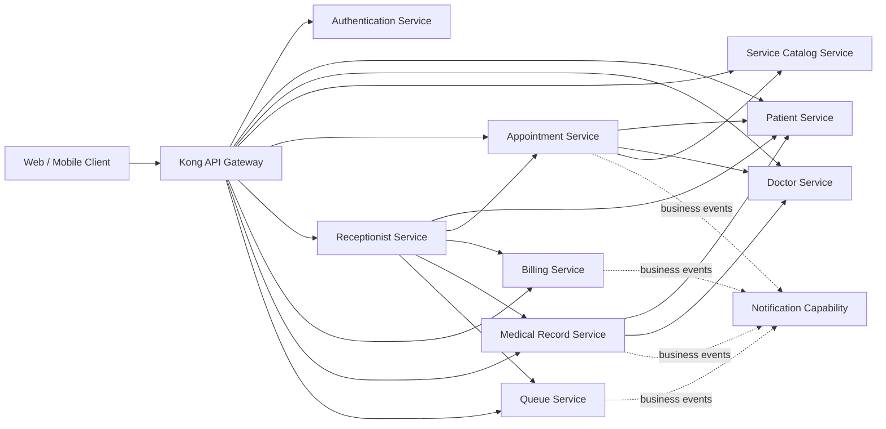
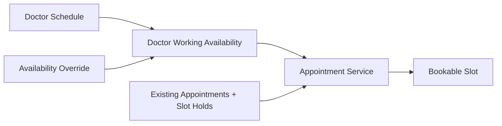

# KIẾN TRÚC TỔNG QUAN VÀ RANH GIỚI DỊCH VỤ

> Tài liệu này dùng để **chốt kiến trúc và ranh giới nghiệp vụ của toàn hệ thống trước khi thiết kế chi tiết từng service**.
>
> Nó không thay thế Service Specification của từng service và không đi vào bảng database, field, endpoint, DTO, state machine hay test case. Mục tiêu duy nhất là bảo đảm khi thiết kế từng service riêng lẻ, các service **không giẫm nghiệp vụ, không tranh quyền sở hữu dữ liệu và không tạo dependency sai**.
>
> Năm service sau đã có nghiệp vụ được xác định tương đối rõ và được dùng làm baseline cho toàn hệ thống:
>
> - Authentication Service
> - Patient Service
> - Doctor Service
> - Receptionist Service
> - Service Catalog Service
>
> Các service còn lại như Appointment, Billing, Medical Record, Queue và Notification phải được thiết kế dựa trên các ranh giới đã chốt ở đây, không được tự ý lấy lại nghiệp vụ đã thuộc năm service trên.

---

# 1. Bức tranh tổng thể của hệ thống

Hệ thống là một nền tảng hỗ trợ quy trình khám và chăm sóc thai phụ tại cơ sở y tế. Trọng tâm của hệ thống không phải quản trị toàn bộ bệnh viện mà là hỗ trợ hành trình của người bệnh từ lúc có tài khoản, có hồ sơ hành chính, tìm dịch vụ và bác sĩ phù hợp, đặt lịch, đến cơ sở y tế, được tiếp nhận, thanh toán, vào hàng chờ, khám và hình thành hồ sơ y khoa.

Các actor chính của hệ thống gồm:

- `PATIENT`: thai phụ/người bệnh sử dụng ứng dụng để quản lý hồ sơ cá nhân, tìm dịch vụ, chọn bác sĩ và đặt lịch.
- `DOCTOR`: bác sĩ tham gia hoạt động khám, có hồ sơ nghiệp vụ, chuyên khoa, lịch nhận khám và khả năng làm việc.
- `RECEPTIONIST`: lễ tân thực hiện nghiệp vụ tiếp nhận bệnh nhân tại quầy.
- `NURSE`: y tá/điều dưỡng tham gia các bước vận hành hàng chờ hoặc hồ sơ khám khi các service tương ứng được thiết kế.
- `ADMIN`: quản trị các tài nguyên nghiệp vụ được phép quản lý.

Role chỉ xác định **loại identity**. Role không tự động cấp quyền trên mọi resource. Ví dụ `DOCTOR` không đồng nghĩa được đọc mọi hồ sơ bệnh nhân, `RECEPTIONIST` không đồng nghĩa được đọc toàn bộ dữ liệu y khoa, và `ADMIN` không đồng nghĩa được bỏ qua audit hoặc resource-level authorization.

Kiến trúc tổng thể được tổ chức theo các bounded context riêng. Client không truy cập trực tiếp database hay gọi thẳng vào các business service từ public network. Luồng ngoài hệ thống đi qua Kong API Gateway. Kong chịu trách nhiệm routing, CORS, rate limiting và xác thực JWT ở tầng edge; các business service vẫn phải tự kiểm tra quyền nghiệp vụ trên resource mà mình sở hữu.



Sơ đồ trên biểu diễn **quan hệ nghiệp vụ**, không có nghĩa mọi mũi tên đều phải là REST hoặc mọi service đều phải được implement ngay. Cách giao tiếp cụ thể có thể là synchronous internal API, event hoặc snapshot tùy trường hợp, nhưng quyền sở hữu nghiệp vụ phải giữ nguyên.

Có bốn nguyên tắc nền tảng mà toàn bộ thiết kế service phải tuân theo.

Thứ nhất, **mỗi business concept chỉ có một source of truth**. Nếu Doctor Service sở hữu lịch làm việc của bác sĩ thì Appointment không được tạo một lịch làm việc authoritative khác. Nếu Catalog sở hữu giá niêm yết thì Billing không được trở thành nơi chỉnh sửa giá danh mục. Service khác có thể giữ reference hoặc snapshot nhưng không trở thành owner.

Thứ hai, **không query database xuyên service và không tạo foreign key xuyên database service**. `patientId`, `doctorId`, `serviceId`, `appointmentId`... khi xuất hiện ở service khác chỉ là external reference. Nếu cần xác minh hoặc lấy dữ liệu, service phải dùng internal contract hoặc dữ liệu snapshot/event đã được owner cung cấp.

Thứ ba, **authentication và business authorization là hai việc khác nhau**. Auth/Kong xác định request đến từ account nào và role nào. Business service đang sở hữu resource mới quyết định account đó có quyền thực hiện hành động cụ thể hay không.

Thứ tư, **mỗi service chỉ transaction trên dữ liệu local của mình**. Quy trình đi qua nhiều service không được giải bằng distributed database transaction. Nếu một nghiệp vụ cần nhiều bước xuyên service, phải dùng orchestration, idempotency, checkpoint, retry và reconciliation phù hợp.

Hệ thống hiện được xem là MVP cho **một cơ sở**. Không tự đưa thêm Facility, multi-hospital, multi-location hoặc hierarchy Department/Room thành dependency nền tảng nếu chưa có requirement mới được chốt.

---

# 2. Ranh giới của năm service đã được chốt

Năm service này là điểm neo của kiến trúc. Khi thiết kế các service còn lại, phải xem chúng như các owner đã tồn tại.

## Authentication Service

Authentication Service là bounded context về **Identity, Authentication và coarse authorization metadata**.

Service này tồn tại để quản lý account và vòng đời xác thực, không phải để quản lý hồ sơ nghiệp vụ của Patient, Doctor hay Receptionist.

Authentication Service là source of truth cho:

- account identity;
- credential và password hash;
- account status;
- role và permission metadata ở mức coarse-grained;
- access-token signing;
- refresh token/session;
- session revocation;
- public key/JWKS phục vụ xác minh token;
- security audit liên quan login, refresh, logout và session.

Access token là JWT ngắn hạn, stateless. Refresh token/session là stateful và nằm trong persistent storage của Auth. Normal authenticated request không được gọi Auth `/verify` cho mỗi request. Kong verify JWT locally bằng public key, sau đó forward identity context đã xác thực tới business service.

Điều quan trọng nhất là phân biệt:

```text
Auth Account
≠ Patient Profile
≠ Doctor Profile
≠ Receptionist Profile
```

Ví dụ một account có role `DOCTOR` chỉ chứng minh người dùng đã được cấp identity loại Doctor. Hồ sơ bác sĩ trong nghiệp vụ vẫn phải thuộc Doctor Service và được map bằng `accountId`.

Auth không được chứa:

- Patient profile;
- Doctor profile;
- Receptionist profile;
- appointment;
- pricing;
- medical record;
- invoice/payment;
- queue;
- resource-level healthcare authorization.

Nếu Doctor được phép xem một medical record cụ thể hay không, quyết định đó phải thuộc Medical Record domain chứ không phải Auth.

Kong chịu trách nhiệm authentication enforcement ở tầng edge, nhưng không được chứa healthcare business rule. Business service vẫn phải tự kiểm tra ownership, assignment hoặc relationship của resource.

---

## Patient Service

Patient Service là bounded context **Patient Administrative Profile**.

Nó mô tả người bệnh về mặt hành chính và định danh, không phải lịch sử y khoa.

Patient Service là source of truth cho:

- `Patient`;
- thông tin hành chính ổn định của Patient;
- thông tin liên hệ;
- thông tin định danh;
- `EmergencyContact`;
- việc hồ sơ đã đủ dữ liệu cơ bản cho nghiệp vụ tiếp theo hay chưa.

Một Patient có thể có Auth account hoặc có thể được tạo tại quầy mà chưa có Auth account. Vì vậy:

```text
patientId
```

là định danh nghiệp vụ của bệnh nhân,

còn:

```text
authAccountId
```

chỉ là external reference tới Auth khi có liên kết.

Các service khác phải dùng `patientId` khi tham chiếu Patient, không được lấy `JWT.sub` hoặc `accountId` làm Patient ID.

Patient Service không sở hữu:

- account/password/role/token;
- appointment;
- check-in state;
- queue;
- invoice/payment;
- tuần thai hiện tại;
- pregnancy episode;
- tiền sử sản khoa chi tiết;
- vital signs;
- xét nghiệm;
- siêu âm;
- diagnosis;
- prescription;
- treatment plan;
- medical record.

Đây là boundary đặc biệt quan trọng. Patient Service trả lời:

> “Người bệnh này là ai về mặt hành chính?”

Medical Record Service sau này trả lời:

> “Điều gì đã xảy ra với người bệnh này về mặt y khoa?”

Appointment chỉ nên lấy dữ liệu tối thiểu từ Patient để kiểm tra Patient tồn tại và hồ sơ đã đủ điều kiện đặt lịch. Receptionist được phép tìm và xem phần dữ liệu cần thiết để đối chiếu định danh tại quầy, nhưng việc đó không biến Receptionist thành owner của Patient data.

Auth registration cũng không được tự động tạo Patient bằng distributed transaction. Account và Patient Profile có vòng đời riêng; client hoặc business flow hoàn thiện Patient Profile sau khi account đã được tạo.

---

## Doctor Service

Doctor Service là bounded context **Doctor Directory & Working Availability**.

Nó quản lý thông tin bác sĩ cần cho nghiệp vụ khám và đặt lịch, nhưng không phải một hệ thống HR.

Doctor Service là source of truth cho:

- `Doctor`;
- `DoctorProfile`;
- `Specialty`;
- quan hệ Doctor–Specialty;
- lịch nhận khám định kỳ;
- availability override như nghỉ đột xuất hoặc ca làm bổ sung;
- trạng thái hoạt động của bác sĩ;
- rank/phân loại bác sĩ chuẩn hóa dùng cho các nghiệp vụ downstream.

Doctor Service phải trả lời được:

- bác sĩ này là ai trong nghiệp vụ khám;
- đang active hay không;
- thuộc chuyên khoa nào;
- rank/phân loại chuẩn hóa là gì;
- có thể làm việc trong khoảng thời gian nào.

Doctor Service không quản lý:

- account/password/JWT/role;
- payroll;
- contract;
- attendance;
- chấm công;
- HR shift management;
- dịch vụ khám;
- giá;
- appointment;
- slot hold;
- queue;
- check-in;
- medical record;
- prescription;
- treatment plan;
- notification delivery.

Boundary quan trọng nhất là **working availability và bookable slot không phải một khái niệm**.

Doctor Service sở hữu:

```text
Khoảng bác sĩ có thể làm việc
```

Appointment Service phải sở hữu:

```text
Slot thực sự còn đặt được
```

vì chỉ Appointment biết lịch nào đã được đặt và slot nào đang được hold.



Doctor availability API không được cam kết “slot chưa bị ai đặt”. Nó chỉ cam kết bác sĩ có khả năng làm việc ở khoảng đó.

Một boundary quan trọng khác là **doctor rank và pricing**.

Doctor Service sở hữu:

```text
doctorId → consultationRank
```

Service Catalog sở hữu:

```text
consultationRank → surcharge
```

`professionalTitle` như `BS.CKI`, `BS.CKII`, `PGS.TS...` chỉ là text hiển thị. Không được parse hoặc dùng trực tiếp để tính giá. Pricing phải dựa trên rank code chuẩn hóa.

`Specialty` cũng thuộc Doctor Service. Service Catalog chỉ tham chiếu `specialtyId`; không tạo một specialty source-of-truth khác.

---

## Service Catalog Service

Service Catalog Service là bounded context **Medical Service Catalog & Listed Pricing**.

Catalog mô tả cơ sở y tế đang cung cấp những dịch vụ nào và các quy tắc giá niêm yết liên quan đến các dịch vụ đó.

Catalog là source of truth cho:

- `MedicalService`;
- service lifecycle;
- category/tag phục vụ discovery;
- base price của dịch vụ;
- booking enabled flag;
- chính sách lựa chọn rank bác sĩ cho dịch vụ;
- bảng phụ phí rank bác sĩ trong MVP;
- version của dữ liệu pricing phục vụ snapshot downstream.

Catalog trả lời các câu hỏi:

- dịch vụ này có tồn tại và đang active không;
- có được booking không;
- thuộc specialty nào;
- duration tham khảo là bao nhiêu;
- base price hiện hành là bao nhiêu;
- có cho phép chọn/nâng rank bác sĩ không;
- rank được chọn có phụ phí bao nhiêu.

Trong luồng đặt theo dịch vụ, công thức baseline hiện tại là:

```text
estimatedTotal = serviceBasePrice + doctorRankSurcharge
```

Base price đã bao gồm rank cơ bản nếu dịch vụ cần bác sĩ; rank cơ bản có surcharge bằng `0`.

Catalog **không** sở hữu:

- hồ sơ bác sĩ;
- doctor schedule;
- doctor availability;
- rank thực tế của từng doctor;
- appointment lifecycle;
- check-in;
- queue;
- medical record;
- invoice;
- final payment.

Quan hệ Doctor–Catalog phải hiểu như sau:

```text
Doctor Service:
doctorId → consultationRank
specialtyId → specialty definition

Catalog:
medicalServiceId → specialtyId
consultationRank → surcharge
```

Catalog không được query trực tiếp Doctor DB.

Appointment khi tạo booking nên nhận dữ liệu resolve từ Catalog và lưu pricing snapshot của booking, ví dụ service name/version, base price, rank policy, rank surcharge và estimated total. Snapshot đó giúp lịch sử booking không bị thay đổi khi Catalog cập nhật giá sau này.

Catalog hiện được chốt theo MVP **một cơ sở**. Facility, Department, Room và ServiceOffering theo cơ sở không thuộc Catalog MVP. Do đó service mới không được tự coi Facility/Department/Room là dependency bắt buộc nếu chưa có quyết định mới.

---

## Receptionist Service

Receptionist Service có bounded context đặc biệt vì nó gồm hai trách nhiệm liên quan nhưng khác bản chất:

1. **Receptionist Business Profile**: hồ sơ nghiệp vụ tối thiểu để xác định ai là lễ tân hợp lệ.
2. **Admission Process Management**: điều phối quá trình tiếp nhận bệnh nhân khi các downstream contract đã sẵn sàng.

Receptionist Service là source of truth cho:

- Receptionist business identity;
- employee code;
- receptionist profile;
- receptionist business status;
- admission/reception process state khi Admission được triển khai;
- checkpoint và reference của các bước orchestration.

Receptionist Profile không phải HR profile đầy đủ. Service này không quản lý:

- ca làm;
- lịch trực;
- nghỉ phép;
- availability;
- attendance;
- payroll;
- contract;
- recruitment;
- các nghiệp vụ HR khác.

Tương tự Doctor:

```text
Auth Account role RECEPTIONIST
≠ Receptionist Business Profile
```

Auth xác định account và role. Receptionist Service xác định business profile và trạng thái local của Receptionist.

Điểm quan trọng nhất là Receptionist Service có thể là **orchestrator**, nhưng không được trở thành owner của state thuộc downstream service.

Khi Admission được mở, quy trình đã được xác định theo hướng:

```text
Tra cứu lịch hẹn/bệnh nhân
→ mở ReceptionCase
→ đối chiếu hồ sơ
→ xác nhận chi phí/thanh toán
→ mở hồ sơ khám
→ check-in Appointment
→ tạo Queue Ticket
→ hoàn tất Admission
```

Receptionist có thể gọi Patient, Appointment, Billing, Medical Record và Queue. Tuy nhiên:

- Patient profile vẫn thuộc Patient Service.
- Appointment/check-in state vẫn thuộc Appointment Service.
- Invoice/payment state vẫn thuộc Billing Service.
- Medical record vẫn thuộc Medical Record Service.
- Queue ticket/priority/position vẫn thuộc Queue Service.

Receptionist chỉ giữ các external reference như `appointmentId`, `invoiceId`, `medicalRecordId`, `queueTicketId` và process checkpoint của chính Admission.

Khi một downstream write đã thành công, Receptionist ghi checkpoint local rồi mới đi tiếp. Nếu timeout xảy ra, không được giả định downstream chắc chắn rollback; retry phải dùng stable idempotency key hoặc query outcome để xác định trạng thái thật. Receptionist không được rollback bằng cách sửa trực tiếp database của service khác.

---

# 3. Ownership của toàn hệ thống và cách dữ liệu được tham chiếu

Đây là phần dùng để kiểm tra nhanh khi thiết kế một service mới. Nếu một concept đã có owner trong bảng này, service mới không được tự tạo thêm một source of truth khác.

| Business concept | Owner |
|---|---|
| Account identity | Authentication Service |
| Credential/password | Authentication Service |
| Role/permission metadata | Authentication Service |
| Refresh session | Authentication Service |
| Patient administrative profile | Patient Service |
| Patient identity/contact | Patient Service |
| Emergency contact | Patient Service |
| Doctor business profile | Doctor Service |
| Specialty | Doctor Service |
| Doctor-specialty relationship | Doctor Service |
| Doctor working schedule | Doctor Service |
| Doctor availability override | Doctor Service |
| Doctor consultation rank | Doctor Service |
| Medical service catalog | Service Catalog Service |
| Service category/tag | Service Catalog Service |
| Service base price | Service Catalog Service |
| Doctor-rank surcharge | Service Catalog Service trong MVP |
| Receptionist business profile | Receptionist Service |
| Admission/reception process | Receptionist Service |
| Appointment lifecycle | Appointment Service |
| Booking occupancy | Appointment Service |
| Slot hold | Appointment Service |
| Bookable slot | Appointment Service |
| Appointment check-in state | Appointment Service |
| Invoice/payment/refund | Billing Service |
| Clinical encounter | Medical Record Service |
| Pregnancy clinical information | Medical Record Service |
| Diagnosis/result/prescription/treatment | Medical Record Service, trừ khi sau này tách service riêng |
| Queue ticket | Queue Service |
| Queue priority/position/state | Queue Service |
| Notification delivery | Notification capability/service |

Một service có ba cách hợp lệ để dùng dữ liệu của service khác.

**External reference:** chỉ giữ ID của resource bên ngoài. Ví dụ `Appointment.patientId`, `Appointment.doctorId`, `MedicalRecord.patientId`.

**Historical snapshot:** copy một số field tại thời điểm transaction để bảo toàn lịch sử. Ví dụ Appointment có thể giữ `serviceName`, `baseAmount`, `selectedDoctorName`, `selectedDoctorRank`. Snapshot không được đồng bộ ngược và không biến Appointment thành owner.

**Runtime resolve:** gọi internal API của owner để kiểm tra trạng thái hiện tại khi business rule thực sự cần dữ liệu mới nhất.

Phải tránh copy dữ liệu chỉ để “đỡ gọi service khác”. Mỗi bản copy phải có lý do rõ ràng: lịch sử, performance projection, hoặc eventual-consistency read model. Nếu không có lý do đó, ưu tiên reference và contract rõ ràng.

Ví dụ pricing minh họa rõ nhất:

```text
Doctor Service:
D001 → consultationRank = SPECIALIST_II

Catalog:
SPECIALIST_II → surcharge = 300000

Appointment:
lưu snapshot:
doctorId = D001
selectedDoctorRankCode = SPECIALIST_II
rankSurchargeAmountMinor = 300000
```

Appointment không được thay đổi rank của Doctor và cũng không được thay đổi bảng surcharge của Catalog.

Tương tự, nếu Patient đổi số điện thoại sau khi Appointment được tạo, Patient Service vẫn là source of truth cho contact hiện tại. Appointment chỉ giữ contact snapshot nếu có requirement lịch sử rõ ràng.

---

# 4. Quan hệ và cách các service phối hợp với nhau

Kiến trúc giao tiếp phải phản ánh ownership, không làm mờ ownership.

Luồng public luôn theo hướng:

```text
Client
→ Kong
→ Business Service
```

Kong verify JWT, nhưng business service vẫn kiểm tra rule nghiệp vụ. Client không được tự gửi `X-User-Id`, `X-Role` hoặc các identity header rồi yêu cầu service tin chúng.

Business service gọi service khác qua internal network, không cần vòng qua public Kong. Tuy nhiên internal API phải có service authentication được chốt; không dùng một header kiểu `X-Service-Name` không được ký làm bằng chứng tin cậy.

Dependency chính giữa các bounded context hiện tại:

| Caller | Owner được gọi | Mục đích |
|---|---|---|
| Appointment | Patient | Xác minh Patient tồn tại và đủ điều kiện booking |
| Appointment | Doctor | Lấy doctor status, specialty, rank và working availability |
| Appointment | Catalog | Resolve service, pricing policy và pricing snapshot |
| Receptionist | Patient | Search/đối chiếu danh tính tối thiểu |
| Receptionist | Appointment | Search lịch, validate, check-in |
| Receptionist | Billing | Tạo/lấy invoice và xác minh payment authoritative |
| Receptionist | Medical Record | Mở/lấy hồ sơ khám |
| Receptionist | Queue | Tạo/lấy queue ticket |
| Medical Record | Patient | Tham chiếu Patient identity/demographic cần thiết |
| Medical Record | Doctor | Xác minh doctor và lấy display/specialty snapshot khi cần |

Một internal contract phải trả **minimum necessary data**. Appointment kiểm tra Patient eligibility không cần full national ID, địa chỉ và emergency contacts. Receptionist tìm Patient để đối chiếu không cần clinical record. Catalog không cần PII của Doctor để resolve specialty/rank pricing.

Synchronous call phù hợp khi caller phải có kết quả ngay mới tiếp tục được transaction nghiệp vụ, ví dụ Appointment cần Patient eligibility hoặc Catalog pricing resolve trước khi tạo booking.

Eventual consistency phù hợp khi owner thay đổi dữ liệu mà consumer cần reconcile sau đó, ví dụ Doctor thay đổi schedule/availability và Appointment cần rà soát các appointment tương lai bị ảnh hưởng. Doctor không được gọi Appointment trong availability request chỉ để đếm booking; Appointment mới là owner của booking occupancy.

Các write operation có khả năng bị retry qua orchestration phải hỗ trợ idempotency. Đặc biệt các operation như:

```text
check-in appointment
create invoice
open medical record
create queue ticket
```

không được tạo duplicate khi Receptionist retry sau timeout.

Một timeout sau write không chứng minh operation thất bại. Downstream có thể đã commit nhưng response bị mất. Vì vậy contract cần có ít nhất một trong các khả năng:

- idempotency key ổn định;
- lookup theo business key;
- operation status lookup;
- reconciliation.

Không được “retry create mới” bằng request khác và hy vọng database downstream tự xử lý.

Về authentication, normal user request không được tạo dependency runtime tới Auth Service. Auth outage không nên làm toàn bộ business API ngừng hoạt động nếu access JWT đã được phát hành và public key vẫn có thể verify. Chỉ các operation thật sự cần account validation hiện tại, như tạo/kích hoạt staff mapping, mới có thể cần internal Auth contract.

---

# 5. Ranh giới bắt buộc của các service chưa thiết kế chi tiết

Năm service baseline đã tạo ra những constraint khá rõ cho các service tiếp theo. Phần này không thiết kế database hay API của chúng; nó chỉ xác định **chúng phải sở hữu phần nào và không được chiếm phần nào**.

## Appointment Service

Appointment Service phải là owner của toàn bộ lifecycle của lịch hẹn và booking occupancy.

Nó phải chịu trách nhiệm cho các concept như:

- appointment;
- trạng thái lịch hẹn;
- thời gian khám đã đặt;
- booking occupancy;
- slot hold;
- bookable slot;
- selected doctor/rank/service reference;
- snapshot cần thiết tại thời điểm booking;
- appointment check-in state.

Appointment phải kết hợp ba nguồn dữ liệu ngoài:

**Patient Service** cung cấp `patientId` và eligibility/profile completeness.

**Doctor Service** cung cấp doctor status, specialty, consultation rank và working availability.

**Service Catalog** cung cấp service definition, booking flag, specialty requirement, duration tham khảo, pricing policy, base price và rank surcharge.

Appointment sau đó mới tính:

```text
bookable slot
=
doctor working availability
- appointments đã chiếm chỗ
- active slot holds
```

Appointment không được sở hữu Doctor schedule, Doctor rank, Patient profile hoặc Catalog price rule.

Khi tạo booking, Appointment nên lưu snapshot của các dữ liệu có ý nghĩa lịch sử như tên dịch vụ, version, base price, rank surcharge, selected doctor/rank. Snapshot phục vụ lịch sử của Appointment chứ không thay thế owner gốc.

Check-in state của appointment cũng thuộc Appointment Service. Receptionist là actor/orchestrator gửi command check-in; Appointment mới quyết định appointment có đang ở state cho phép check-in hay không và thực hiện transition authoritative.

---

## Billing Service

Billing phải là owner của **financial state thực tế**.

Catalog trả lời:

> Giá niêm yết hiện tại là gì?

Appointment giữ:

> Giá đã được snapshot khi booking.

Billing phải trả lời:

> Trường hợp cụ thể này bệnh nhân phải trả bao nhiêu, invoice hiện ở trạng thái gì, payment đã hoàn tất hay chưa, có refund/void/adjustment hay không?

Vì vậy Billing dự kiến sở hữu:

- invoice;
- invoice line/charge;
- amount due;
- payment;
- payment status;
- refund;
- void/cancellation financial state;
- adjustment nếu scope yêu cầu.

Billing không được trở thành nơi cấu hình Medical Service hoặc base price. Nếu cần giá, Billing nhận snapshot/context từ Appointment hoặc resolve theo contract đã chốt.

Receptionist có thể trigger create/get invoice và kiểm tra payment, nhưng payment authoritative vẫn nằm ở Billing.

Admission không được cho bệnh nhân đi tiếp nếu policy đã chốt yêu cầu payment nhưng Billing chưa xác nhận điều kiện đó.

---

## Medical Record Service

Medical Record Service phải là owner của **clinical domain**.

Những dữ liệu bị cố ý loại khỏi Patient Service phải đi về đây hoặc một clinical sub-service được tách rõ sau này:

- encounter;
- pregnancy clinical information;
- gestational/obstetric information;
- vital signs;
- clinical notes;
- test/imaging result;
- diagnosis;
- assessment;
- prescription;
- treatment plan.

Medical Record tham chiếu `patientId` từ Patient Service và `doctorId` từ Doctor Service. Nó có thể lưu demographic hoặc doctor display snapshot khi cần bảo toàn lịch sử, nhưng Patient/Doctor vẫn là owner của profile hiện tại.

Doctor Service chỉ xác nhận doctor tồn tại, active, profile/specialty/rank. Doctor Service không quyết định doctor có quyền đọc medical record nào. Resource-level authorization trên medical record phải dựa trên relationship của encounter/appointment/assignment và được enforce trong Medical Record domain.

Receptionist chỉ yêu cầu mở/lấy hồ sơ khám trong Admission. Nó không được chỉnh clinical data hay trở thành owner của medical record.

---

## Queue Service

Queue Service phải là owner của **trạng thái hàng chờ thực tế**.

Queue phải chịu trách nhiệm cho:

- queue ticket;
- queue state;
- priority;
- position;
- called state;
- late-arrival handling;
- demotion/reordering rule nếu nghiệp vụ có.

Appointment và Queue phải tách rõ:

```text
Appointment = kế hoạch khám đã đặt
Queue = vị trí chờ thực tế sau khi bệnh nhân đã vào quy trình khám
```

Receptionist có thể request tạo queue ticket sau khi các bước Admission trước đó đã hoàn tất, nhưng Queue mới sinh ticket, áp dụng priority và quyết định position authoritative.

Nurse sau này thao tác gọi bệnh nhân tiếp theo qua Queue Service chứ không trực tiếp sửa Appointment hoặc Reception database.

---

## Notification capability

Notification chỉ nên chịu trách nhiệm **delivery**, không sở hữu domain state.

Nó có thể nhận tín hiệu:

- appointment changed;
- appointment reminder due;
- queue called;
- payment confirmed;
- result available.

Nhưng không được tự suy luận hoặc tự thay đổi:

- appointment status;
- queue position;
- payment status;
- medical state.

Nếu tách thành service riêng, ownership hợp lý chỉ gồm message/template, delivery attempt, channel, delivery status và communication preference theo scope được chốt.

---

# 6. Những ranh giới dễ bị thiết kế sai và các quyết định chưa được phép tự giả định

Các cặp dưới đây phải được xem như invariant của kiến trúc.

**Auth Account và business profile là hai lớp khác nhau.** `JWT.sub` là account identity. Patient, Doctor và Receptionist đều có business ID riêng. Không dùng account ID thay business ID.

**Patient administrative data và clinical data phải tách.** Patient không được phình thành “hồ sơ bệnh nhân tổng hợp” chứa cả hành chính lẫn y khoa.

**Doctor working availability và Appointment bookable slot phải tách.** Doctor chỉ biết bác sĩ có thể làm việc; Appointment mới biết thời gian đó còn trống sau khi tính booking và hold.

**Doctor rank và pricing phải tách.** Doctor sở hữu rank của từng bác sĩ. Catalog sở hữu giá/phụ phí theo rank. `professionalTitle` không phải pricing key.

**Catalog pricing và Billing financial state phải tách.** Giá niêm yết không phải invoice và invoice không phải price catalog.

**Reception orchestration và downstream ownership phải tách.** Receptionist điều phối nhưng không sở hữu Appointment, Billing, Medical Record hoặc Queue state.

**Appointment và Queue phải tách.** Lịch hẹn là kế hoạch; queue là trạng thái chờ thực tế.

**Snapshot và source of truth phải tách.** Một service giữ snapshot không có nghĩa nó được phép cập nhật domain gốc.

Ngoài các invariant trên, một số quyết định trong năm specification vẫn chưa được chốt hoàn toàn. Khi thiết kế service tiếp theo không được tự ý chọn thay:

- cơ chế service-to-service authentication cuối cùng chưa được thống nhất;
- event transport/broker chưa được chốt;
- taxonomy chính thức của `consultationRank` vẫn cần chốt;
- hành vi Appointment khi bác sĩ nghỉ/deactivate và appointment tương lai bị ảnh hưởng chưa thuộc Doctor Service và phải được định nghĩa ở Appointment;
- cách chọn “rank thôi” hay “bác sĩ cụ thể” trong một số flow Catalog/Appointment vẫn cần business decision;
- thời điểm thu tiền và cách xử lý chênh lệch giá khi doctor/rank thay đổi chưa được Catalog quyết định;
- multi-facility chưa thuộc MVP và không được tự đưa vào thiết kế nền tảng.

Nguyên tắc ở đây là: nếu một câu hỏi chưa có answer trong các specification hiện tại, service mới phải ghi nó là open decision hoặc thiết kế interface linh hoạt; không được âm thầm biến một giả định thành architecture fact.

---

# 7. Quy trình bắt buộc trước khi bắt đầu thiết kế chi tiết một service

Trước khi viết database, API hoặc entity cho một service mới, phải hoàn thành lần lượt các bước dưới đây. Đây là phần quan trọng nhất của tài liệu vì nó giúp tránh thiết kế lệch ngay từ đầu.

### Bước 1 — Viết một câu xác định bounded context

Phải mô tả được service bằng một câu ngắn nhưng đủ nghĩa:

> `<Service>` là source of truth cho ______ và chịu trách nhiệm ______.

Nếu câu mô tả chứa nhiều nhóm nghiệp vụ không liên quan, service đang quá rộng.

Ví dụ đúng:

> Appointment Service là source of truth cho lịch hẹn, booking occupancy và bookable slot.

Ví dụ đáng nghi:

> Appointment Service quản lý bệnh nhân, bác sĩ, giá, lịch hẹn, thanh toán và hàng chờ.

Câu thứ hai cho thấy nhiều ownership đã bị lấy từ service khác.

### Bước 2 — Liệt kê business concept mà service thực sự sở hữu

Chưa thiết kế bảng. Chỉ liệt kê domain concept.

Sau đó đối chiếu với ownership map ở Chương 3.

Mỗi concept phải có câu trả lời rõ:

> Tại sao service này, chứ không phải service khác, phải là source of truth?

Nếu không giải thích được, chưa nên thiết kế entity.

### Bước 3 — Liệt kê dữ liệu cần dùng nhưng không sở hữu

Với mỗi dependency, ghi rõ:

```text
Concept
Owner
Cách dùng: reference / snapshot / runtime resolve
```

Ví dụ Appointment:

```text
Patient → owner Patient Service → reference + eligibility resolve
Doctor → owner Doctor Service → reference + availability resolve + snapshot
Medical Service → owner Catalog → reference + pricing resolve + snapshot
```

Bước này ngăn việc copy nguyên entity của service khác vào database local.

### Bước 4 — Xác định state mà service có quyền thay đổi

Đây là cách rõ nhất để kiểm tra boundary.

Ví dụ Receptionist được phép thay đổi:

```text
ReceptionCase / Admission process state
```

nhưng chỉ được yêu cầu owner thay đổi:

```text
Appointment check-in state
Payment state
Medical Record state
Queue state
```

Nếu service đang tự thay đổi state thuộc service khác, boundary sai.

### Bước 5 — Xác định inbound và outbound dependency

Phải biết:

- ai gọi service này;
- service này cần gọi ai;
- operation nào cần kết quả synchronous;
- operation nào có thể eventual;
- dependency lỗi thì có được tiếp tục không.

Chỉ khi dependency thật sự rõ mới bắt đầu viết internal API/event contract.

### Bước 6 — Xác định historical snapshot

Hỏi:

> Nếu dữ liệu ở owner thay đổi sau transaction, lịch sử của resource local có cần giữ nguyên không?

Nếu có, xác định đúng field cần snapshot.

Không copy toàn bộ object chỉ vì “sau này có thể cần”.

### Bước 7 — Xác định authorization boundary

Không chỉ ghi `role = DOCTOR` hoặc `role = ADMIN`.

Phải xác định:

- resource owner là ai;
- actor có relationship gì với resource;
- internal service có quyền đọc/write ở mức nào;
- dữ liệu nào phải mask hoặc giảm thiểu.

Role là điều kiện đầu vào; resource-level rule mới là business authorization.

### Bước 8 — Xác định consistency và failure boundary

Trước khi thiết kế write flow phải trả lời:

- local transaction gồm những gì;
- operation nào cần idempotency;
- nếu downstream timeout sau write thì xác định outcome thế nào;
- có retry không;
- có cần reconciliation không;
- eventual consistency có chấp nhận được không.

Không chọn distributed transaction làm mặc định.

### Bước 9 — Viết rõ “service không chịu trách nhiệm”

Đây không phải phần phụ.

Danh sách “không chịu trách nhiệm” là rào chắn giúp service không phình ra trong implementation.

Mỗi item nên chỉ rõ owner đúng nếu đã biết.

### Bước 10 — Chỉ sau khi boundary được chốt mới thiết kế chi tiết

Thứ tự hợp lý:

```text
System Boundary
→ Service Boundary
→ Ownership
→ Dependencies
→ State authority
→ Consistency model
→ Entity/Data Model
→ Database
→ API
→ Business Rules
→ Security
→ Tests
```

Không nên bắt đầu bằng “cần những bảng nào” rồi mới tìm cách gán business meaning cho chúng.

---

## Kết luận kiến trúc

Có thể nhớ toàn bộ hệ thống bằng một đoạn ngắn:

```text
Authentication Service biết người dùng là ai và phát identity/token.

Patient Service biết người bệnh là ai về mặt hành chính.

Doctor Service biết bác sĩ là ai, thuộc chuyên khoa nào,
rank gì và có thể làm việc khi nào.

Service Catalog biết cơ sở đang cung cấp dịch vụ gì
và giá niêm yết/rank surcharge hiện hành là bao nhiêu.

Appointment Service sẽ biết lịch nào được đặt,
slot nào thực sự còn đặt được và appointment đang ở trạng thái nào.

Receptionist Service biết ai là lễ tân hợp lệ
và điều phối quá trình bệnh nhân được tiếp nhận.

Billing Service sẽ biết nghĩa vụ tài chính và payment state thực tế.

Medical Record Service sẽ biết điều gì đã xảy ra về mặt y khoa.

Queue Service sẽ biết bệnh nhân đang ở đâu trong hàng chờ thực tế.

Notification chỉ truyền đạt các thay đổi do domain owner phát ra.
```

Nếu trong quá trình thiết kế một service, service đó bắt đầu trả lời câu hỏi vốn thuộc một dòng khác trong đoạn trên, đó là dấu hiệu cần dừng lại và kiểm tra lại boundary.

Tài liệu này là **baseline cấp hệ thống**. Service Specification được phép đào sâu bên trong boundary đã được giao, nhưng không được âm thầm thay đổi ownership của service khác.
