# Biểu đồ luồng hoạt động - Quy trình khám thai

Tài liệu này mô tả luồng hoạt động cho use case "Thai phụ khám thai" dựa trên mô tả nghiệp vụ đã cho.

```mermaid
flowchart TD
    A[Thai phụ đăng ký tài khoản] --> B[Đăng nhập hệ thống]
    B --> C[Chọn chức năng Đăng ký dịch vụ khám thai]
    C --> D{Chọn hình thức khám}

    D -->|Khám thường| N1[Hệ thống hiển thị ngày/ca khám còn trống]
    N1 --> N2[Thai phụ chọn ngày khám]
    N2 --> N3[Thai phụ cung cấp thông tin định danh nếu chưa có]
    N3 --> N4[Hệ thống ghi nhận lịch khám]

    D -->|Khám dịch vụ| P1[Hệ thống hiển thị danh sách dịch vụ khám]
    P1 --> P2[Thai phụ chọn dịch vụ khám]
    P2 --> P3[Hệ thống hiển thị danh sách bác sĩ]
    P3 --> P4[Thai phụ chọn bác sĩ]
    P4 --> P5[Hệ thống hiển thị ngày giờ còn trống]
    P5 --> P6[Thai phụ chọn ngày giờ khám]
    P6 --> P7[Thai phụ cung cấp thông tin định danh nếu chưa có]
    P7 --> P8[Hệ thống ghi nhận lịch khám]

    N4 --> E[Hệ thống trả số thứ tự ưu tiên và thời gian ước tính]
    P8 --> E
    E --> F[Hệ thống gửi thông báo nhắc lịch hẹn]
    F --> G[Thai phụ đến bệnh viện đúng ngày giờ hẹn]
    G --> H[Thai phụ đến quầy lễ tân]
    H --> I[Lễ tân xác nhận định danh]
    I --> J[Lễ tân xử lý nhập khám, cấp hồ sơ, thanh toán]
    J --> K[Hệ thống đưa thai phụ vào hàng chờ khám]
    K --> L[Thai phụ chờ đến lượt khám]

    L --> M[Hệ thống hiển thị danh sách chờ khám cho y tá/điều dưỡng]
    M --> Q[Y tá/điều dưỡng mời thai phụ tiếp theo vào khám]
    Q --> R[Hệ thống gửi thông báo đẩy tới thai phụ]
    R --> S[Bác sĩ thực hiện khám lâm sàng]
    S --> T[Bác sĩ tổng hợp kết quả xét nghiệm/siêu âm]
    T --> U[Bác sĩ chẩn đoán, kê đơn, lập phác đồ điều trị]
    U --> V[Y tá/điều dưỡng scan hồ sơ và gửi lên hệ thống]
    V --> W[Hệ thống luân chuyển hồ sơ giữa các phòng khám/dịch vụ]
    W --> X[Hồ sơ và kết quả được hiển thị cho bác sĩ]
    X --> Y[Quy trình khám hoàn tất]

    note1[[Lưu ý: Thai phụ đến trễ quá 30 phút sẽ mất thứ tự ưu tiên trong hàng đợi.]]
    E -.-> note1
```

## Tóm tắt luồng

1. Thai phụ đăng ký và đăng nhập hệ thống.
2. Thai phụ chọn khám thường hoặc khám dịch vụ.
3. Hệ thống ghi nhận lịch khám, trả số thứ tự ưu tiên và thời gian ước tính.
4. Hệ thống gửi thông báo nhắc lịch trước ngày khám.
5. Thai phụ đến quầy lễ tân để xác nhận định danh và nhập khám.
6. Thai phụ được đưa vào hàng chờ khám.
7. Y tá/điều dưỡng gọi bệnh nhân tiếp theo vào khám.
8. Bác sĩ khám, tổng hợp kết quả, chẩn đoán và kê đơn.
9. Y tá/điều dưỡng scan hồ sơ và cập nhật lên hệ thống.
10. Hồ sơ được luân chuyển và hiển thị cho bác sĩ để tổng hợp cuối cùng.
