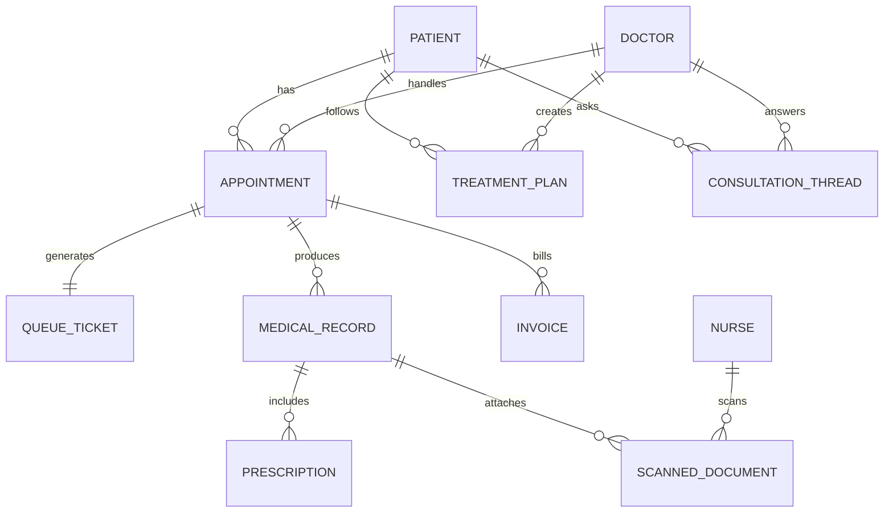

# Xác định Yêu cầu Hệ thống — Bước 1 đến Bước 6

> Điền vào template này TRƯỚC KHI thiết kế service. Đây là input cho phần "Phân tích & Thiết kế SOA/Microservices".

**Miền nghiệp vụ:** Hệ thống quản lý khám thai và chăm sóc thai phụ

---

## Bước 1 — Mục tiêu & Phạm vi Nghiệp vụ

**Vấn đề hệ thống giải quyết là gì, cho ai?**

> Hệ thống hỗ trợ thai phụ đặt lịch khám thai, khai báo hồ sơ khám và theo dõi toàn bộ quá trình chăm sóc thai kỳ (hồ sơ sức khỏe, phác đồ điều trị, đơn thuốc, hóa đơn) trực tuyến qua Web/App. Hệ thống giảm thời gian chờ tại bệnh viện thông qua hàng đợi số và thông báo tự động, hỗ trợ lễ tân theo dõi và xử lý các tình huống bất thường trong lịch khám, hỗ trợ bác sĩ tư vấn/giải đáp thắc mắc từ xa, hỗ trợ y tá/hộ sinh số hóa hồ sơ khám để tránh thất lạc, và cho phép Admin quản trị toàn bộ hệ thống (người dùng, danh mục, báo cáo).

**Mục tiêu đo được (nếu có):**

| Mục tiêu | Chỉ số đo | Giá trị mong muốn |
|---|---|---|
| Giảm thời gian chờ khám tại bệnh viện | Thời gian chờ trung bình từ lúc lấy số đến lúc vào khám | Giảm ≥ 30% so với quy trình thủ công |
| Tăng tốc độ tra cứu trạng thái hàng đợi | Thời gian phản hồi API tra cứu số thứ tự | < 500ms (P95) |
| Giảm thất lạc hồ sơ giấy | Tỷ lệ hồ sơ khám được số hóa và lưu trữ điện tử | ≥ 95% hồ sơ khám mới |
| Tăng khả năng tự phục vụ của thai phụ | Tỷ lệ lịch khám đặt qua Web/App so với đặt tại quầy | ≥ 70% |
| Đảm bảo thông báo kịp thời | Thời gian gửi thông báo bất thường (đổi lịch, bác sĩ nghỉ...) kể từ khi phát sinh | < 2 phút |
| Hỗ trợ tư vấn tức thời | Tỷ lệ câu hỏi được Chatbot AI trả lời không cần chuyển tiếp bác sĩ | ≥ 60% |

**Trong phạm vi (In-scope):**
- Đặt lịch khám thai trực tuyến, nhận số thứ tự (hàng đợi số) và thông báo nhắc lịch.
- Khai báo, lưu trữ và tra cứu hồ sơ sức khỏe thai kỳ, phác đồ điều trị, đơn thuốc, hóa đơn của thai phụ.
- Tư vấn/hỏi đáp qua Chatbot AI và qua diễn đàn/chat với bác sĩ.
- Theo dõi cổng thông tin bệnh viện (tin tức, thông báo chung).
- Lễ tân theo dõi lịch khám, gửi thông báo bất thường, xử lý các phần không tự động hóa được (thanh toán tiền mặt, hồ sơ vật lý).
- Y tá/hộ sinh nhập liệu thông tin dịch vụ khám và số hóa (quét) hồ sơ giấy lên hệ thống.
- Admin quản trị người dùng, danh mục (bác sĩ, dịch vụ, lịch làm việc) và xem báo cáo thống kê.

**Ngoài phạm vi (Out-of-scope) — và lý do:**
- Thanh toán trực tuyến qua cổng thanh toán bên thứ ba (thẻ, ví điện tử) — giai đoạn đầu chỉ hỗ trợ thanh toán tiền mặt tại quầy do lễ tân xử lý; sẽ bổ sung ở giai đoạn sau.
- Chẩn đoán y khoa tự động (AI chẩn đoán thay bác sĩ) — Chatbot AI chỉ tư vấn thông tin chung, không thay thế chỉ định/chẩn đoán của bác sĩ, nhằm tránh rủi ro pháp lý và an toàn người bệnh.
- Quản lý kho thuốc, dược, bảo hiểm y tế (BHYT/BHXH) — thuộc hệ thống HIS/kho dược riêng của bệnh viện, không thuộc phạm vi hệ thống này.
- Ứng dụng thiết bị IoT (máy đo tại nhà, wearable) đồng bộ trực tiếp — chưa có trong yêu cầu hiện tại, cần khảo sát riêng.
- Đặt lịch khám các chuyên khoa khác ngoài thai sản — hệ thống tập trung riêng cho nghiệp vụ khám thai.

---

## Bước 2 — Actor & Use case

### Actor: Thai phụ

| # | Use case | Mục đích (để làm gì / đạt gì) | Ưu tiên |
|---|----------|-------------------------------|---------|
| 1 | Đăng ký/đặt lịch khám thai | Chọn ngày giờ, bác sĩ/dịch vụ phù hợp để được khám đúng nhu cầu | Cao |
| 2 | Khai báo hồ sơ khám thai (thông tin cá nhân, tiền sử) | Cung cấp dữ liệu đầu vào chính xác cho bác sĩ trước khi khám | Cao |
| 3 | Nhận số thứ tự (vé hàng đợi) | Biết được vị trí xếp hàng, chủ động thời gian chờ | Cao |
| 4 | Nhận thông báo (nhắc lịch, thay đổi lịch, kết quả) | Không bỏ lỡ lịch khám và cập nhật kịp thời các thay đổi | Cao |
| 5 | Đến khám theo lịch hẹn, xác nhận định danh tại quầy lễ tân | Hoàn tất thủ tục nhập khám để được xếp vào hàng chờ khám | Cao |
| 6 | Theo dõi hồ sơ sức khỏe thai kỳ | Nắm được lịch sử khám, kết quả xét nghiệm/siêu âm qua các lần khám | Cao |
| 7 | Theo dõi phác đồ điều trị | Tuân thủ đúng chỉ định của bác sĩ | Trung bình |
| 8 | Theo dõi hóa đơn | Biết chi phí đã/cần thanh toán | Trung bình |
| 9 | Theo dõi đơn thuốc | Biết thuốc cần uống, liều lượng, thời gian | Trung bình |
| 10 | Hỏi đáp, nhận tư vấn qua Chatbot AI | Giải đáp nhanh các thắc mắc thông thường 24/7 | Trung bình |
| 11 | Theo dõi cổng thông tin bệnh viện | Cập nhật tin tức, thông báo chung của bệnh viện | Thấp |

### Actor: Lễ tân

| # | Use case | Mục đích (để làm gì / đạt gì) | Ưu tiên |
|---|----------|-------------------------------|---------|
| 1 | Theo dõi lịch khám của thai phụ (danh sách trong ngày, trạng thái) | Kiểm soát luồng khám, hỗ trợ điều phối phòng khám | Cao |
| 2 | Xác nhận định danh & xử lý thủ tục nhập khám cho thai phụ đến khám (cấp hồ sơ khám, thu tiền, đưa vào hàng chờ) | Hoàn tất thủ tục hành chính trước khi thai phụ vào hàng chờ khám | Cao |
| 3 | Gửi thông báo tới bác sĩ/thai phụ khi có bất thường (trễ giờ, đổi phòng, bác sĩ nghỉ) | Đảm bảo các bên được cập nhật kịp thời, giảm thất vọng của thai phụ | Cao |
| 4 | Thu thêm chi phí phát sinh sau khi khám (xét nghiệm/thuốc ngoài dự kiến) | Hoàn tất nghĩa vụ tài chính đầy đủ cho lần khám | Cao |
| 5 | Thực hiện hồ sơ vật lý / nhập liệu thay cho thai phụ không dùng app | Đảm bảo mọi thai phụ đều được phục vụ dù không rành công nghệ | Trung bình |
| 6 | Hủy/đổi lịch khám thay cho thai phụ (qua điện thoại/tại quầy) | Hỗ trợ trường hợp thai phụ không tự thao tác được trên hệ thống | Trung bình |

### Actor: Bác sĩ

| # | Use case | Mục đích (để làm gì / đạt gì) | Ưu tiên |
|---|----------|-------------------------------|---------|
| 1 | Trả lời/giải đáp thắc mắc của thai phụ (diễn đàn, chat) | Tư vấn chuyên môn, tăng gắn kết và an tâm cho thai phụ | Cao |
| 2 | Xem hồ sơ khám và kết quả nhập liệu trước khi khám | Nắm bệnh sử để khám chính xác, tiết kiệm thời gian | Cao |
| 3 | Khám lâm sàng và ghi nhận kết quả khám | Tạo hồ sơ khám mới, cập nhật tình trạng thai kỳ | Cao |
| 4 | Lập/cập nhật phác đồ điều trị | Định hướng chăm sóc thai kỳ cho các lần khám tiếp theo | Cao |
| 5 | Kê đơn thuốc | Chỉ định thuốc phù hợp với tình trạng thai phụ | Cao |

*(Ghi chú: Use case 2–5 của Bác sĩ được suy luận thêm để đảm bảo actor không chỉ có duy nhất use case "trả lời thắc mắc" — cần xác nhận lại với nghiệp vụ thực tế.)*

### Actor: Y tá/Điều dưỡng/Hộ sinh

| # | Use case | Mục đích (để làm gì / đạt gì) | Ưu tiên |
|---|----------|-------------------------------|---------|
| 1 | Nhập liệu thông tin liên quan đến dịch vụ khám (đo huyết áp, cân nặng, siêu âm, xét nghiệm) | Cung cấp số liệu cận lâm sàng cho bác sĩ trước/trong khi khám | Cao |
| 2 | Quét hồ sơ giấy và lưu lên hệ thống | Số hóa hồ sơ để tránh thất lạc, dễ tra cứu về sau | Cao |
| 3 | Gọi số thứ tự tiếp theo trong danh sách chờ khám | Đảm bảo quy trình khám diễn ra đúng thứ tự hàng đợi, kích hoạt thông báo tới thai phụ | Cao |

### Actor: Admin

| # | Use case | Mục đích (để làm gì / đạt gì) | Ưu tiên |
|---|----------|-------------------------------|---------|
| 1 | Quản lý tài khoản người dùng (thai phụ, lễ tân, bác sĩ, y tá) | Cấp/thu hồi quyền truy cập, đảm bảo bảo mật hệ thống | Cao |
| 2 | Quản lý danh mục (bác sĩ, dịch vụ khám, lịch làm việc, phòng khám) | Đảm bảo dữ liệu nền tảng cho việc đặt lịch chính xác | Cao |
| 3 | Cấu hình quy tắc hàng đợi/ưu tiên (khám thường vs khám dịch vụ) | Đảm bảo vận hành hàng đợi đúng chính sách bệnh viện | Trung bình |
| 4 | Xem báo cáo, thống kê vận hành | Ra quyết định quản trị dựa trên dữ liệu thực tế | Trung bình |
| 5 | Theo dõi nhật ký (audit log) hệ thống | Phục vụ truy vết, tuân thủ quy định pháp lý | Trung bình |

*(Ghi chú: Danh sách use case của Admin được cụ thể hóa từ mô tả gốc "Quản lý" theo yêu cầu checklist — cần xác nhận lại phạm vi thực tế với stakeholder.)*

---

## Bước 3 — Luồng nghiệp vụ chính (Happy path) + Nhánh lỗi/ngoại lệ

### Use case: Đặt lịch khám thai

> Có 2 luồng con khác nhau về cách chọn slot — **không dùng chung 1 quy trình chọn giờ**: Khám thường chỉ chọn ngày (hệ thống tự xếp bác sĩ theo hạn mức ngày), Khám dịch vụ chọn cụ thể dịch vụ → bác sĩ → giờ.

**Happy path — Khám thường (không áp dụng BHYT, theo hạn mức ngày):**
1. Thai phụ đăng nhập → chọn chức năng "Đăng ký dịch vụ khám thai" → chọn hình thức "Khám thường".
2. Hệ thống hiển thị danh sách ngày khám/ca khám còn trống — **chỉ hiển thị tối đa 75% tổng lượt khám của 1 bác sĩ/1 ngày** để đặt online; 25% còn lại được giữ lại cho người đến khám trực tiếp không qua hệ thống (walk-in).
3. Thai phụ chọn ngày khám (không chọn bác sĩ/giờ cụ thể — hệ thống sẽ tự phân bác sĩ trực trong ngày đó khi đến lượt).
4. Nếu chưa từng điền hồ sơ cá nhân, thai phụ cung cấp thông tin định danh (họ tên, ngày sinh, SĐT...).
5. Hệ thống ghi nhận đặt lịch thành công (tạo Appointment loại NORMAL, gắn ngày khám, chưa gắn giờ/bác sĩ cụ thể), trả về số thứ tự hàng đợi ưu tiên dự kiến và thời gian ước tính đến lượt khám, đồng thời gửi thông báo xác nhận.

**Happy path — Khám dịch vụ (tự nguyện, chọn bác sĩ cụ thể):**
1. Thai phụ đăng nhập → chọn chức năng "Đăng ký dịch vụ khám thai" → chọn hình thức "Khám dịch vụ".
2. Hệ thống hiển thị danh sách các dịch vụ khám → thai phụ chọn dịch vụ.
3. Hệ thống hiển thị danh sách bác sĩ phù hợp với dịch vụ đã chọn → thai phụ chọn bác sĩ có nguyện vọng khám.
4. Hệ thống hiển thị ngày/giờ khám còn trống của bác sĩ đó → thai phụ chọn ngày, giờ khám cụ thể.
5. Nếu chưa từng điền hồ sơ cá nhân, thai phụ cung cấp thông tin định danh.
6. Hệ thống ghi nhận đặt lịch thành công (tạo Appointment loại SERVICE, gắn cố định ngày/giờ/bác sĩ), trả về số thứ tự hàng đợi ưu tiên dự kiến và thời gian ước tính đến lượt khám, đồng thời gửi thông báo xác nhận.

**Quy tắc chung cho cả 2 luồng:** thai phụ đến trễ hơn 30 phút so với giờ/ca đã đặt sẽ **mất quyền ưu tiên** trong hàng đợi (bị chuyển xuống hàng chờ thường/cuối danh sách — xử lý chi tiết thuộc use case Nhập khám và Queue Service).

**Các nhánh lỗi / ngoại lệ:**

| Tình huống | Nguyên nhân | Hệ thống cần xử lý thế nào |
|---|---|---|
| Hết hạn mức khám thường trong ngày | Đã đủ 75% lượt online của tất cả bác sĩ trực trong ngày đó | Ẩn ngày đó khỏi danh sách chọn (hoặc hiển thị "hết chỗ"), gợi ý ngày gần nhất còn hạn mức |
| Hết giờ khám dịch vụ | Bác sĩ đã kín giờ trong khung ngày thai phụ chọn | Báo hết giờ, gợi ý bác sĩ khác hoặc ngày khác của cùng bác sĩ |
| Race condition — 2 thai phụ cùng chọn giờ khám dịch vụ / cùng chọn ngày khám thường ở lượt hạn mức cuối cùng | Nhiều request gửi gần như đồng thời | Dùng khóa/ràng buộc UNIQUE ở tầng dữ liệu để chỉ 1 request thành công; request còn lại nhận lỗi và được gợi ý lựa chọn thay thế ngay |
| Hủy lịch | Thai phụ chủ động hủy trước khi đến khám | Giải phóng slot/hạn mức đã giữ (trả lại vào hạn mức 75% hoặc giờ bác sĩ), ghi nhận lịch sử hủy, gửi thông báo xác nhận hủy |
| Bác sĩ nghỉ đột xuất | Bác sĩ báo nghỉ/ốm sau khi thai phụ đã đặt lịch dịch vụ với đúng bác sĩ đó | Hệ thống rà soát Appointment loại SERVICE liên quan, đề xuất đổi bác sĩ thay thế hoặc dời lịch; với Appointment loại NORMAL không bị ảnh hưởng vì không gắn cố định 1 bác sĩ |
| Thanh toán thất bại | Không áp dụng ở bước đặt lịch (thanh toán thực hiện lúc nhập khám, xem use case Nhập khám) | Không chặn việc đặt lịch |
| Trùng lịch của cùng 1 thai phụ | Thai phụ đã có lịch khám khác gần thời điểm đó (kể cả 1 lịch Khám thường + 1 lịch Khám dịch vụ cùng ngày) | Cảnh báo trùng lịch, yêu cầu xác nhận hoặc chọn ngày/giờ khác |
| Chưa cung cấp thông tin định danh | Thai phụ mới đăng ký tài khoản, chưa từng điền hồ sơ | Bắt buộc hoàn tất bước khai báo thông tin định danh trước khi hệ thống xác nhận đặt lịch thành công |

### Use case: Nhập khám (Xác nhận định danh & Thủ tục hành chính → Hàng chờ)

> Sửa lại so với bản trước: việc "vào hàng chờ" không phải do thai phụ tự check-in qua app, mà là **kết quả sau khi lễ tân xử lý xong thủ tục nhập khám**. Thanh toán (phí khám cơ bản) diễn ra ở bước này, TRƯỚC khi khám — không phải sau khi khám xong như hiểu nhầm ở bản trước.

**Happy path:**
1. Hệ thống gửi thông báo nhắc lịch hẹn khám cho thai phụ (trước giờ hẹn theo cấu hình, VD: 1 ngày và 1 giờ trước).
2. Thai phụ đến bệnh viện đúng ngày/giờ đã đặt, đến bàn lễ tân để xác nhận định danh (tra cứu theo mã lịch hẹn/SĐT/tên).
3. Lễ tân xác nhận đúng người, xử lý thủ tục nhập khám: cấp hồ sơ khám (tạo/mở MedicalRecord rỗng gắn Appointment), thu tiền tạm ứng/phí khám cơ bản theo loại hình đã đăng ký (Khám thường/Khám dịch vụ).
4. Sau khi lễ tân xác nhận hoàn tất thủ tục, hệ thống tự động sinh QueueTicket (trạng thái "waiting"), tính vị trí trong hàng đợi theo quy tắc ưu tiên (khám dịch vụ ưu tiên hơn khám thường theo cấu hình).
5. Thai phụ chờ đến lượt khám (xem use case Khám lâm sàng để biết bước gọi số tiếp theo).

**Các nhánh lỗi / ngoại lệ:**

| Tình huống | Nguyên nhân | Hệ thống cần xử lý thế nào |
|---|---|---|
| Hết slot khám | Không áp dụng (slot/hạn mức đã được giữ ở bước đặt lịch) | — |
| Trễ giờ >30 phút | Thai phụ đến bàn lễ tân trễ hơn 30 phút so với giờ/ca đã đặt | QueueTicket được sinh ra với `demoted=true` ngay từ đầu (mất quyền ưu tiên), xếp xuống cuối danh sách khám thường thay vì theo đúng thứ tự đặt lịch ban đầu; lễ tân vẫn xử lý thủ tục nhập khám bình thường |
| Hủy lịch | Thai phụ đến quầy nhưng đổi ý không khám nữa | Lễ tân hủy Appointment tại chỗ (nếu chưa thu tiền) hoặc xử lý hoàn phí một phần (nếu đã thu), không sinh QueueTicket |
| Không xác định được danh tính | Thai phụ quên mã lịch hẹn, thông tin cung cấp không khớp hồ sơ | Lễ tân tra cứu thủ công theo tên/SĐT/CCCD; nếu vẫn không khớp, xử lý như một ca đăng ký mới tại quầy (không qua hệ thống đặt lịch trước) |
| Thanh toán thất bại tại bước nhập khám | Thai phụ không đủ tiền mặt hoặc từ chối thanh toán phí khám cơ bản | Lễ tân có thể ghi nhận công nợ và vẫn cho vào hàng chờ (tùy chính sách bệnh viện), hoặc tạm giữ chưa cấp hồ sơ cho đến khi thanh toán — cần xác nhận chính sách cụ thể với bệnh viện |
| Bác sĩ nghỉ đột xuất trước khi thai phụ được xếp hàng | Bác sĩ trực ngày đó báo nghỉ sau khi đã có người nhập khám | Hệ thống rà soát các Appointment/QueueTicket liên quan tới bác sĩ đó, điều phối sang bác sĩ trực thay thế, thông báo cho lễ tân và thai phụ đang chờ |
| Hệ thống hàng đợi quá tải giờ cao điểm | Lượng nhập khám dồn vào buổi sáng | Cảnh báo vận hành, áp dụng cơ chế giãn tải/hàng đợi phân tầng theo khung giờ |

### Use case: Khám lâm sàng

> Bổ sung so với bản trước: người bấm gọi số là **Y tá/Điều dưỡng** (không phải hệ thống tự động/lễ tân); hồ sơ khám có thể **luân chuyển qua nhiều phòng/dịch vụ** (siêu âm, xét nghiệm...) trước khi về bác sĩ tổng hợp cuối cùng; việc số hóa kết quả cuối (đơn thuốc, phác đồ, hồ sơ bệnh án) do **Y tá/Điều dưỡng scan và gửi lên hệ thống**, không phải bác sĩ tự nhập toàn bộ.

**Happy path:**
1. Hệ thống hiển thị danh sách chờ khám (QueueTicket trạng thái "waiting") cho Y tá/Điều dưỡng tại quầy khám.
2. Y tá/Điều dưỡng nhấn nút mời thai phụ tiếp theo vào khám (chuyển QueueTicket sang "called"); hệ thống gửi thông báo đẩy (push notification) tới thai phụ.
3. Thai phụ vào phòng, Y tá/Điều dưỡng nhập các chỉ số ban đầu (cân nặng, huyết áp...) vào hệ thống, gắn với MedicalRecord của lượt khám.
4. Bác sĩ thực hiện quy trình khám thai thông thường. Nếu cần thêm cận lâm sàng (siêu âm, xét nghiệm), hồ sơ được luân chuyển sang phòng/dịch vụ tương ứng — mỗi phòng ghi nhận kết quả riêng (MedicalRecord con, gắn `department`), kết quả (biểu đồ, chỉ số...) hiển thị về cho bác sĩ qua hệ thống.
5. Bác sĩ là người tổng hợp cuối cùng: xem toàn bộ kết quả từ các phòng/dịch vụ, đưa ra chẩn đoán, kê đơn thuốc và/hoặc lập/cập nhật phác đồ điều trị.
6. Y tá/Điều dưỡng scan hồ sơ bệnh án, đơn thuốc, phác đồ điều trị (bản giấy có chữ ký/con dấu nếu có) và gửi lên hệ thống, đính kèm vào MedicalRecord tổng hợp.
7. Hệ thống đóng Appointment (trạng thái "completed"), phát sự kiện để Billing Service tổng hợp chi phí phát sinh thêm (nếu có) cho bước thanh toán bổ sung.

*(Giả định cần xác nhận: bác sĩ có thể nhập trực tiếp kết luận chẩn đoán dạng dữ liệu có cấu trúc vào hệ thống để phục vụ tra cứu, song song với việc y tá scan bản giấy gốc để lưu trữ pháp lý — cần làm rõ với nghiệp vụ thực tế bác sĩ có thao tác trực tiếp trên hệ thống hay hoàn toàn ghi giấy rồi y tá số hóa.)*

**Các nhánh lỗi / ngoại lệ:**

| Tình huống | Nguyên nhân | Hệ thống cần xử lý thế nào |
|---|---|---|
| Hết slot khám | Không áp dụng | — |
| Trễ giờ >30 phút | Đã xử lý ở bước Nhập khám (demote khi vào hàng chờ), không phát sinh thêm ở bước này | — |
| Hủy lịch | Thai phụ rời đi giữa chừng (khẩn cấp) | Ghi nhận trạng thái "hủy giữa chừng", yêu cầu bác sĩ ghi chú lý do, thông báo lễ tân |
| Bác sĩ nghỉ đột xuất | Bác sĩ không thể hoàn tất ca khám giữa chừng | Bàn giao hồ sơ đang khám dở (kể cả các MedicalRecord con từ phòng/dịch vụ đã có) cho bác sĩ thay thế, ghi nhận lịch sử bàn giao |
| Kết quả từ 1 phòng/dịch vụ bị trễ hoặc thiếu | Phòng siêu âm/xét nghiệm quá tải, chưa trả kết quả kịp | Bác sĩ có thể tạm hoãn tổng hợp và chuyển sang khám bệnh nhân khác, hệ thống nhắc khi kết quả về đủ để bác sĩ hoàn tất |
| Thanh toán thất bại | Xảy ra ở bước tiếp theo (thanh toán bổ sung), không thuộc use case này | Đóng luồng khám lâm sàng độc lập với luồng thanh toán để tránh chặn hồ sơ y tế vì lý do tài chính |
| Kết quả khám bất thường cần theo dõi khẩn | Phát hiện dấu hiệu nguy hiểm thai kỳ | Hệ thống hỗ trợ gắn cờ "cần theo dõi đặc biệt", tự động thông báo cho lễ tân/quản lý để sắp xếp tái khám sớm |
| Lỗi khi scan/upload hồ sơ | File lỗi, quá dung lượng, mất kết nối khi y tá upload | Cho phép lưu nháp và scan lại, không chặn việc đóng Appointment nếu hồ sơ scan bị trễ (xử lý bù sau) |

### Use case: Thanh toán bổ sung (sau khám)

> Đã sửa lại: thanh toán chính (phí khám cơ bản) diễn ra ở use case **Nhập khám** (trước khi khám). Use case này chỉ xử lý phần **phát sinh thêm** sau khi khám xong (xét nghiệm/siêu âm ngoài dự kiến, thuốc kê thêm) — không phải luồng thanh toán duy nhất của hệ thống.

**Happy path:**
1. Sau khi bác sĩ hoàn tất khám và kê đơn/chỉ định, hệ thống tổng hợp các khoản phát sinh ngoài phí khám cơ bản đã thu (dịch vụ thêm, thuốc) thành hóa đơn bổ sung (Invoice loại "SUPPLEMENTARY") gắn với Appointment.
2. Nếu có phát sinh, thai phụ quay lại quầy, lễ tân xác nhận hóa đơn bổ sung và thu tiền mặt.
3. Lễ tân xác nhận đã thanh toán trên hệ thống, hệ thống cập nhật trạng thái hóa đơn "đã thanh toán" và gửi biên nhận/thông báo cho thai phụ.
4. Nếu không có phát sinh thêm, hệ thống tự động đánh dấu "không có hóa đơn bổ sung" và kết thúc luồng khám.

**Các nhánh lỗi / ngoại lệ:**

| Tình huống | Nguyên nhân | Hệ thống cần xử lý thế nào |
|---|---|---|
| Hết slot khám | Không áp dụng | — |
| Trễ giờ >30 phút | Không áp dụng trực tiếp | — |
| Hủy lịch | Thai phụ hủy khám giữa chừng sau khi đã phát sinh chi phí một phần (ví dụ đã xét nghiệm) | Tính hóa đơn bổ sung theo phần dịch vụ đã thực hiện thực tế, không tính phần chưa thực hiện |
| Bác sĩ nghỉ đột xuất | Không áp dụng trực tiếp ở bước này | — |
| Thanh toán thất bại | Thai phụ không đủ tiền mặt / từ chối thanh toán khoản phát sinh | Ghi nhận công nợ (trạng thái "chưa thanh toán"), thông báo nhắc nợ, không giữ hồ sơ y tế làm điều kiện ép buộc thanh toán |
| Sai lệch số tiền giữa hệ thống và thực thu | Lỗi nhập liệu của lễ tân | Yêu cầu xác nhận lại/đối soát cuối ngày, ghi log điều chỉnh hóa đơn kèm người thực hiện (audit) |

### Use case: Tư vấn qua Chatbot AI / Diễn đàn

**Happy path:**
1. Thai phụ đặt câu hỏi qua Chatbot AI.
2. Chatbot trả lời dựa trên cơ sở tri thức (FAQ, kiến thức y khoa phổ thông đã được duyệt).
3. Nếu câu hỏi ngoài khả năng, Chatbot chuyển tiếp (escalate) câu hỏi thành bài đăng trên diễn đàn để bác sĩ trả lời; thai phụ nhận thông báo khi có phản hồi.

**Các nhánh lỗi / ngoại lệ:**

| Tình huống | Nguyên nhân | Hệ thống cần xử lý thế nào |
|---|---|---|
| Hết slot khám | Không áp dụng | — |
| Trễ giờ >30 phút | Không áp dụng | — |
| Hủy lịch | Không áp dụng | — |
| Bác sĩ nghỉ đột xuất | Bác sĩ phụ trách trả lời diễn đàn không hoạt động | Định tuyến câu hỏi sang bác sĩ trực khác theo hàng đợi trả lời (round-robin/ưu tiên) |
| Thanh toán thất bại | Không áp dụng | — |
| Chatbot trả lời sai/không chắc chắn (nguy cơ y khoa) | Giới hạn của mô hình AI, câu hỏi nhạy cảm (triệu chứng nguy hiểm) | Bắt buộc chuyển tiếp cho bác sĩ khi phát hiện từ khóa/ngữ cảnh liên quan đến dấu hiệu cấp cứu, không để Chatbot tự chẩn đoán |

---

## Bước 4 — Domain Model (Thực thể & Quan hệ)

### Danh sách thực thể

| Thực thể | Mô tả ngắn | Thuộc tính chính |
|---|---|---|
| Patient (Thai phụ) | Người dùng chính, đối tượng được chăm sóc thai kỳ | id, họ tên, ngày sinh, SĐT, địa chỉ, tuần thai hiện tại, tiền sử bệnh |
| Doctor (Bác sĩ) | Nhân sự thực hiện khám và tư vấn chuyên môn | id, họ tên, chuyên khoa, lịch làm việc, tỷ lệ slot mở đặt online mỗi ngày (mặc định 75%, còn lại 25% dành cho walk-in), trạng thái (đang làm việc/nghỉ) |
| Nurse/Midwife (Y tá/Hộ sinh) | Nhân sự hỗ trợ nhập liệu và số hóa hồ sơ | id, họ tên, ca trực |
| Receptionist (Lễ tân) | Nhân sự điều phối quầy tiếp đón | id, họ tên, quầy phụ trách |
| Admin | Quản trị viên hệ thống | id, họ tên, vai trò/quyền |
| Appointment (Lịch hẹn) | Một lượt đặt khám; Khám thường chỉ gắn ngày (bác sĩ được phân khi vào hàng chờ), Khám dịch vụ gắn cố định bác sĩ + giờ | id, patient_id, doctor_id (nullable với loại NORMAL cho tới khi vào hàng chờ), booking_type (NORMAL/SERVICE), ngày khám, giờ khám (bắt buộc nếu SERVICE, null nếu NORMAL), trạng thái |
| QueueTicket (Vé hàng đợi) | Vé số thứ tự sinh ra khi Appointment được kích hoạt (check-in) | id, appointment_id, số thứ tự, mức ưu tiên, trạng thái (waiting/serving/done) |
| MedicalRecord (Hồ sơ khám) | Kết quả khám/xét nghiệm/siêu âm; 1 Appointment có thể sinh nhiều MedicalRecord con theo từng phòng/dịch vụ, 1 bản được đánh dấu là bản tổng hợp cuối của bác sĩ | id, appointment_id, department (phòng/dịch vụ tạo ra, VD: "Khám tổng quát", "Siêu âm", "Xét nghiệm"), loại hồ sơ, nội dung/kết quả, is_final_summary (boolean — true nếu là bản tổng hợp của bác sĩ), created_by (doctor_id/nurse_id), file scan đính kèm |
| TreatmentPlan (Phác đồ điều trị) | Kế hoạch chăm sóc thai kỳ do bác sĩ lập | id, patient_id, doctor_id, nội dung phác đồ, ngày áp dụng, ngày tái khám dự kiến |
| Prescription (Đơn thuốc) | Đơn thuốc được kê trong 1 lần khám | id, medical_record_id, danh sách thuốc, liều dùng, hướng dẫn |
| Invoice (Hóa đơn) | Chi phí phát sinh của 1 Appointment; có thể có nhiều hóa đơn cho 1 lần khám (tạm ứng lúc nhập khám + bổ sung sau khám nếu có) | id, appointment_id, invoice_type (ADVANCE/SUPPLEMENTARY), danh sách khoản mục, tổng tiền, trạng thái thanh toán |
| Notification (Thông báo) | Thông báo gửi tới actor (nhắc lịch, cảnh báo bất thường...) | id, người nhận, loại thông báo, nội dung, kênh gửi, trạng thái đã đọc |
| ConsultationThread (Diễn đàn/Chat tư vấn) | Luồng hỏi đáp giữa Thai phụ và Chatbot/Bác sĩ | id, patient_id, doctor_id (nullable nếu do Chatbot xử lý), nội dung câu hỏi/trả lời, trạng thái (đã trả lời/chờ escalate) |
| ScannedDocument (Hồ sơ scan) | Bản scan hồ sơ giấy do Y tá số hóa | id, medical_record_id, file, người scan, ngày scan |

### Quan hệ giữa các thực thể

| Thực thể A | Quan hệ | Thực thể B | Ghi chú |
|---|---|---|---|
| Patient | 1 — n | Appointment | 1 bệnh nhân có nhiều lịch hẹn |
| Appointment | 1 — 1 | QueueTicket | 1 lịch hẹn sinh 1 vé hàng đợi |
| Appointment | 1 — n | MedicalRecord | 1 lịch hẹn có thể sinh nhiều hồ sơ (xét nghiệm, siêu âm...) |
| Doctor | 1 — n | Appointment | 1 bác sĩ phụ trách nhiều lịch hẹn |
| Patient | 1 — n | TreatmentPlan | 1 thai phụ có thể có nhiều phác đồ theo từng giai đoạn thai kỳ |
| Doctor | 1 — n | TreatmentPlan | 1 bác sĩ lập nhiều phác đồ cho nhiều thai phụ |
| MedicalRecord | 1 — n | Prescription | 1 hồ sơ khám có thể sinh nhiều đơn thuốc |
| Appointment | 1 — n | Invoice | 1 lịch hẹn có thể có hóa đơn tạm ứng (lúc nhập khám) và hóa đơn bổ sung (sau khám, nếu phát sinh) |
| MedicalRecord | 1 — n | ScannedDocument | 1 hồ sơ khám có thể có nhiều bản scan đính kèm |
| Nurse | 1 — n | ScannedDocument | 1 y tá thực hiện scan nhiều hồ sơ |
| Patient | 1 — n | ConsultationThread | 1 thai phụ có thể tạo nhiều luồng hỏi đáp |
| Doctor | 1 — n | ConsultationThread | 1 bác sĩ tham gia trả lời nhiều luồng hỏi đáp |
| Patient/Doctor/Receptionist | 1 — n | Notification | Mỗi actor nhận nhiều thông báo |
| Receptionist | 1 — n | Appointment | Lễ tân theo dõi/điều phối nhiều lịch hẹn (quan hệ giám sát, không sở hữu) |

### Sơ đồ ER

---

## Bước 5 — Phân rã Use case → Hành động chi tiết → Lọc hành động phù hợp làm Service

### Use case: Đặt lịch khám thai

| # | Hành động | Actor | Mô tả | Phù hợp làm service? |
|---|-----------|-------|-------|----------------------|
| 1 | Chọn hình thức khám (Thường/Dịch vụ) | Thai phụ | Điều hướng sang đúng luồng con | ✅ |
| 2 | Tra cứu ngày còn hạn mức (Khám thường) | Thai phụ | Truy vấn hạn mức 75% theo ngày, tổng hợp từ lịch tất cả bác sĩ trực | ✅ |
| 3 | Tra cứu dịch vụ → bác sĩ → giờ trống (Khám dịch vụ) | Thai phụ | Truy vấn lịch làm việc của bác sĩ cụ thể | ✅ |
| 4 | Giữ chỗ tạm thời (hold hạn mức ngày hoặc hold giờ cụ thể) | Hệ thống | Khóa trong thời gian ngắn để tránh trùng đặt | ✅ |
| 5 | Khai báo thông tin định danh (nếu chưa có) | Thai phụ | Tạo/hoàn thiện hồ sơ Patient | ✅ |
| 6 | Xác nhận đặt lịch | Thai phụ | Chốt thông tin, tạo Appointment (NORMAL hoặc SERVICE) | ✅ |
| 7 | Tính số thứ tự hàng đợi dự kiến & thời gian ước tính | Hệ thống | Trả về ngay sau khi xác nhận thành công | ✅ |
| 8 | Gửi thông báo xác nhận lịch | Hệ thống | Gửi qua app/SMS/email | ✅ |
| 9 | Thai phụ chuẩn bị giấy tờ tùy thân trước khi đến khám | Thai phụ | Hành động vật lý, ngoài hệ thống | ❌ |

### Use case: Nhập khám (Xác nhận định danh & Thủ tục hành chính → Hàng chờ)

| # | Hành động | Actor | Mô tả | Phù hợp làm service? |
|---|-----------|-------|-------|----------------------|
| 1 | Gửi thông báo nhắc lịch hẹn | Hệ thống | Push/SMS trước giờ hẹn | ✅ |
| 2 | Tra cứu lịch hẹn theo mã/SĐT/tên | Lễ tân | Xác định đúng thai phụ đến khám | ✅ |
| 3 | Xác nhận định danh (đối chiếu giấy tờ) | Lễ tân | Hành động vật lý (xem CCCD/giấy tờ) | ❌ |
| 4 | Cấp hồ sơ khám (tạo MedicalRecord rỗng gắn Appointment) | Lễ tân | Chuẩn bị hồ sơ cho lượt khám | ✅ |
| 5 | Thu tiền tạm ứng/phí khám cơ bản | Lễ tân | Hành động vật lý (giao nhận tiền mặt) | ❌ |
| 6 | Ghi nhận đã thu tiền, tạo Invoice loại ADVANCE | Lễ tân | Cập nhật trạng thái thanh toán trên hệ thống | ✅ |
| 7 | Đánh dấu Appointment đã nhập khám xong | Hệ thống | Trigger để sinh QueueTicket | ✅ |
| 8 | Sinh và tính vị trí vé hàng đợi (áp dụng demote nếu trễ >30 phút) | Hệ thống | Áp dụng quy tắc ưu tiên dịch vụ/thường | ✅ |
| 9 | Hướng dẫn thai phụ ngồi khu vực chờ | Lễ tân | Hành động vật lý tại chỗ | ❌ |

### Use case: Khám lâm sàng

| # | Hành động | Actor | Mô tả | Phù hợp làm service? |
|---|-----------|-------|-------|----------------------|
| 1 | Xem danh sách chờ khám | Y tá | Truy vấn QueueTicket trạng thái "waiting" | ✅ |
| 2 | Gọi số thứ tự tiếp theo | Y tá | Chuyển QueueTicket sang "called" | ✅ |
| 3 | Gửi thông báo đẩy tới thai phụ | Hệ thống | Push notification khi được gọi | ✅ |
| 4 | Đo chỉ số ban đầu (cân nặng, huyết áp) | Y tá | Hành động vật lý | ❌ |
| 5 | Nhập chỉ số ban đầu vào hồ sơ | Y tá | Lưu vào MedicalRecord gắn Appointment | ✅ |
| 6 | Khám lâm sàng trực tiếp | Bác sĩ | Hành động chuyên môn vật lý (khám, siêu âm...) | ❌ |
| 7 | Luân chuyển hồ sơ sang phòng/dịch vụ khác (nếu cần) | Hệ thống | Tạo MedicalRecord con gắn department, đồng bộ trạng thái luân chuyển | ✅ |
| 8 | Thực hiện xét nghiệm/siêu âm tại phòng chuyên môn | Nhân sự phòng đó | Hành động chuyên môn vật lý | ❌ |
| 9 | Ghi nhận kết quả cận lâm sàng lên hệ thống | Nhân sự phòng đó | Cập nhật MedicalRecord con | ✅ |
| 10 | Tổng hợp kết quả từ các phòng, chẩn đoán | Bác sĩ | Xem toàn bộ MedicalRecord con qua hệ thống | ✅ |
| 11 | Lập/cập nhật phác đồ điều trị | Bác sĩ | Tạo/cập nhật TreatmentPlan | ✅ |
| 12 | Kê đơn thuốc | Bác sĩ | Tạo Prescription gắn với MedicalRecord tổng hợp | ✅ |
| 13 | Scan hồ sơ bệnh án/đơn thuốc/phác đồ và gửi lên hệ thống | Y tá | Tạo ScannedDocument, đính kèm MedicalRecord tổng hợp (is_final_summary=true) | ✅ |
| 14 | Đóng Appointment, kích hoạt luồng thanh toán bổ sung | Hệ thống | Cập nhật trạng thái, phát event cho Billing Service | ✅ |

### Use case: Thanh toán bổ sung (sau khám)

| # | Hành động | Actor | Mô tả | Phù hợp làm service? |
|---|-----------|-------|-------|----------------------|
| 1 | Tổng hợp chi phí phát sinh thành hóa đơn bổ sung | Hệ thống | Tính từ dịch vụ thêm + thuốc, tạo Invoice loại SUPPLEMENTARY | ✅ |
| 2 | Thu tiền mặt phần phát sinh tại quầy | Lễ tân | Hành động vật lý (giao nhận tiền) | ❌ |
| 3 | Xác nhận đã thanh toán trên hệ thống | Lễ tân | Cập nhật trạng thái Invoice | ✅ |
| 4 | Gửi biên nhận điện tử | Hệ thống | Gửi thông báo/email biên nhận | ✅ |

### Use case: Tư vấn qua Chatbot AI / Diễn đàn

| # | Hành động | Actor | Mô tả | Phù hợp làm service? |
|---|-----------|-------|-------|----------------------|
| 1 | Gửi câu hỏi tới Chatbot | Thai phụ | Nhập câu hỏi qua giao diện chat | ✅ |
| 2 | Chatbot xử lý và trả lời tự động | Hệ thống (AI) | Dựa trên cơ sở tri thức đã duyệt | ✅ |
| 3 | Phát hiện & chuyển tiếp câu hỏi vượt khả năng cho bác sĩ | Hệ thống | Escalation dựa trên rule/độ tin cậy | ✅ |
| 4 | Bác sĩ trả lời câu hỏi được chuyển tiếp | Bác sĩ | Nhập câu trả lời qua giao diện | ✅ |
| 5 | Thai phụ đọc và tự đánh giá mức độ hữu ích (cảm nhận cá nhân) | Thai phụ | Hành vi chủ quan ngoài hệ thống, chỉ ghi nhận nếu có nút đánh giá | ❌ |

---

## Bước 6 — Yêu cầu Phi chức năng (NFR)

| Yêu cầu | Mô tả cụ thể | Ảnh hưởng đến thiết kế service |
|---|---|---|
| Hiệu năng | Tra cứu trạng thái hàng đợi phản hồi < 500ms (P95); tra cứu slot khám trống < 800ms; gửi thông báo trong vòng < 2 phút kể từ sự kiện phát sinh | Cần Queue Service tách riêng, có cache (Redis) cho trạng thái hàng đợi thời gian thực; Notification Service xử lý bất đồng bộ qua message queue |
| Bảo mật | Mã hóa hồ sơ y tế (MedicalRecord, Prescription) khi lưu trữ (at-rest) và truyền tải (TLS); phân quyền RBAC theo actor (Thai phụ chỉ xem hồ sơ của mình, Bác sĩ xem hồ sơ bệnh nhân được phân công, Admin toàn quyền cấu hình) | Cần Auth Service (JWT/OAuth2) tập trung cấp token và xác thực; Authorization được kiểm tra ở API Gateway và tại từng service nghiệp vụ |
| Khả năng mở rộng | Queue Service và Notification Service cần scale độc lập vào giờ cao điểm buổi sáng (7h-9h); Chatbot AI Service cần scale theo lượng truy vấn đồng thời | Thiết kế các service này stateless, deploy độc lập (container hóa), autoscale theo tải; tách biệt khỏi các service ít biến động như Doctor/Patient Service |
| Sẵn sàng | Uptime tối thiểu 99.5% cho các service cốt lõi (Appointment, Queue); có cơ chế fallback khi Notification Service lỗi (chuyển sang kênh dự phòng SMS nếu push notification thất bại); circuit breaker giữa các service | Áp dụng health check, retry với backoff, circuit breaker (VD: Resilience4j/Envoy); Notification Service có hàng đợi retry và kênh gửi dự phòng |
| Tuân thủ / Pháp lý | Lưu trữ dữ liệu y tế (MedicalRecord, TreatmentPlan, Prescription) theo quy định pháp luật về hồ sơ bệnh án; có audit trail cho mọi thao tác chỉnh sửa hóa đơn, hồ sơ y tế, cấp quyền tài khoản | Cần Audit Log Service riêng, ghi lại mọi hành động thay đổi dữ liệu nhạy cảm (ai, khi nào, thay đổi gì); dữ liệu y tế lưu trữ có thời hạn tối thiểu theo quy định, có cơ chế backup định kỳ |

---

## Bước 7 — Định hướng chuyển giao sang thiết kế Service

> Mục này KHÔNG thay thế tài liệu thiết kế service (spec 6 phần/service) — chỉ nêu sơ bộ để người đọc file yêu cầu hình dung được bước tiếp theo. Chi tiết Data model/API/Business rule của từng service nằm ở file spec riêng (VD: `appointment-service-spec.md`, `patient-service-spec.md`...).

### Danh sách service dự kiến (dựa trên Bước 4 & Bước 5)

| Nhóm | Service | Sở hữu (rút gọn từ Bước 4) |
|---|---|---|
| Entity | Patient Service | Patient, EmergencyContact |
| Entity | Doctor Service | Doctor, lịch làm việc |
| Entity | Medical Record Service | MedicalRecord, TreatmentPlan, Prescription, ScannedDocument |
| Entity | Billing Service | Invoice |
| Task/Process | Appointment Service | Appointment, SlotHold |
| Task/Process | Queue Service | QueueTicket |
| Task/Process | Consultation Service | ConsultationThread (Chatbot AI + diễn đàn) |
| Utility | Auth Service | Tài khoản, RBAC |
| Utility | Notification Service | Notification |
| Utility | Audit Log Service | Nhật ký thao tác |
| Hạ tầng | API Gateway | Routing, auth check tầng vào |

### Thứ tự triển khai đề xuất (theo chiều phụ thuộc)

1. **Auth Service** — mọi service khác đều cần xác thực/RBAC, làm trước tiên hoặc chí ít có bản mock JWT sớm.
2. **Notification Service + Audit Log Service** (bản tối giản/mock) — vì hầu hết service nghiệp vụ đều phát event tới đây; nếu chưa có, service khác vẫn code được nhưng cần stub sẵn interface.
3. **Patient Service, Doctor Service** — Entity Service nền tảng, không phụ thuộc service nghiệp vụ nào khác, nên làm song song sớm.
4. **Medical Record Service, Billing Service** — phụ thuộc Patient/Doctor để verify dữ liệu, làm sau bước 3.
5. **Appointment Service** — phụ thuộc Patient Service + Doctor Service (verify slot, verify bệnh nhân); nên làm sau khi 2 service đó có API ổn định.
6. **Queue Service** — phụ thuộc trực tiếp vào event từ Appointment Service (`appointment.checked_in`, `appointment.cancelled`), bắt buộc làm sau Appointment Service.
7. **Consultation Service** — phụ thuộc Patient/Doctor để biết ai hỏi/ai trả lời, có thể làm song song với bước 5–6 vì ít phụ thuộc lẫn nhau.
8. **API Gateway** — tích hợp cuối cùng khi phần lớn service đã có endpoint ổn định, để tránh phải sửa routing liên tục.

**Lưu ý khi triển khai thực tế:** nếu team làm song song nhiều service, có thể dùng **contract-first** (định nghĩa API contract trước ở bước spec, mock response giả) để các team không bị chặn lẫn nhau theo đúng thứ tự trên.

---

## Checklist trước khi sang bước thiết kế service

- [x] Bước 1: Mục tiêu rõ ràng, phạm vi trong/ngoài đã liệt kê
- [x] Bước 2: Tất cả actor có use case, không actor nào chỉ ghi chung chung ("Quản lý") — *lưu ý: use case của Bác sĩ và Admin đã được cụ thể hóa thêm, cần xác nhận lại với nghiệp vụ thực tế*
- [x] Bước 3: Mỗi use case chính có ít nhất 1 nhánh lỗi được xử lý
- [x] Bước 4: Domain model có đủ quan hệ 1-n / n-n, không thực thể nào "mồ côi"
- [x] Bước 5: Mọi hành động ✅ ở đây phải xuất hiện lại ở bước tách Entity/Task Service
- [x] Bước 6: Không còn ô NFR nào bỏ trống
